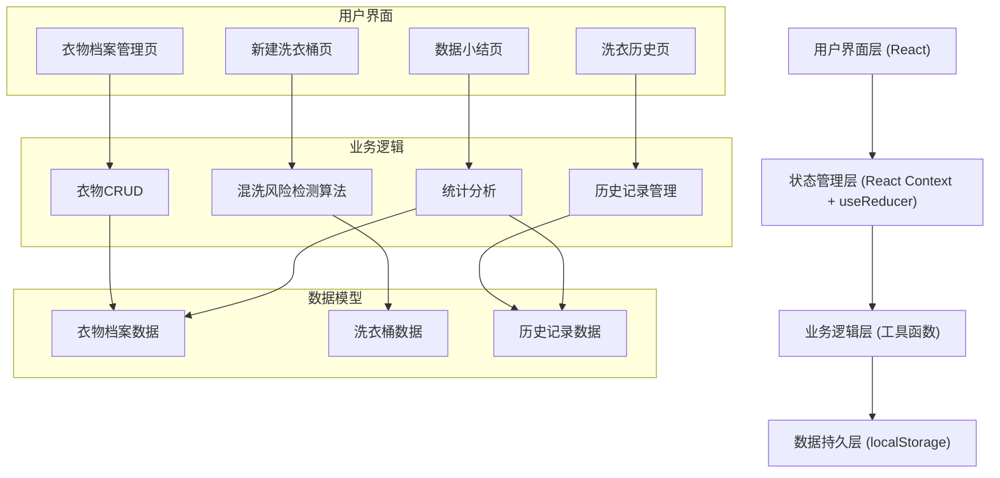
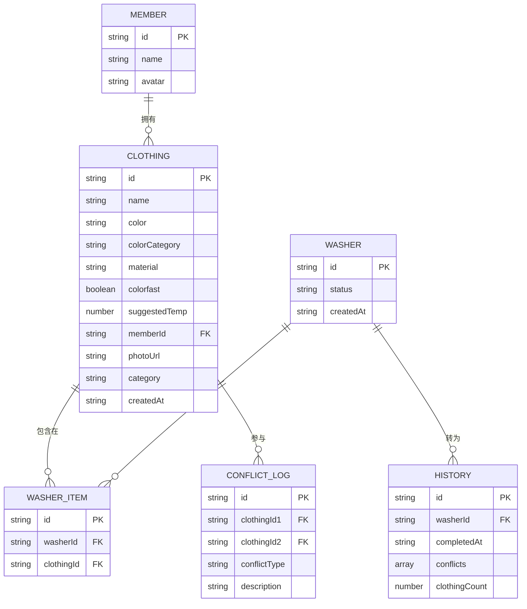

## 1. 架构设计



## 2. 技术说明

- **前端框架**: React@18 + TypeScript
- **构建工具**: Vite@5
- **样式方案**: TailwindCSS@3
- **图标库**: lucide-react
- **状态管理**: React Context + useReducer
- **数据持久化**: localStorage（纯前端，无后端）
- **图表库**: recharts（用于数据小结的可视化图表）
- **拖拽实现**: HTML5 原生 Drag & Drop API

## 3. 路由定义

| 路由 | 用途 |
|------|------|
| / | 首页/衣物档案管理页 |
| /washer | 新建洗衣桶页 |
| /history | 洗衣历史页 |
| /summary | 数据小结页 |

## 4. 数据模型

### 4.1 数据模型定义



### 4.2 核心数据结构

```typescript
// 衣物颜色分类
type ColorCategory = 'light' | 'dark' | 'medium';

// 衣物材质分类
type MaterialCategory = 'cotton' | 'wool' | 'silk' | 'synthetic' | 'denim' | 'towel' | 'underwear' | 'other';

// 衣物大类
type ClothingCategory = 'top' | 'pants' | 'underwear' | 'socks' | 'towel' | 'coat' | 'other';

// 家庭成员
interface Member {
  id: string;
  name: string;
  avatar: string; // emoji
}

// 衣物档案
interface Clothing {
  id: string;
  name: string;
  color: string; // 具体颜色名称
  colorCategory: ColorCategory;
  material: MaterialCategory;
  colorfast: boolean; // 是否掉色（true=易掉色）
  suggestedTemp: number; // 建议水温（摄氏度）
  memberId: string;
  photoUrl: string;
  category: ClothingCategory;
  createdAt: string;
}

// 冲突类型
type ConflictType = 'color' | 'wool' | 'towel' | 'underwear' | 'temperature';

// 冲突记录
interface Conflict {
  id: string;
  clothingId1: string;
  clothingId2: string;
  type: ConflictType;
  description: string;
}

// 洗衣桶
interface Washer {
  id: string;
  clothingIds: string[];
  conflicts: Conflict[];
  createdAt: string;
}

// 历史记录
interface WashHistory {
  id: string;
  clothingIds: string[];
  conflicts: Conflict[];
  completedAt: string;
  memberStats: Record<string, number>;
}
```

## 5. 混洗风险检测算法

### 5.1 检测规则

| 规则类型 | 检测条件 | 说明 |
|----------|----------|------|
| 深浅色冲突 | 浅色衣物 + (深色衣物 或 易掉色衣物) | 可能染色，明确指出哪两件冲突 |
| 羊毛混洗 | 羊毛材质 + 非羊毛材质 | 羊毛需单独洗涤 |
| 毛巾混洗 | 毛巾 + 非毛巾类 | 毛巾易粘毛，需分开 |
| 内衣混洗 | 内衣类 + 外衣类 | 卫生考虑，内衣应单独洗 |
| 水温冲突 | 两件衣物建议水温差 > 20°C | 温度要求差异大 |

### 5.2 算法输出

返回具体的冲突对数组，每项包含：
- 冲突衣物1的ID和名称
- 冲突衣物2的ID和名称
- 冲突类型
- 详细冲突原因描述
