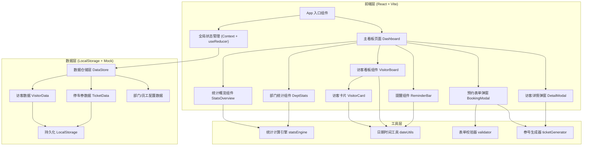
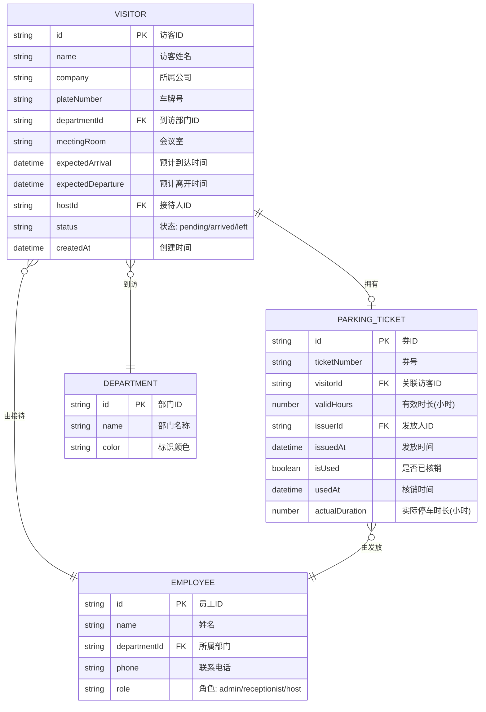

## 1. 架构设计



## 2. 技术描述

- **前端框架**：React@18 + TypeScript@5
- **构建工具**：Vite@5（极速 HMR）
- **样式方案**：TailwindCSS@3 + CSS Variables（主题色）
- **状态管理**：React Context + useReducer（轻量级，无需 Redux）
- **数据持久化**：LocalStorage（无需后端，刷新不丢数据）
- **图标库**：Lucide React（轻量 SVG 图标）
- **动画库**：Framer Motion（流畅的列表/弹窗/数字动画）
- **图表方案**：纯 CSS + Tailwind 实现进度条形图（避免引入重型图表库）
- **Mock 数据**：内置 15+ 条访客示例数据，覆盖今日/明日/已超时三种场景

## 3. 组件目录与路由

| 路径 | 组件/文件 | 用途 |
|------|----------|------|
| `/` | App.tsx | 应用根组件，全局 Context 包裹 |
| `/components/Dashboard.tsx` | 主看板页 | 唯一页面，集成所有子模块 |
| `/components/StatsOverview.tsx` | 统计概览 | 4 个核心指标卡片 + 数字计数动画 |
| `/components/DeptStats.tsx` | 部门统计 | 横向条形图展示各部门用券量 |
| `/components/VisitorBoard.tsx` | 访客看板 | 三列分组：今日/明日/已超时 |
| `/components/VisitorCard.tsx` | 访客卡片 | 单访客信息展示 + 快捷操作 |
| `/components/BookingModal.tsx` | 预约弹窗 | 访客信息录入表单 + 校验 |
| `/components/DetailModal.tsx` | 详情弹窗 | 停车券详情 + 核销操作 |
| `/components/ReminderBar.tsx` | 提醒条 | 顶部未核销提醒横向滚动条 |
| `/context/AppContext.tsx` | 全局状态 | 访客/券数据 + CRUD 方法 + 统计计算 |
| `/types/index.ts` | 类型定义 | Visitor, Ticket, User, Department 等 |
| `/utils/dateUtils.ts` | 日期工具 | 格式化、分组判断、时长计算 |
| `/utils/ticketGenerator.ts` | 券号生成 | 按规则生成唯一停车券号 |
| `/utils/statsEngine.ts` | 统计引擎 | 部门统计、平均时长、库存计算 |
| `/utils/validator.ts` | 表单校验 | 必填、车牌格式、时间逻辑校验 |
| `/data/mockData.ts` | 模拟数据 | 初始访客、部门、员工数据 |
| `/data/departments.ts` | 部门配置 | 公司部门列表 |
| `/styles/index.css` | 全局样式 | Tailwind 指令 + 自定义主题变量 |

## 4. 数据模型

### 4.1 数据模型定义 (ER 图)



### 4.2 TypeScript 类型定义

```typescript
interface Department {
  id: string;
  name: string;
  color: string;
}

interface Employee {
  id: string;
  name: string;
  departmentId: string;
  phone: string;
  role: 'admin' | 'receptionist' | 'host';
}

interface Visitor {
  id: string;
  name: string;
  company: string;
  plateNumber: string;
  departmentId: string;
  meetingRoom: string;
  expectedArrival: string;
  expectedDeparture: string;
  hostId: string;
  status: 'pending' | 'arrived' | 'left';
  createdAt: string;
}

interface ParkingTicket {
  id: string;
  ticketNumber: string;
  visitorId: string;
  validHours: number;
  issuerId: string;
  issuedAt: string;
  isUsed: boolean;
  usedAt?: string;
  actualDuration?: number;
}

interface AppState {
  visitors: Visitor[];
  tickets: ParkingTicket[];
  departments: Department[];
  employees: Employee[];
  ticketInventory: { total: number; used: number };
  currentUserId: string;
}

interface StatsData {
  todayUsedCount: number;
  pendingCount: number;
  avgDuration: number;
  remainingInventory: number;
  deptUsage: { deptId: string; deptName: string; count: number; color: string; percentage: number }[];
  overdueCount: number;
}
```

## 5. 核心业务规则实现

### 5.1 发券规则
```
IF visitor.plateNumber IS EMPTY → 禁止发券，表单提示
IF visitor.ticket IS NOT NULL → 提示已发券，可查看详情
ELSE → 生成券号（T+年月日+4位序号）→ 默认有效时长8小时 → 记录发放人=当前用户 → 库存减1
```

### 5.2 核销规则
```
IF 当前时间 >= expectedDeparture - 30min AND ticket.isUsed = false
  → 触发提醒（接待人姓名+电话 + 一键通知按钮）
IF 核销操作 → isUsed = true, usedAt = now, actualDuration = usedAt - issuedAt
```

### 5.3 看板分组规则
```
今日组：expectedArrival 的日期 == 今天日期
明日组：expectedArrival 的日期 == 明天日期
已超时：(expectedDeparture < now OR expectedArrival < 今天) AND (status != 'left' 或 ticket 未核销)
```
