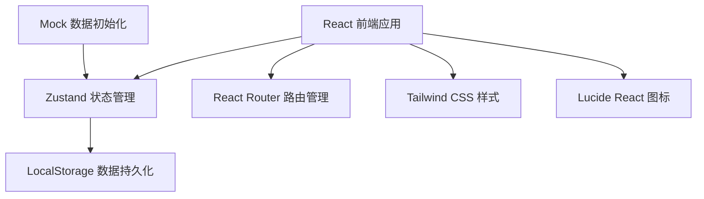
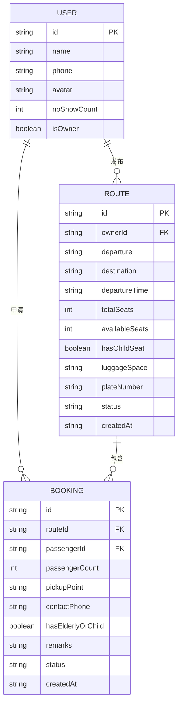

## 1. 架构设计

本项目为纯前端React应用，使用LocalStorage进行数据持久化，无需后端服务。



---

## 2. 技术描述

- **前端框架**：React@18 + TypeScript
- **构建工具**：Vite@5
- **状态管理**：Zustand@4
- **路由管理**：React Router DOM@6
- **样式方案**：Tailwind CSS@3
- **图标库**：Lucide React@0.294
- **数据存储**：LocalStorage（模拟后端）
- **初始化工具**：vite-init

---

## 3. 路由定义

| 路由路径 | 页面名称 | 说明 |
|----------|----------|------|
| / | 首页看板 | 展示今日路线、待确认、常用目的地、爽约名单、儿童座椅需求 |
| /routes | 路线列表 | 展示所有可申请路线，支持筛选 |
| /routes/publish | 发布路线 | 车主发布新路线表单 |
| /routes/:id | 路线详情 | 查看路线详情、乘客列表、操作按钮 |
| /orders | 订单管理 | 查看所有订单记录 |

---

## 4. 数据模型

### 4.1 ER图



### 4.2 类型定义

```typescript
// 用户类型
interface User {
  id: string;
  name: string;
  phone: string;
  avatar: string;
  noShowCount: number;
  isOwner: boolean;
}

// 路线类型
interface Route {
  id: string;
  ownerId: string;
  ownerName: string;
  departure: string;
  destination: string;
  departureTime: string;
  totalSeats: number;
  availableSeats: number;
  hasChildSeat: boolean;
  luggageSpace: 'small' | 'medium' | 'large';
  plateNumber: string;
  status: 'open' | 'full' | 'closed' | 'completed' | 'cancelled';
  createdAt: string;
}

// 订单/申请类型
interface Booking {
  id: string;
  routeId: string;
  passengerId: string;
  passengerName: string;
  passengerCount: number;
  pickupPoint: string;
  contactPhone: string;
  hasElderlyOrChild: boolean;
  remarks: string;
  status: 'pending' | 'confirmed' | 'rejected' | 'cancelled' | 'completed' | 'no_show';
  createdAt: string;
}

// 常用目的地统计
interface DestinationStat {
  name: string;
  count: number;
}

// 状态枚举
type RouteStatus = 'open' | 'full' | 'closed' | 'completed' | 'cancelled';
type BookingStatus = 'pending' | 'confirmed' | 'rejected' | 'cancelled' | 'completed' | 'no_show';
```

---

## 5. 状态管理设计

### 5.1 Zustand Store 结构

```typescript
interface CarpoolStore {
  // 数据
  routes: Route[];
  bookings: Booking[];
  currentUser: User;
  
  // 路线操作
  addRoute: (route: Omit<Route, 'id' | 'createdAt' | 'status'>) => void;
  updateRouteStatus: (routeId: string, status: RouteStatus) => void;
  getRouteById: (id: string) => Route | undefined;
  getTodayRoutes: () => Route[];
  getOpenRoutes: () => Route[];
  
  // 订单操作
  addBooking: (booking: Omit<Booking, 'id' | 'createdAt' | 'status'>) => void;
  updateBookingStatus: (bookingId: string, status: BookingStatus) => void;
  confirmAllPassengers: (routeId: string) => void;
  markNoShow: (bookingId: string) => void;
  getPendingBookings: () => Booking[];
  getBookingsByRouteId: (routeId: string) => Booking[];
  
  // 统计操作
  getDestinationStats: () => DestinationStat[];
  getNoShowList: () => User[];
  getChildSeatBookings: () => Booking[];
  
  // 工具方法
  checkAndUpdateFullStatus: (routeId: string) => void;
}
```

---

## 6. 项目结构

```
src/
├── components/           # 公共组件
│   ├── Layout/           # 布局组件
│   │   ├── Header.tsx
│   │   └── Navigation.tsx
│   ├── RouteCard.tsx     # 路线卡片
│   ├── BookingCard.tsx   # 订单卡片
│   ├── StatCard.tsx      # 统计卡片
│   ├── Modal.tsx         # 弹窗组件
│   └── StatusBadge.tsx   # 状态标签
├── pages/               # 页面组件
│   ├── Dashboard.tsx    # 首页看板
│   ├── RouteList.tsx    # 路线列表
│   ├── RoutePublish.tsx # 发布路线
│   ├── RouteDetail.tsx  # 路线详情
│   └── OrderList.tsx    # 订单管理
├── store/               # 状态管理
│   └── useCarpoolStore.ts
├── types/               # 类型定义
│   └── index.ts
├── utils/               # 工具函数
│   ├── mockData.ts      # Mock数据
│   ├── storage.ts       # LocalStorage操作
│   └── helpers.ts       # 通用工具
├── App.tsx              # 根组件
├── main.tsx             # 入口文件
└── index.css            # 全局样式
```

---

## 7. 核心业务逻辑

### 7.1 满座自动关闭逻辑
```typescript
const checkAndUpdateFullStatus = (routeId: string) => {
  const route = getRouteById(routeId);
  if (!route) return;
  
  const confirmedBookings = getBookingsByRouteId(routeId)
    .filter(b => b.status === 'confirmed');
  
  const totalPassengers = confirmedBookings.reduce(
    (sum, b) => sum + b.passengerCount, 0
  );
  
  const newAvailableSeats = route.totalSeats - totalPassengers;
  
  if (newAvailableSeats <= 0) {
    updateRouteStatus(routeId, 'full');
  }
  
  // 更新可用座位数
  routes = routes.map(r => 
    r.id === routeId 
      ? { ...r, availableSeats: Math.max(0, newAvailableSeats) }
      : r
  );
};
```

### 7.2 标记爽约逻辑
```typescript
const markNoShow = (bookingId: string) => {
  const booking = bookings.find(b => b.id === bookingId);
  if (!booking) return;
  
  // 更新订单状态
  updateBookingStatus(bookingId, 'no_show');
  
  // 更新用户爽约次数
  const passengerId = booking.passengerId;
  // 在实际应用中这里会更新用户表
  // mock环境下通过users store更新
};
```

---

## 8. Mock 数据规划

初始化数据包含：
- 5个用户（2个车主，3个乘客）
- 8条路线（含今日路线、历史路线）
- 12个订单申请（覆盖各种状态）
- 3个爽约记录用户
