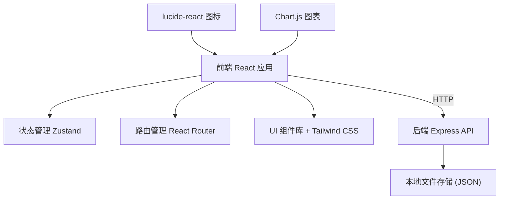
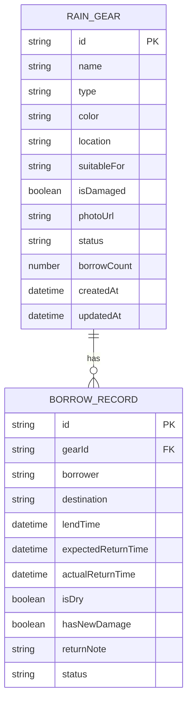

## 1. 架构设计



## 2. 技术描述

- **前端**：React@18 + TypeScript + Vite + tailwindcss@3
- **路由**：react-router-dom@6
- **状态管理**：zustand
- **图标**：lucide-react
- **图表**：chart.js + react-chartjs-2
- **后端**：Express@4 + TypeScript
- **数据存储**：本地 JSON 文件（模拟数据库）
- **HTTP 客户端**：axios
- **初始化工具**：vite-init

## 3. 目录结构

```
trae0601-1/
├── src/
│   ├── components/        # 可复用组件
│   │   ├── Layout.tsx         # 页面布局
│   │   ├── RainGearCard.tsx  # 雨具卡片
│   │   ├── StatusBadge.tsx    # 状态标签
│   │   ├── Modal.tsx         # 弹窗组件
│   │   └── Button.tsx        # 按钮组件
│   ├── pages/             # 页面组件
│   │   ├── Dashboard.tsx      # 首页仪表盘
│   │   ├── GearArchive.tsx    # 雨具档案页
│   │   ├── LendReturn.tsx   # 借出归还页
│   │   └── Statistics.tsx   # 统计分析页
│   ├── stores/            # 状态管理
│   │   └── useGearStore.ts  # 雨具状态
│   ├── types/             # 类型定义
│   │   └── index.ts
│   ├── utils/             # 工具函数
│   │   ├── date.ts           # 日期处理
│   │   └── storage.ts        # 本地存储
│   ├── api/               # API 调用
│   │   └── gear.ts
│   ├── App.tsx
│   ├── main.tsx
│   └── index.css
├── api/                 # 后端代码
│   ├── index.ts             # Express 服务器入口
│   ├── routes/            # 路由
│   ├── controllers/       # 控制器
│   └── data/            # 数据存储 (JSON文件)
│   └── types.ts           # 共享类型
├── shared/              # 前后端共享类型
│   └── index.ts
├── vite.config.ts
├── tailwind.config.js
└── package.json
```

## 4. 路由定义

| 路由 | 页面 | 功能 |
|-------|------|------|
| `/` | 首页仪表盘 | 状态概览、快捷操作、超时提醒 |
| `/archive` | 雨具档案 | 雨具列表、新增/编辑/删除 |
| `/lend-return` | 借出归还 | 借出登记、归还登记 |
| `/statistics` | 统计分析 | 借出排行、损坏清单、备用缺口 |

## 5. API 定义

### 5.1 雨具档案 API

| 方法 | 路径 | 功能 | 请求体 | 响应 |
|------|------|------|--------|------|
| GET | `/api/gears` | 获取所有雨具 | - | `RainGear[]` |
| GET | `/api/gears/:id` | 获取单个雨具 | - | `RainGear` |
| POST | `/api/gears` | 新增雨具 | `CreateGearDto` | `RainGear` |
| PUT | `/api/gears/:id` | 更新雨具 | `UpdateGearDto` | `RainGear` |
| DELETE | `/api/gears/:id` | 删除雨具 | - | `{ success: boolean }` |

### 5.2 借出归还 API

| 方法 | 路径 | 功能 | 请求体 | 响应 |
|------|------|------|--------|------|
| POST | `/api/gears/:id/lend` | 借出雨具 | `LendDto` | `BorrowRecord` |
| POST | `/api/gears/:id/return` | 归还雨具 | `ReturnDto` | `BorrowRecord` |
| GET | `/api/records` | 获取所有记录 | - | `BorrowRecord[]` |

### 5.3 统计 API

| 方法 | 路径 | 功能 | 响应 |
|------|------|------|
| GET | `/api/statistics/summary` | 获取统计概览 | `StatisticsSummary` |
| GET | `/api/statistics/overdue` | 获取超时未归 | `OverdueItem[]` |

### 5.4 TypeScript 类型定义

```typescript
// shared/index.ts

export type GearType = 'umbrella' | 'raincoat' | 'shoecover' | 'other';
export type GearStatus = 'in_cabinet' | 'lent' | 'drying' | 'damaged';

export interface RainGear {
  id: string;
  name: string;
  type: GearType;
  color: string;
  location: string;
  suitableFor: string;
  isDamaged: boolean;
  photoUrl: string;
  status: GearStatus;
  borrowCount: number;
  createdAt: string;
  updatedAt: string;
}

export interface BorrowRecord {
  id: string;
  gearId: string;
  borrower: string;
  destination: string;
  lendTime: string;
  expectedReturnTime: string;
  actualReturnTime?: string;
  isDry: boolean;
  hasNewDamage: boolean;
  returnNote?: string;
  status: 'active' | 'returned';
}

export interface CreateGearDto {
  name: string;
  type: GearType;
  color: string;
  location: string;
  suitableFor: string;
  isDamaged: boolean;
  photoUrl: string;
}

export interface UpdateGearDto extends Partial<CreateGearDto> {
  status?: GearStatus;
}

export interface LendDto {
  borrower: string;
  destination: string;
  expectedReturnTime: string;
}

export interface ReturnDto {
  isDry: boolean;
  hasNewDamage: boolean;
  returnNote?: string;
}

export interface StatisticsSummary {
  totalCount: number;
  inCabinetCount: number;
  lentCount: number;
  dryingCount: number;
  damagedCount: number;
  overdueCount: number;
  mostBorrowed: { gear: RainGear; count: number }[];
  spareGap: { needed: number; available: number };
}

export interface OverdueItem {
  record: BorrowRecord;
  gear: RainGear;
  overdueHours: number;
}
```

## 6. 数据模型

### 6.1 ER 图



### 6.2 Mock 初始数据

```typescript
// api/data/gears.json
[
  {
    "id": "1",
    "name": "大黑伞",
    "type": "umbrella",
    "color": "黑色",
    "location": "门口雨伞架-第一层",
    "suitableFor": "爸爸",
    "isDamaged": false,
    "photoUrl": "https://trae-api-cn.mchost.guru/api/ide/v1/text_to_image?prompt=black%20umbrella%20product%20photo%20on%20white%20background&image_size=square",
    "status": "in_cabinet",
    "borrowCount": 15,
    "createdAt": "2024-01-15T10:00:00Z",
    "updatedAt": "2024-06-10T14:30:00Z"
  },
  {
    "id": "2",
    "name": "粉色折叠伞",
    "type": "umbrella",
    "color": "粉色",
    "location": "门口雨伞架-第二层",
    "suitableFor": "妈妈",
    "isDamaged": false,
    "photoUrl": "https://trae-api-cn.mchost.guru/api/ide/v1/text_to_image?prompt=pink%20foldable%20umbrella%20product%20photo&image_size=square",
    "status": "lent",
    "borrowCount": 23,
    "createdAt": "2024-02-20T09:00:00Z",
    "updatedAt": "2024-06-12T08:00:00Z"
  },
  {
    "id": "3",
    "name": "儿童雨衣",
    "type": "raincoat",
    "color": "蓝色",
    "location": "玄关柜-雨具格",
    "suitableFor": "孩子",
    "isDamaged": true,
    "photoUrl": "https://trae-api-cn.mchost.guru/api/ide/v1/text_to_image?prompt=blue%20kids%20raincoat%20product%20photo&image_size=square",
    "status": "drying",
    "borrowCount": 8,
    "createdAt": "2024-03-10T11:00:00Z",
    "updatedAt": "2024-06-11T18:00:00Z"
  },
  {
    "id": "4",
    "name": "透明鞋套",
    "type": "shoecover",
    "color": "透明",
    "location": "门口鞋架",
    "suitableFor": "全家",
    "isDamaged": false,
    "photoUrl": "https://trae-api-cn.mchost.guru/api/ide/v1/text_to_image?prompt=transparent%20shoe%20cover%20product%20photo&image_size=square",
    "status": "in_cabinet",
    "borrowCount": 5,
    "createdAt": "2024-04-05T15:00:00Z",
    "updatedAt": "2024-06-08T16:00:00Z"
  },
  {
    "id": "5",
    "name": "长柄雨伞",
    "type": "umbrella",
    "color": "墨绿色",
    "location": "门口雨伞架-第三层",
    "suitableFor": "爷爷",
    "isDamaged": false,
    "photoUrl": "https://trae-api-cn.mchost.guru/api/ide/v1/text_to_image?prompt=dark%20green%20long%20handle%20umbrella%20product%20photo&image_size=square",
    "status": "in_cabinet",
    "borrowCount": 12,
    "createdAt": "2024-01-20T10:00:00Z",
    "updatedAt": "2024-06-09T10:00:00Z"
  },
  {
    "id": "6",
    "name": "成人雨衣",
    "type": "raincoat",
    "color": "黄色",
    "color": "黄色",
    "location": "玄关柜-雨具格",
    "suitableFor": "爸爸",
    "isDamaged": false,
    "photoUrl": "https://trae-api-cn.mchost.guru/api/ide/v1/text_to_image?prompt=yellow%20adult%20raincoat%20product%20photo&image_size=square",
    "status": "in_cabinet",
    "borrowCount": 3,
    "createdAt": "2024-05-10T10:00:00Z",
    "updatedAt": "2024-06-01T12:00:00Z"
  }
]
```

```typescript
// api/data/records.json
[
  {
    "id": "r1",
    "gearId": "2",
    "borrower": "妈妈",
    "destination": "公司",
    "lendTime": "2024-06-12T08:00:00Z",
    "expectedReturnTime": "2024-06-12T19:00:00Z",
    "status": "active",
    "isDry": false,
    "hasNewDamage": false
  },
  {
    "id": "r2",
    "gearId": "3",
    "borrower": "孩子",
    "destination": "学校",
    "lendTime": "2024-06-11T07:30:00Z",
    "expectedReturnTime": "2024-06-11T17:00:00Z",
    "actualReturnTime": "2024-06-11T18:00:00Z",
    "isDry": false,
    "hasNewDamage": true,
    "returnNote": "袖口磨破了一点",
    "status": "returned"
  },
  {
    "id": "r3",
    "gearId": "1",
    "borrower": "爸爸",
    "destination": "超市",
    "lendTime": "2024-06-10T14:30:00Z",
    "expectedReturnTime": "2024-06-10T17:00:00Z",
    "actualReturnTime": "2024-06-10T16:50:00Z",
    "isDry": true,
    "hasNewDamage": false,
    "status": "returned"
  }
]
```

## 7. 业务逻辑关键点

### 7.1 超时判断逻辑

```typescript
// src/utils/date.ts
export const isOverdue = (lendTime: string, expectedReturnTime: string): boolean => {
  const now = new Date();
  const lend = new Date(lendTime);
  const diffHours = (now.getTime() - lend.getTime()) / (1000 * 60 * 60);
  return diffHours > 24;
};

export const getOverdueHours = (lendTime: string): number => {
  const now = new Date();
  const lend = new Date(lendTime);
  return Math.floor((now.getTime() - lend.getTime()) / (1000 * 60 * 60));
};
```

### 7.2 湿雨具处理

归还时 `isDry = false` 的情况下，雨具状态必须设置为 `drying`，禁止设置为 `in_cabinet`。

### 7.3 备用缺口计算

```typescript
// 算法：取最近30天内，记录中同一时间点最大借出数量 - 当前在柜数量 = 缺口
// 备用建议 = max(0, 历史峰值借出数 - 当前在柜数)
```
