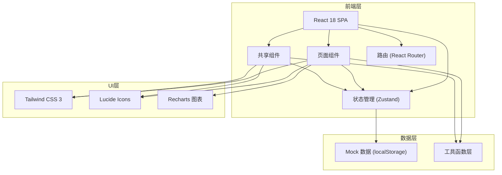
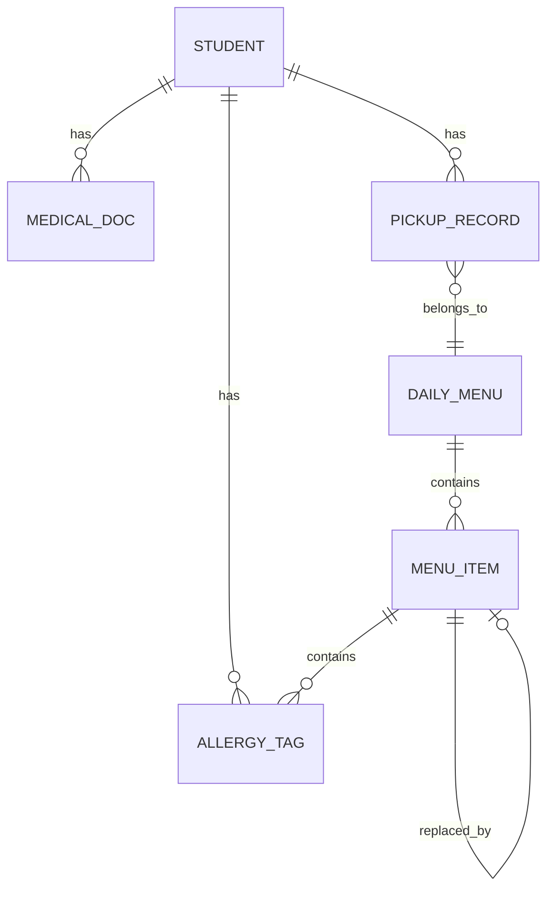

## 1. 架构设计



## 2. 技术说明

- **前端框架**：React@18 + TypeScript@5
- **构建工具**：Vite@5
- **样式方案**：Tailwind CSS@3
- **状态管理**：Zustand@4
- **路由管理**：react-router-dom@6
- **图表库**：Recharts@2
- **图标库**：lucide-react@latest
- **数据持久化**：localStorage + Mock数据
- **初始化模板**：react-ts (纯前端项目)

## 3. 路由定义

| 路由路径 | 页面组件 | 页面用途 |
|----------|----------|----------|
| `/` | Dashboard | 工作台首页，数据概览和快捷入口 |
| `/students` | StudentList | 学生过敏档案列表 |
| `/students/new` | StudentForm | 新增学生档案 |
| `/students/:id` | StudentDetail | 学生档案详情/编辑 |
| `/menu` | MenuManage | 每日菜单管理 |
| `/kitchen` | KitchenPrep | 后厨备餐中心 |
| `/pickup` | PickupRegister | 领取登记与扫码 |
| `/statistics` | Statistics | 数据统计与报表 |

## 4. 数据模型

### 4.1 ER 图



### 4.2 核心数据类型定义

```typescript
// 过敏源类型
type AllergyType = 'nuts' | 'dairy' | 'seafood' | 'eggs' | 'wheat' | 'soy' | 'other';

interface AllergyTag {
  id: string;
  type: AllergyType;
  name: string;
  severity: 'mild' | 'moderate' | 'severe';
  icon: string;
}

// 学生档案
interface Student {
  id: string;
  name: string;
  className: string;
  grade: string;
  studentNo: string;
  photo?: string;
  allergies: AllergyTag[];
  guardianName: string;
  guardianPhone: string;
  guardianConfirmed: boolean;
  medicalCertificateUrl?: string;
  notes?: string;
  createdAt: string;
  updatedAt: string;
}

// 菜品
interface MenuItem {
  id: string;
  name: string;
  category: 'staple' | 'main' | 'side' | 'soup' | 'fruit';
  ingredients: string[];
  allergies: AllergyType[];
  replacementId?: string;
}

// 每日菜单
interface DailyMenu {
  date: string;
  breakfast: MenuItem[];
  lunch: MenuItem[];
  dinner: MenuItem[];
}

// 过敏餐备餐项
interface PrepItem {
  id: string;
  date: string;
  mealType: 'breakfast' | 'lunch' | 'dinner';
  studentId: string;
  studentName: string;
  className: string;
  originalDish: string;
  replacementDish: string;
  allergies: AllergyType[];
  qrCode: string;
  status: 'pending' | 'preparing' | 'ready' | 'picked';
}

// 领取记录
type PickupStatus = 'picked' | 'not_picked' | 'wrong_pick' | 'leave';

interface PickupRecord {
  id: string;
  date: string;
  mealType: 'breakfast' | 'lunch' | 'dinner';
  studentId: string;
  prepItemId: string;
  status: PickupStatus;
  pickedBy?: 'student' | 'teacher';
  pickedByName?: string;
  pickedAt?: string;
  notes?: string;
}

// 统计数据
interface WeeklyStats {
  weekStart: string;
  weekEnd: string;
  totalReplacements: number;
  notPickedCount: number;
  wrongPickCount: number;
  allergyRanking: { type: AllergyType; count: number }[];
  notPickedList: { studentId: string; studentName: string; className: string; count: number }[];
}
```

## 5. 目录结构

```
src/
├── components/          # 共享组件
│   ├── layout/         # 布局组件（Sidebar, Header）
│   ├── ui/             # 基础UI组件（Button, Card, Badge, Table）
│   ├── allergy/        # 过敏源相关组件（AllergyBadge, AllergyWarning）
│   └── common/         # 其他通用组件（EmptyState, Loading）
├── pages/              # 页面组件
│   ├── Dashboard.tsx
│   ├── StudentList.tsx
│   ├── StudentForm.tsx
│   ├── StudentDetail.tsx
│   ├── MenuManage.tsx
│   ├── KitchenPrep.tsx
│   ├── PickupRegister.tsx
│   └── Statistics.tsx
├── stores/             # Zustand状态管理
│   ├── studentStore.ts
│   ├── menuStore.ts
│   ├── prepStore.ts
│   └── pickupStore.ts
├── types/              # TypeScript类型定义
│   └── index.ts
├── utils/              # 工具函数
│   ├── mockData.ts
│   ├── qrcode.ts
│   └── dateUtils.ts
├── App.tsx
├── main.tsx
└── index.css
```

## 6. 状态管理设计

### 6.1 Student Store
- `students: Student[]` - 学生档案列表
- `currentStudent: Student | null` - 当前编辑的学生
- `addStudent()` - 新增学生
- `updateStudent()` - 更新学生
- `deleteStudent()` - 删除学生
- `filterByAllergy()` - 按过敏源筛选
- `filterByClass()` - 按班级筛选

### 6.2 Menu Store
- `dailyMenus: DailyMenu[]` - 每日菜单数据
- `currentMenu: DailyMenu | null` - 当前日期菜单
- `menuItems: MenuItem[]` - 菜品库
- `getMenuByDate()` - 获取指定日期菜单
- `calculateReplacements()` - 计算过敏餐替换需求

### 6.3 Prep Store
- `prepItems: PrepItem[]` - 备餐清单
- `todayPrepItems: PrepItem[]` - 今日备餐
- `generateLabels()` - 生成餐品标签
- `updatePrepStatus()` - 更新备餐状态

### 6.4 Pickup Store
- `pickupRecords: PickupRecord[]` - 领取记录
- `todayRecords: PickupRecord[]` - 今日领取记录
- `scanQrCode()` - 扫码确认领取
- `recordException()` - 记录异常
- `getWeeklyStats()` - 获取周统计数据
