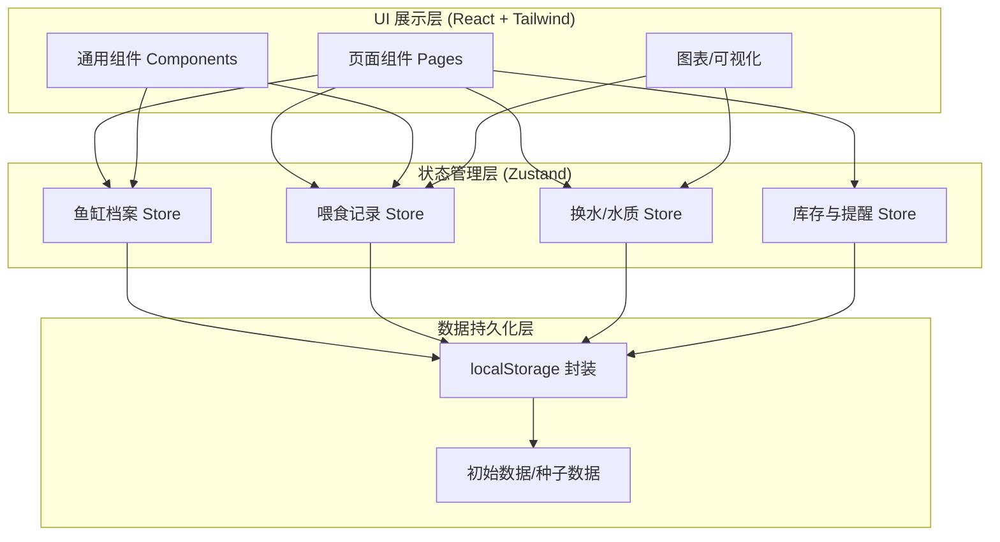
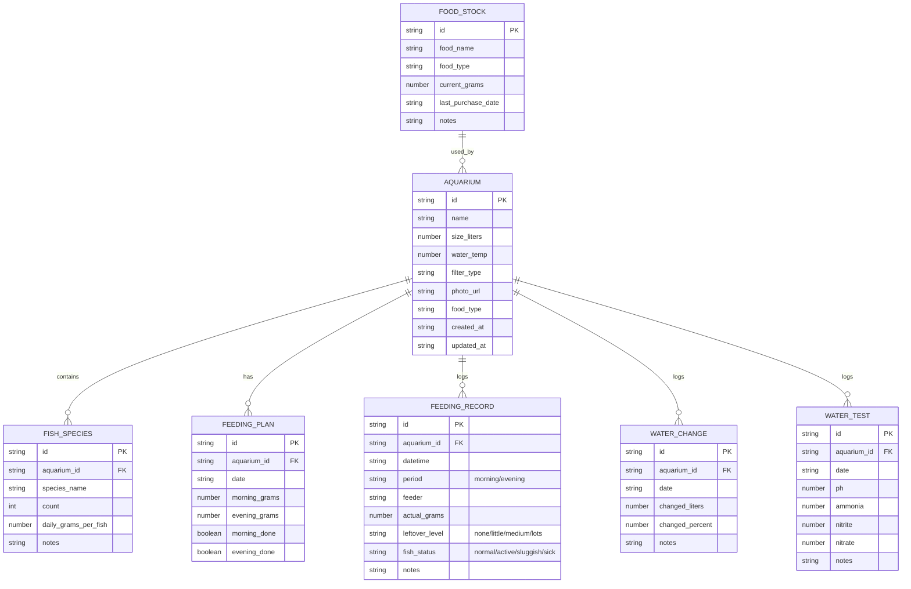

## 1. 架构设计

纯前端单页应用，使用浏览器 localStorage 持久化存储，无需后端服务。架构分为三层：UI 展示层、状态管理层、数据持久化层。



## 2. 技术描述

- **前端框架**：React 18 + TypeScript + Vite
- **样式方案**：TailwindCSS 3 + CSS 变量主题系统
- **状态管理**：Zustand（轻量级，支持 devtools + persist 中间件）
- **路由**：react-router-dom v6
- **图标库**：lucide-react
- **图表**：recharts（React 图表库，支持面积图/柱状图/饼图）
- **日期处理**：date-fns（轻量级日期工具库）
- **后端/数据库**：无，纯前端 localStorage 持久化
- **初始化方式**：pnpm create vite-init@latest . --template react-ts --force

## 3. 路由定义

| Route | 页面组件 | 用途 |
|-------|----------|------|
| `/` | Dashboard | 控制面板首页（今日概览+快捷操作+预警） |
| `/aquariums` | AquariumList | 鱼缸档案列表 |
| `/aquariums/:id` | AquariumDetail | 鱼缸档案详情/编辑 |
| `/aquariums/new` | AquariumForm | 新增鱼缸档案 |
| `/feeding` | FeedingRecord | 喂食记录（日历+计划+录入） |
| `/water` | WaterRecord | 换水与水质检测记录 |
| `/statistics` | Statistics | 数据统计与库存预警 |

## 4. 数据模型（TypeScript 类型 + localStorage 结构）

### 4.1 ER 关系图



### 4.2 localStorage Key 设计

| Key | 存储内容 |
|-----|----------|
| `aquarium_data` | 鱼缸档案数组 |
| `feeding_plan_data` | 喂食计划数组 |
| `feeding_record_data` | 喂食记录数组 |
| `water_change_data` | 换水记录数组 |
| `water_test_data` | 水质检测数组 |
| `food_stock_data` | 鱼粮库存数组 |

### 4.3 核心工具函数

- `generateDailyPlan(aquarium)`：根据鱼种总建议量 + 早晚比例（默认 6:4）生成当日计划
- `checkDuplicateFeeding(aquariumId, period, date)`：检测重复喂食
- `checkMissedFeeding(plan)`：检测漏喂（超时阈值可配置）
- `checkContinuousLeftover(aquariumId, days=3)`：检测连续 N 天剩食
- `calcWeeklyFoodUsage(aquariumId, startOfWeek)`：计算周用粮量
- `calcStockDaysRemaining(stockId, avgDailyUsage)`：计算库存剩余天数
- `findMostMissedTimeframes(records)`：统计最易漏喂时段

## 5. 组件目录结构

```
src/
├── components/
│   ├── aquarium/
│   │   ├── AquariumCard.tsx
│   │   ├── AquariumForm.tsx
│   │   └── FishSpeciesList.tsx
│   ├── feeding/
│   │   ├── FeedingModal.tsx
│   │   ├── FeedingCalendar.tsx
│   │   ├── FeedingPlanCard.tsx
│   │   └── LeftoverBadge.tsx
│   ├── water/
│   │   ├── WaterChangeForm.tsx
│   │   └── WaterTestForm.tsx
│   ├── statistics/
│   │   ├── FoodUsageChart.tsx
│   │   ├── AppetiteAnalysis.tsx
│   │   └── StockWarning.tsx
│   ├── common/
│   │   ├── AlertBanner.tsx
│   │   ├── QuickActionButton.tsx
│   │   └── AppLayout.tsx
│   └── App.tsx
├── pages/
│   ├── Dashboard.tsx
│   ├── AquariumList.tsx
│   ├── AquariumDetail.tsx
│   ├── FeedingRecord.tsx
│   ├── WaterRecord.tsx
│   └── Statistics.tsx
├── store/
│   ├── useAquariumStore.ts
│   ├── useFeedingStore.ts
│   ├── useWaterStore.ts
│   └── useStockStore.ts
├── utils/
│   ├── planGenerator.ts
│   ├── alertChecker.ts
│   ├── statistics.ts
│   ├── formatters.ts
│   └── storage.ts
├── types/
│   └── index.ts
├── data/
│   └── seedData.ts
└── index.css
```
