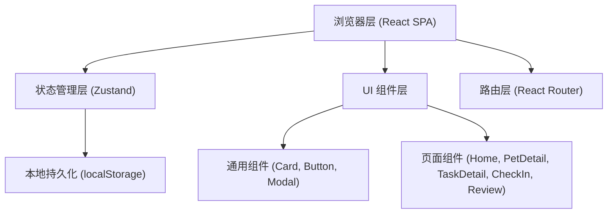
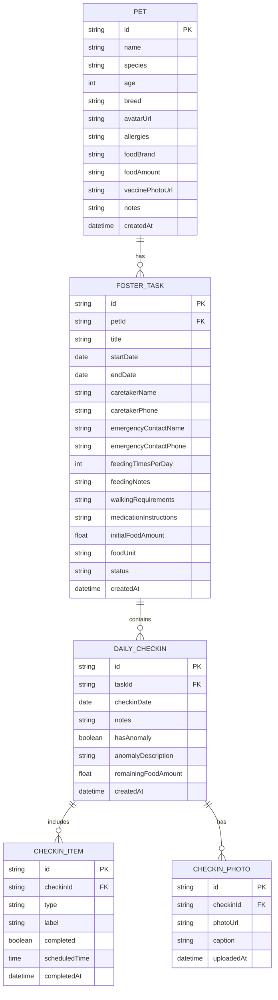

## 1. 架构设计



## 2. 技术描述

- **前端框架**：React@18 + TypeScript
- **构建工具**：Vite@5
- **样式方案**：TailwindCSS@3
- **状态管理**：Zustand（带 localStorage 持久化）
- **路由方案**：React Router DOM@6
- **图标库**：lucide-react
- **数据存储**：前端本地存储（localStorage），无需后端服务
- **初始化方式**：使用 react-ts 模板（纯前端项目）

## 3. 路由定义

| 路由 | 用途 |
|-------|---------|
| / | 首页，任务列表 + 宠物列表 |
| /pets | 宠物列表页 |
| /pets/new | 新增宠物资料 |
| /pets/:id | 宠物详情页 |
| /pets/:id/edit | 编辑宠物资料 |
| /tasks | 寄养任务列表 |
| /tasks/new | 新建寄养任务 |
| /tasks/:id | 任务详情 + 打卡入口 |
| /tasks/:id/checkin | 每日打卡页 |
| /tasks/:id/review | 交接回顾页 |

## 4. 数据模型

### 4.1 数据模型定义（ER图）



### 4.2 状态管理 Store 结构

```typescript
interface PetStore {
  pets: Pet[];
  currentPet: Pet | null;
  addPet: (pet: Omit<Pet, 'id' | 'createdAt'>) => void;
  updatePet: (id: string, pet: Partial<Pet>) => void;
  deletePet: (id: string) => void;
  getPetById: (id: string) => Pet | undefined;
}

interface TaskStore {
  tasks: FosterTask[];
  currentTask: FosterTask | null;
  addTask: (task: Omit<FosterTask, 'id' | 'createdAt' | 'status'>) => void;
  updateTask: (id: string, task: Partial<FosterTask>) => void;
  getTaskById: (id: string) => FosterTask | undefined;
  getTasksByPetId: (petId: string) => FosterTask[];
  getTaskStatus: (task: FosterTask) => 'pending' | 'active' | 'completed';
}

interface CheckInStore {
  checkins: DailyCheckIn[];
  checkinItems: CheckInItem[];
  checkinPhotos: CheckInPhoto[];
  addCheckIn: (checkin: Omit<DailyCheckIn, 'id' | 'createdAt'>) => DailyCheckIn;
  addCheckInItem: (item: Omit<CheckInItem, 'id'>) => void;
  updateCheckInItem: (id: string, data: Partial<CheckInItem>) => void;
  addPhoto: (photo: Omit<CheckInPhoto, 'id' | 'uploadedAt'>) => void;
  getCheckInsByTaskId: (taskId: string) => DailyCheckIn[];
  getTodayCheckIn: (taskId: string) => DailyCheckIn | null;
  getMissedItems: (taskId: string, date: string) => CheckInItem[];
}
```
