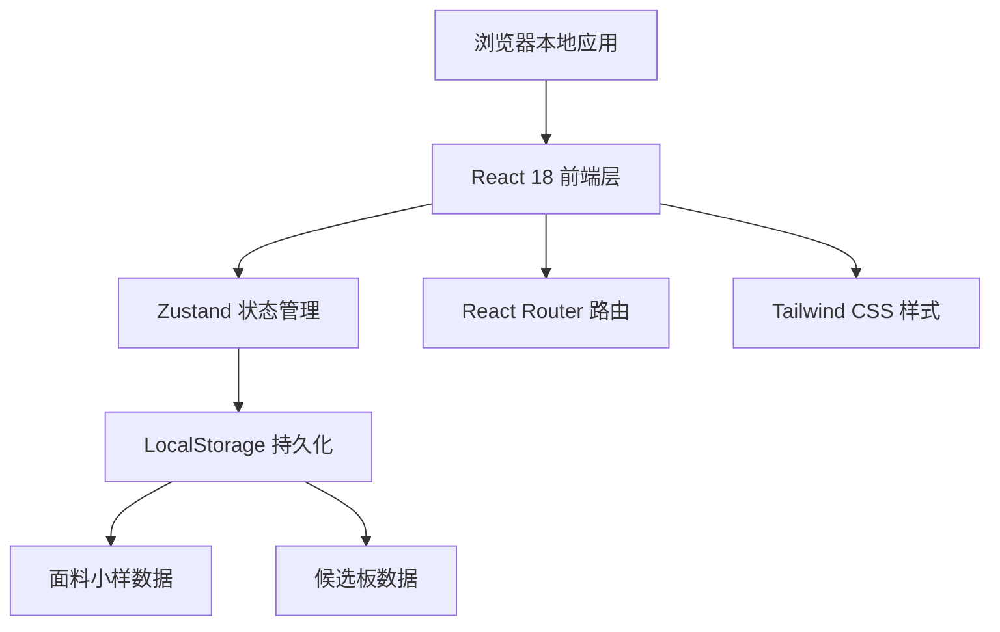
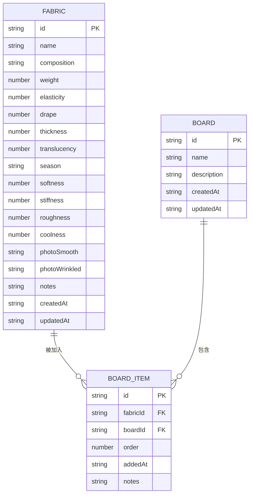

## 1. 架构设计



## 2. 技术选型说明

- **前端框架**：React@18 + TypeScript@5
- **构建工具**：Vite@5
- **样式方案**：TailwindCSS@3
- **状态管理**：Zustand@4
- **路由管理**：React Router DOM@6
- **图标库**：Lucide React
- **数据持久化**：LocalStorage（纯前端，无需后端）
- **初始化模板**：react-ts

## 3. 路由定义

| 路由 | 页面 | 功能 |
|------|------|------|
| `/` | 面料小样列表页 | 展示所有面料小样、智能筛选、搜索 |
| `/fabric/:id` | 面料详情页 | 查看完整属性、触感评分、照片对比 |
| `/fabric/new` | 新增/编辑面料页 | 录入新面料或编辑现有面料信息 |
| `/boards` | 候选板列表页 | 展示所有款式候选板 |
| `/board/:id` | 候选板详情页 | 查看某款式下的所有候选面料对比 |

## 4. 数据模型

### 4.1 ER 图



### 4.2 TypeScript 类型定义

```typescript
interface Fabric {
  id: string;
  name: string;
  composition: string;
  weight: number;
  elasticity: number;
  drape: number;
  thickness: number;
  translucency: number;
  season: 'spring' | 'summer' | 'autumn' | 'winter' | 'all';
  softness: number;
  stiffness: number;
  roughness: number;
  coolness: number;
  photoSmooth: string;
  photoWrinkled: string;
  notes?: string;
  createdAt: string;
  updatedAt: string;
}

interface Board {
  id: string;
  name: string;
  description?: string;
  createdAt: string;
  updatedAt: string;
}

interface BoardItem {
  id: string;
  fabricId: string;
  boardId: string;
  order: number;
  addedAt: string;
  notes?: string;
}

interface FilterPreset {
  id: string;
  name: string;
  description: string;
  filters: Partial<FilterCriteria>;
}

interface FilterCriteria {
  season?: string[];
  weightMin?: number;
  weightMax?: number;
  elasticityMin?: number;
  elasticityMax?: number;
  drapeMin?: number;
  drapeMax?: number;
  thicknessMin?: number;
  thicknessMax?: number;
  translucencyMin?: number;
  translucencyMax?: number;
  softnessMin?: number;
  softnessMax?: number;
  stiffnessMin?: number;
  stiffnessMax?: number;
  roughnessMin?: number;
  roughnessMax?: number;
  coolnessMin?: number;
  coolnessMax?: number;
  search?: string;
}
```

## 5. 目录结构

```
src/
├── components/
│   ├── FabricCard.tsx          # 面料卡片组件
│   ├── FabricForm.tsx          # 面料表单组件
│   ├── FilterPanel.tsx         # 筛选面板组件
│   ├── TouchScoreSlider.tsx    # 触感评分滑杆组件
│   ├── PhotoCompare.tsx        # 照片对比组件
│   ├── BoardCard.tsx           # 候选板卡片组件
│   ├── PresetFilterTags.tsx    # 预设筛选标签组件
│   ├── AddToBoardModal.tsx     # 加入候选板弹窗
│   └── Header.tsx              # 顶部导航
├── pages/
│   ├── FabricList.tsx          # 面料列表页
│   ├── FabricDetail.tsx        # 面料详情页
│   ├── FabricEditor.tsx        # 面料编辑页
│   ├── BoardList.tsx           # 候选板列表页
│   └── BoardDetail.tsx         # 候选板详情页
├── store/
│   ├── fabricStore.ts          # 面料数据状态管理
│   ├── boardStore.ts           # 候选板状态管理
│   └── filterStore.ts          # 筛选状态管理
├── types/
│   └── index.ts                # TypeScript 类型定义
├── utils/
│   ├── storage.ts              # LocalStorage 操作工具
│   ├── filterEngine.ts         # 筛选逻辑引擎
│   ├── presetFilters.ts        # 预设筛选方案
│   └── mockData.ts             # 示例数据
├── App.tsx
├── main.tsx
└── index.css
```

## 6. 核心功能实现思路

### 6.1 筛选引擎
- 使用 `filterEngine.ts` 实现多条件组合筛选
- 支持数值范围筛选（min/max）和多选项筛选
- 预设筛选方案通过 `presetFilters.ts` 定义，点击即可自动填充筛选条件

### 6.2 图片存储
- 图片使用 Base64 编码存储在 LocalStorage 中
- 上传时自动压缩图片尺寸以控制存储大小
- 提供揉皱前后两张照片的对比展示

### 6.3 状态管理
- `fabricStore`：管理面料小样的 CRUD 操作
- `boardStore`：管理候选板和候选面料的关联
- `filterStore`：管理当前筛选条件，实时联动列表更新

### 6.4 Mock 数据
- 首次加载时自动注入 8-10 条示例面料数据
- 示例数据覆盖不同材质、季节和触感特征，便于演示筛选功能
