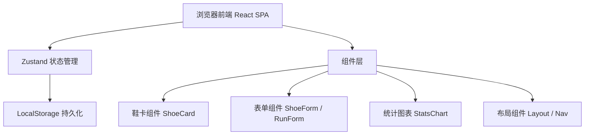
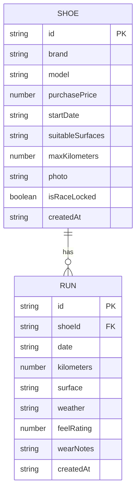

## 1. 架构设计



## 2. 技术说明
- **前端**：React@18 + TypeScript + Vite
- **样式**：TailwindCSS@3
- **状态管理**：Zustand
- **路由**：React Router DOM
- **图表**：Recharts
- **图标**：Lucide React
- **数据存储**：浏览器 LocalStorage（纯前端，无后端）
- **初始化工具**：vite-init 使用 react-ts 模板

## 3. 路由定义
| 路由 | 用途 |
|------|------|
| / | 鞋柜首页，展示所有跑鞋卡片 |
| /shoe/new | 新增跑鞋档案 |
| /shoe/:id | 跑鞋详情 + 编辑 + 跑步记录列表 |
| /run/new | 新增跑步记录（可选鞋ID参数预选） |
| /stats | 复盘统计页 |

## 4. 数据模型

### 4.1 数据模型定义



### 4.2 TypeScript 类型定义

```typescript
type Surface = 'asphalt' | 'concrete' | 'track' | 'trail' | 'treadmill';
type Weather = 'sunny' | 'cloudy' | 'rainy' | 'cold' | 'hot';

interface Shoe {
  id: string;
  brand: string;
  model: string;
  purchasePrice: number;
  startDate: string;
  suitableSurfaces: Surface[];
  maxKilometers: number;
  photo?: string;
  isRaceLocked: boolean;
  createdAt: string;
}

interface Run {
  id: string;
  shoeId: string;
  date: string;
  kilometers: number;
  surface: Surface;
  weather: Weather;
  feelRating: number; // 1-5
  wearNotes?: string;
  createdAt: string;
}
```

### 4.3 计算属性（非存储）
- Shoe.totalKilometers: 该鞋所有跑步记录公里数之和
- Shoe.remainingKilometers: maxKilometers - totalKilometers
- Shoe.lifePercentage: (totalKilometers / maxKilometers) * 100
- Shoe.costPerKilometer: purchasePrice / totalKilometers
- stats.totalDistance: 所有鞋总里程
- stats.totalCost: 所有鞋买入价总和
- stats.avgCostPerKm: totalCost / totalDistance
- stats.surfaceComparison: { track: 磨损系数, concrete: 磨损系数, ... }

