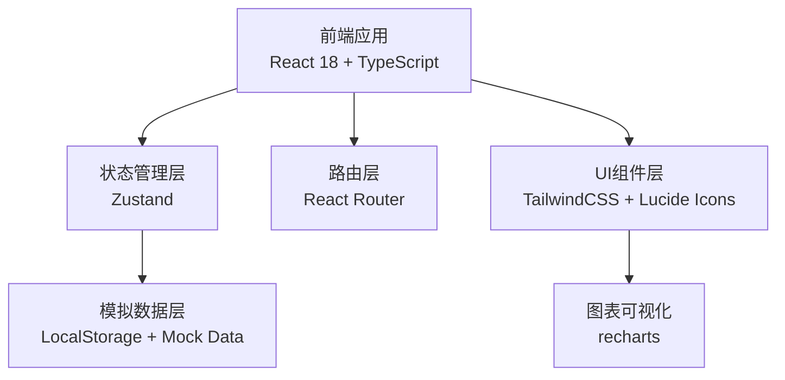
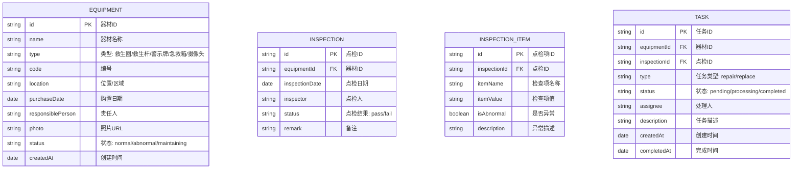

## 1. 架构设计



## 2. 技术描述

- **前端框架**：React 18 + TypeScript + Vite
- **状态管理**：Zustand（轻量级状态管理）
- **路由**：React Router DOM v6
- **样式方案**：TailwindCSS 3
- **图标库**：lucide-react
- **图表库**：recharts（数据可视化）
- **数据持久化**：LocalStorage（模拟后端存储）
- **初始化工具**：vite-init

## 3. 路由定义

| 路由 | 页面用途 |
|-------|---------|
| /dashboard | 数据看板首页 |
| /equipment | 器材档案列表 |
| /equipment/:id | 器材详情/编辑 |
| /inspection | 点检任务列表 |
| /inspection/:id | 执行点检表单 |
| /tasks | 维修/补采任务中心 |
| /tasks/:id | 任务详情页 |

## 4. 数据模型

### 4.1 数据模型定义



### 4.2 核心数据类型定义

```typescript
// 器材类型枚举
type EquipmentType = 'lifebuoy' | 'rescue_pole' | 'warning_sign' | 'first_aid_kit' | 'camera';

// 器材状态
type EquipmentStatus = 'normal' | 'abnormal' | 'maintaining';

// 点检检查项定义（按器材类型）
interface LifebuoyCheck {
  agingCondition: 'good' | 'minor' | 'severe'; // 老化情况
  ropeLength: number; // 绳索长度(米)
  ropeCondition: 'good' | 'damaged' | 'missing'; // 绳索状态
}

interface RescuePoleCheck {
  crackCondition: 'none' | 'minor' | 'severe'; // 裂纹情况
  lengthOk: boolean; // 长度是否达标
  hookCondition: 'good' | 'damaged' | 'missing'; // 挂钩状态
}

interface WarningSignCheck {
  clarity: 'clear' | 'faded' | 'unreadable'; // 清晰度
  fixation: 'firm' | 'loose' | 'missing'; // 固定状态
}

interface FirstAidKitCheck {
  completeness: 'complete' | 'partial' | 'empty'; // 物品完整性
  expiryOk: boolean; // 是否过期
  sealCondition: 'good' | 'damaged'; // 封条状态
}

interface CameraCheck {
  viewBlocked: boolean; // 视线是否遮挡
  working: boolean; // 是否正常工作
  angleOk: boolean; // 角度是否合适
}
```

## 5. 项目目录结构

```
src/
├── components/           # 通用组件
│   ├── Layout/          # 布局组件
│   ├── StatusBadge/     # 状态标签
│   ├── StatCard/        # 统计卡片
│   └── Modal/           # 弹窗组件
├── pages/               # 页面组件
│   ├── Dashboard/       # 数据看板
│   ├── Equipment/       # 器材档案
│   ├── Inspection/      # 点检管理
│   └── Tasks/           # 任务中心
├── store/               # Zustand状态
│   ├── equipmentStore.ts
│   ├── inspectionStore.ts
│   └── taskStore.ts
├── types/               # TypeScript类型定义
│   └── index.ts
├── data/                # 模拟数据
│   └── mockData.ts
├── utils/               # 工具函数
│   ├── dateUtils.ts
│   └── statusUtils.ts
├── App.tsx
├── main.tsx
└── index.css
```
