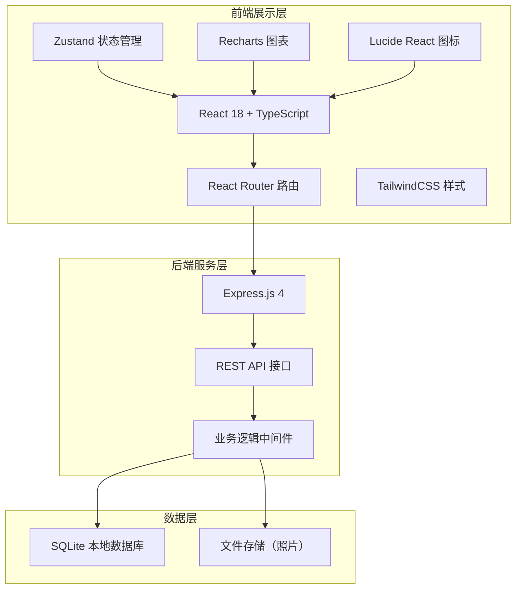
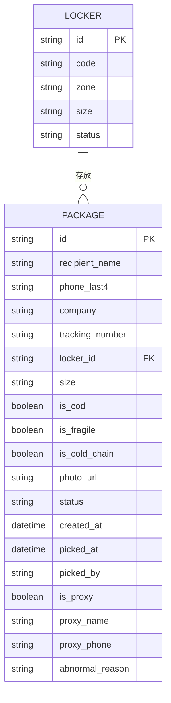

## 1. 架构设计



## 2. 技术描述

- **前端**：React@18 + TypeScript + TailwindCSS@3 + Vite + Zustand + Recharts + Lucide React
- **后端**：Express@4 + TypeScript + better-sqlite3
- **数据库**：SQLite（本地存储，无需额外部署）
- **初始化工具**：vite-init（react-express-ts 模板）

## 3. 路由定义

### 前端路由

| 路由 | 页面 | 用途 |
|------|------|------|
| / | Dashboard | 首页：待取包裹、柜格状态、超期提醒 |
| /register | PackageRegister | 包裹登记页面 |
| /pickup | Pickup | 取件操作页面 |
| /stats | Statistics | 数据统计页面 |
| /lockers | LockerManager | 柜格管理页面 |

### 后端 API 路由

| 方法 | 路由 | 用途 |
|------|------|------|
| GET | /api/packages | 获取包裹列表（支持筛选、分页） |
| GET | /api/packages/:id | 获取单个包裹详情 |
| POST | /api/packages | 登记新包裹 |
| PUT | /api/packages/:id | 更新包裹信息 |
| PUT | /api/packages/:id/pickup | 确认取件（含代领信息） |
| PUT | /api/packages/:id/abnormal | 记录异常取件 |
| GET | /api/packages/overdue | 获取超期包裹列表 |
| GET | /api/lockers | 获取所有柜格状态 |
| GET | /api/lockers/available | 获取空闲柜格 |
| PUT | /api/lockers/:id | 更新柜格状态 |
| GET | /api/stats/summary | 获取统计总览数据 |
| GET | /api/stats/by-company | 按快递公司统计 |
| GET | /api/stats/abnormal | 获取异常取件记录 |
| POST | /api/upload | 上传包裹照片 |

## 4. API 类型定义

```typescript
// 包裹大小
type PackageSize = 'S' | 'M' | 'L' | 'XL';

// 包裹状态
type PackageStatus = 'waiting' | 'picked' | 'abnormal';

// 快递公司
type CourierCompany =
  | '顺丰' | '京东' | '圆通' | '中通' | '申通' | '韵达'
  | '极兔' | '德邦' | '邮政' | '其他';

// 柜格状态
type LockerStatus = 'free' | 'occupied' | 'disabled';

interface Package {
  id: string;
  recipientName: string;
  phoneLast4: string;
  company: CourierCompany;
  trackingNumber: string;
  lockerId: string;
  size: PackageSize;
  isCod: boolean;       // 到付
  isFragile: boolean;   // 易碎
  isColdChain: boolean; // 冷链
  photoUrl?: string;
  status: PackageStatus;
  createdAt: string;
  pickedAt?: string;
  pickedBy?: string;        // 取件人
  isProxy?: boolean;        // 是否代领
  proxyName?: string;       // 代领人姓名
  proxyPhone?: string;      // 代领人手机
  abnormalReason?: string;  // 异常原因
}

interface Locker {
  id: string;
  code: string;    // 柜格编号如 A-01
  zone: string;    // 区域如 A/B/C
  size: PackageSize;
  status: LockerStatus;
}

interface StatsSummary {
  totalWaiting: number;
  totalOverdue: number;
  lockerOccupancy: number;  // 百分比
  totalToday: number;
  pickedToday: number;
}
```

## 5. 数据模型

### 6.1 ER 图



### 6.2 DDL

```sql
-- 柜格表
CREATE TABLE IF NOT EXISTS lockers (
  id TEXT PRIMARY KEY,
  code TEXT NOT NULL UNIQUE,
  zone TEXT NOT NULL,
  size TEXT NOT NULL CHECK(size IN ('S', 'M', 'L', 'XL')),
  status TEXT NOT NULL DEFAULT 'free' CHECK(status IN ('free', 'occupied', 'disabled'))
);

-- 包裹表
CREATE TABLE IF NOT EXISTS packages (
  id TEXT PRIMARY KEY,
  recipient_name TEXT NOT NULL,
  phone_last4 TEXT NOT NULL,
  company TEXT NOT NULL,
  tracking_number TEXT NOT NULL,
  locker_id TEXT NOT NULL,
  size TEXT NOT NULL CHECK(size IN ('S', 'M', 'L', 'XL')),
  is_cod INTEGER NOT NULL DEFAULT 0,
  is_fragile INTEGER NOT NULL DEFAULT 0,
  is_cold_chain INTEGER NOT NULL DEFAULT 0,
  photo_url TEXT,
  status TEXT NOT NULL DEFAULT 'waiting' CHECK(status IN ('waiting', 'picked', 'abnormal')),
  created_at TEXT NOT NULL,
  picked_at TEXT,
  picked_by TEXT,
  is_proxy INTEGER DEFAULT 0,
  proxy_name TEXT,
  proxy_phone TEXT,
  abnormal_reason TEXT,
  FOREIGN KEY (locker_id) REFERENCES lockers(id)
);

-- 索引
CREATE INDEX IF NOT EXISTS idx_packages_status ON packages(status);
CREATE INDEX IF NOT EXISTS idx_packages_phone ON packages(phone_last4);
CREATE INDEX IF NOT EXISTS idx_packages_created ON packages(created_at);
CREATE INDEX IF NOT EXISTS idx_lockers_status ON lockers(status);

-- 初始化柜格数据（3个区域，每区12格，共36格）
INSERT OR IGNORE INTO lockers (id, code, zone, size, status) VALUES
  ('A01','A-01','A','S','free'),('A02','A-02','A','S','free'),('A03','A-03','A','S','free'),
  ('A04','A-04','A','M','free'),('A05','A-05','A','M','free'),('A06','A-06','A','M','free'),
  ('A07','A-07','A','M','free'),('A08','A-08','A','L','free'),('A09','A-09','A','L','free'),
  ('A10','A-10','A','L','free'),('A11','A-11','A','XL','free'),('A12','A-12','A','XL','free'),
  ('B01','B-01','B','S','free'),('B02','B-02','B','S','free'),('B03','B-03','B','S','free'),
  ('B04','B-04','B','M','free'),('B05','B-05','B','M','free'),('B06','B-06','B','M','free'),
  ('B07','B-07','B','M','free'),('B08','B-08','B','L','free'),('B09','B-09','B','L','free'),
  ('B10','B-10','B','L','free'),('B11','B-11','B','XL','free'),('B12','B-12','B','XL','free'),
  ('C01','C-01','C','S','free'),('C02','C-02','C','S','free'),('C03','C-03','C','S','free'),
  ('C04','C-04','C','M','free'),('C05','C-05','C','M','free'),('C06','C-06','C','M','free'),
  ('C07','C-07','C','M','free'),('C08','C-08','C','L','free'),('C09','C-09','C','L','free'),
  ('C10','C-10','C','L','free'),('C11','C-11','C','XL','free'),('C12','C-12','C','XL','free');
```
