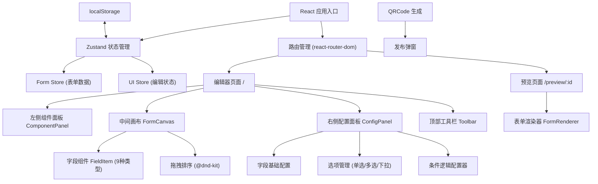

## 1. 架构设计



## 2. 技术描述

- **前端框架**: React@18 + TypeScript
- **构建工具**: Vite@5
- **样式方案**: TailwindCSS@3
- **状态管理**: Zustand
- **拖拽库**: @dnd-kit/core, @dnd-kit/sortable, @dnd-kit/utilities
- **图标库**: lucide-react
- **二维码**: qrcode.react
- **路由**: react-router-dom
- **后端**: 无（纯前端应用）
- **数据存储**: localStorage（本地草稿）

## 3. 路由定义

| 路由 | 页面组件 | 用途 |
|-------|---------|-------|
| `/` | `EditorPage` | 表单编辑器主页 |
| `/preview/:id` | `PreviewPage` | 表单预览填写页 |

## 4. 数据模型

### 4.1 核心类型定义

```typescript
// 字段类型枚举
type FieldType = 'text' | 'textarea' | 'radio' | 'checkbox' | 'select' | 'date' | 'number' | 'rating' | 'file';

// 选项类型
interface Option {
  id: string;
  label: string;
  value: string;
}

// 条件逻辑
interface Condition {
  fieldId: string;      // 关联的字段ID
  operator: 'equals' | 'not_equals' | 'contains';
  value: string;        // 目标值
}

// 表单字段
interface FormField {
  id: string;
  type: FieldType;
  title: string;
  placeholder: string;
  required: boolean;
  options?: Option[];   // 单选/多选/下拉专用
  min?: number;         // 数字/评分专用
  max?: number;
  condition?: Condition; // 条件显示逻辑
}

// 表单整体结构
interface FormData {
  id: string;
  title: string;
  description: string;
  fields: FormField[];
  createdAt: number;
  updatedAt: number;
}

// 表单答案（预览时使用）
interface FormAnswers {
  [fieldId: string]: string | string[] | number;
}
```

### 4.2 组件类型映射

| 字段类型 | 组件名称 | 配置项 |
|---------|---------|--------|
| `text` | `TextField` | 标题、提示、必填 |
| `textarea` | `TextareaField` | 标题、提示、必填 |
| `radio` | `RadioField` | 标题、提示、必填、选项列表 |
| `checkbox` | `CheckboxField` | 标题、提示、必填、选项列表 |
| `select` | `SelectField` | 标题、提示、必填、选项列表 |
| `date` | `DateField` | 标题、提示、必填 |
| `number` | `NumberField` | 标题、提示、必填、最小值、最大值 |
| `rating` | `RatingField` | 标题、提示、必填、星星数量 |
| `file` | `FileField` | 标题、提示、必填 |

## 5. 核心模块结构

```
src/
├── components/
│   ├── editor/
│   │   ├── ComponentPanel.tsx    # 左侧组件面板
│   │   ├── FormCanvas.tsx        # 中间画布
│   │   ├── ConfigPanel.tsx       # 右侧配置面板
│   │   ├── FieldItem.tsx         # 画布中的字段项
│   │   └── Toolbar.tsx           # 顶部工具栏
│   ├── fields/
│   │   ├── TextField.tsx
│   │   ├── TextareaField.tsx
│   │   ├── RadioField.tsx
│   │   ├── CheckboxField.tsx
│   │   ├── SelectField.tsx
│   │   ├── DateField.tsx
│   │   ├── NumberField.tsx
│   │   ├── RatingField.tsx
│   │   ├── FileField.tsx
│   │   └── index.ts              # 字段组件映射
│   ├── config/
│   │   ├── BasicConfig.tsx       # 基础配置
│   │   ├── OptionsConfig.tsx     # 选项配置
│   │   └── ConditionConfig.tsx   # 条件逻辑配置
│   ├── common/
│   │   ├── Modal.tsx             # 弹窗组件
│   │   ├── Toast.tsx             # 提示组件
│   │   └── Switch.tsx            # 开关组件
│   └── preview/
│       ├── FormRenderer.tsx      # 表单渲染器
│       └── PreviewModal.tsx      # 预览弹窗
├── store/
│   ├── useFormStore.ts           # 表单数据store
│   └── useUIStore.ts             # UI状态store
├── hooks/
│   ├── useDragAndDrop.ts         # 拖拽hooks
│   ├── useLocalStorage.ts        # localStorage hooks
│   └── useConditionLogic.ts      # 条件逻辑hooks
├── pages/
│   ├── EditorPage.tsx
│   └── PreviewPage.tsx
├── types/
│   └── form.ts                   # 类型定义
└── utils/
    ├── generateId.ts
    ├── copyToClipboard.ts
    └── conditionEvaluator.ts     # 条件逻辑求值
```

## 6. 关键实现方案

### 6.1 拖拽实现
使用 `@dnd-kit` 实现：
- 组件面板到画布的拖拽（创建新字段）
- 画布内字段的拖拽排序
- 拖拽时的视觉反馈（半透明、放置指示器）

### 6.2 条件逻辑求值
```typescript
// 条件逻辑判断函数
function evaluateCondition(
  condition: Condition,
  answers: FormAnswers
): boolean {
  const fieldValue = answers[condition.fieldId];
  switch (condition.operator) {
    case 'equals':
      return fieldValue === condition.value;
    case 'not_equals':
      return fieldValue !== condition.value;
    case 'contains':
      if (Array.isArray(fieldValue)) {
        return fieldValue.includes(condition.value);
      }
      return String(fieldValue).includes(condition.value);
    default:
      return true;
  }
}
```

### 6.3 localStorage 自动保存
- 使用 `useLocalStorage` hook 监听表单数据变化
- 防抖处理（500ms）避免频繁写入
- 数据版本管理，支持迁移

### 6.4 发布分享流程
1. 生成唯一分享ID（时间戳+随机串）
2. 将表单数据存入 localStorage 以ID为key
3. 生成预览链接：`/preview/{id}`
4. 使用 `qrcode.react` 生成二维码
5. 弹窗展示链接和二维码
