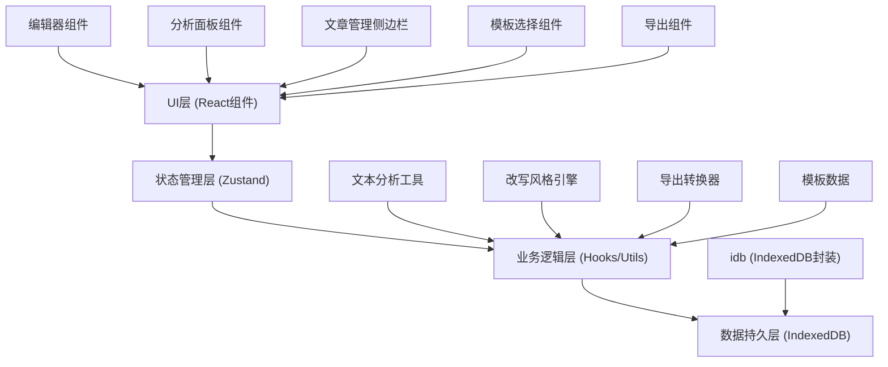
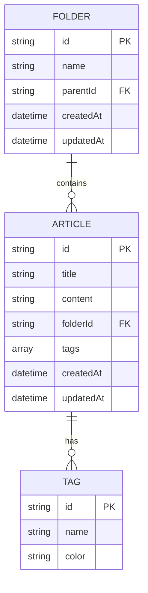

## 1. 架构设计



## 2. 技术选型

- **前端框架**: React@18 + TypeScript
- **构建工具**: Vite@5
- **样式方案**: TailwindCSS@3
- **状态管理**: Zustand@4
- **富文本编辑器**: Quill@1.3.7 + react-quill
- **本地存储**: idb@8 (IndexedDB封装)
- **图标库**: lucide-react
- **导出功能**: 
  - docx: docx@8 + file-saver
  - markdown: turndown (HTML转Markdown)
  - PDF: html2pdf.js 或 jspdf + html2canvas

## 3. 目录结构

```
src/
├── components/
│   ├── Editor/           # 富文本编辑器组件
│   │   ├── Editor.tsx
│   │   ├── Toolbar.tsx
│   │   └── ContextMenu.tsx
│   ├── Sidebar/          # 左侧文章管理
│   │   ├── Sidebar.tsx
│   │   ├── FolderTree.tsx
│   │   ├── ArticleList.tsx
│   │   └── SearchBar.tsx
│   ├── AnalysisPanel/    # 右侧分析面板
│   │   ├── AnalysisPanel.tsx
│   │   ├── StatsCard.tsx
│   │   ├── TypoList.tsx
│   │   └── TypeAnalysis.tsx
│   ├── TemplateModal/    # 模板选择弹窗
│   │   └── TemplateModal.tsx
│   └── ExportMenu/       # 导出菜单
│       └── ExportMenu.tsx
├── hooks/
│   ├── useAnalysis.ts    # 文本分析逻辑
│   ├── useRewrite.ts     # 改写逻辑
│   ├── useArticles.ts    # 文章CRUD
│   └── useIndexedDB.ts   # IndexedDB操作
├── store/
│   └── useStore.ts       # Zustand全局状态
├── utils/
│   ├── textAnalysis.ts   # 文本分析算法
│   ├── rewrite.ts        # 改写规则
│   ├── templates.ts      # 模板数据
│   ├── export.ts         # 导出转换
│   └── db.ts             # IndexedDB配置
├── types/
│   └── index.ts          # 类型定义
├── pages/
│   └── Home.tsx          # 主页面
├── App.tsx
└── main.tsx
```

## 4. 数据模型

### 4.1 数据模型定义



### 4.2 核心类型定义

```typescript
interface Article {
  id: string;
  title: string;
  content: string;
  folderId: string;
  tags: string[];
  createdAt: Date;
  updatedAt: Date;
}

interface Folder {
  id: string;
  name: string;
  parentId: string | null;
  createdAt: Date;
  updatedAt: Date;
}

interface Tag {
  id: string;
  name: string;
  color: string;
}

interface AnalysisResult {
  totalChars: number;
  totalWords: number;
  paragraphCount: number;
  sentenceCount: number;
  typos: Array<{ word: string; position: number; suggestion: string }>;
  repeatedWords: Array<{ word: string; count: number }>;
  readabilityScore: number;
  articleType: 'argumentative' | 'narrative' | 'expository' | 'other';
  typeConfidence: number;
}

interface Template {
  id: string;
  name: string;
  category: string;
  icon: string;
  content: string;
  description: string;
}
```

## 5. 核心算法说明

### 5.1 文本分析
- **字数统计**: 中文按字符计数，英文按单词计数
- **错别字检测**: 使用常见错别字词库匹配
- **重复词检测**: 分词后统计词频，标记高频重复词
- **可读性评分**: 基于句子长度、词汇复杂度、段落结构综合评分
- **类型识别**: 基于关键词特征匹配（议论文：论点、论据、因此；叙事文：那天、记得、当时；说明文：首先、其次、步骤）

### 5.2 改写引擎
- **简洁风格**: 去除冗余修饰词，合并短句，精简表达
- **正式风格**: 使用书面语，替换口语化表达，调整句式结构
- **活泼风格**: 使用生动词汇，增加感叹词，调整语气更轻松

### 5.3 导出转换
- **Markdown**: 使用turndown将HTML内容转换为Markdown
- **DOCX**: 使用docx库生成Word文档，保留基本格式
- **PDF**: 使用html2pdf.js将编辑器内容渲染为PDF

## 6. 性能优化
- 防抖处理文本分析（300ms延迟）
- IndexedDB异步操作不阻塞UI
- 虚拟滚动处理长文章列表
- 分析结果缓存，避免重复计算
