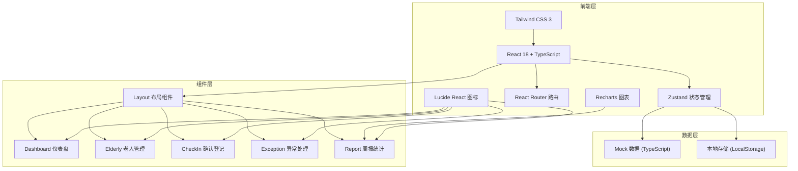
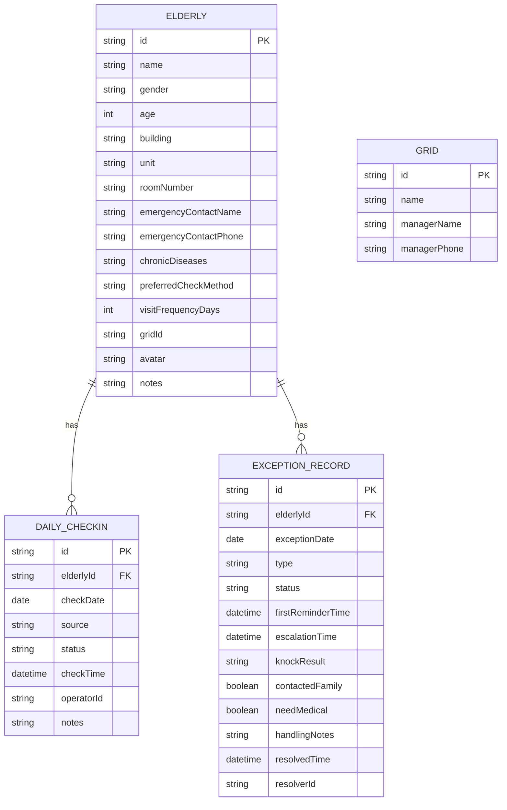

## 1. 架构设计


## 2. 技术描述
- **前端框架**：React@18 + TypeScript + Vite@5
- **UI 框架**：Tailwind CSS@3
- **状态管理**：Zustand@4
- **路由管理**：React Router Dom@6
- **图标库**：Lucide React@0.344
- **图表库**：Recharts@2.12
- **初始化工具**：vite-init
- **后端**：无后端，使用 Mock 数据 + LocalStorage 持久化

## 3. 路由定义
| 路由 | 页面 | 说明 |
|------|------|------|
| / | 首页仪表盘 | 展示今日未报平安列表、统计数据 |
| /elderly | 老人信息管理 | 老人列表、详情、编辑 |
| /checkin | 确认登记 | 每日平安确认登记 |
| /exceptions | 异常处理 | 异常列表、异常处置 |
| /report | 周报统计 | 数据概览、重点关注名单 |

## 4. 数据模型

### 4.1 数据模型定义


### 4.2 TypeScript 类型定义
```typescript
// 老人信息
interface Elderly {
  id: string;
  name: string;
  gender: 'male' | 'female';
  age: number;
  building: string;
  unit: string;
  roomNumber: string;
  emergencyContactName: string;
  emergencyContactPhone: string;
  chronicDiseases: string;
  preferredCheckMethod: 'phone' | 'family' | 'device' | 'visit';
  visitFrequencyDays: number;
  gridId: string;
  avatar: string;
  notes: string;
}

// 确认来源
type CheckInSource = 'elderly_phone' | 'family_report' | 'smart_device' | 'home_visit';

// 每日确认记录
interface DailyCheckIn {
  id: string;
  elderlyId: string;
  checkDate: string;
  source: CheckInSource;
  status: 'confirmed' | 'pending' | 'exception';
  checkTime: string;
  operatorId: string;
  notes: string;
}

// 异常记录
interface ExceptionRecord {
  id: string;
  elderlyId: string;
  exceptionDate: string;
  type: 'timeout' | 'abnormal';
  status: 'pending' | 'processing' | 'escalated' | 'resolved';
  firstReminderTime: string | null;
  escalationTime: string | null;
  knockResult: string | null;
  contactedFamily: boolean | null;
  needMedical: boolean | null;
  handlingNotes: string;
  resolvedTime: string | null;
  resolverId: string | null;
}

// 网格
interface Grid {
  id: string;
  name: string;
  managerName: string;
  managerPhone: string;
}

// 周报数据
interface WeeklyReport {
  gridId: string;
  weekStartDate: string;
  weekEndDate: string;
  totalElderly: number;
  unreportedCount: number;
  continuousExceptionCount: number;
  avgHandlingTime: number;
  focusList: string[];
}
```

## 5. 项目目录结构
```
src/
├── components/          # 公共组件
│   ├── Layout/         # 布局组件
│   ├── Card/           # 卡片组件
│   ├── Badge/          # 徽章组件
│   ├── Modal/          # 模态框组件
│   └── Table/          # 表格组件
├── pages/              # 页面组件
│   ├── Dashboard/      # 首页仪表盘
│   ├── Elderly/        # 老人信息管理
│   ├── CheckIn/        # 确认登记
│   ├── Exceptions/     # 异常处理
│   └── Report/         # 周报统计
├── store/              # Zustand 状态管理
│   ├── elderlyStore.ts
│   ├── checkInStore.ts
│   ├── exceptionStore.ts
│   └── reportStore.ts
├── types/              # TypeScript 类型定义
│   └── index.ts
├── data/               # Mock 数据
│   ├── elderly.ts
│   ├── checkIn.ts
│   ├── exceptions.ts
│   └── grids.ts
├── utils/              # 工具函数
│   ├── date.ts
│   ├── storage.ts
│   └── source.ts
├── App.tsx
├── main.tsx
└── index.css
```

## 6. 状态管理设计
```typescript
// elderlyStore.ts - 老人信息状态
import { create } from 'zustand';
import { Elderly } from '@/types';

interface ElderlyState {
  elderlyList: Elderly[];
  loading: boolean;
  addElderly: (elderly: Omit<Elderly, 'id'>) => void;
  updateElderly: (id: string, data: Partial<Elderly>) => void;
  deleteElderly: (id: string) => void;
  getElderlyById: (id: string) => Elderly | undefined;
}

// checkInStore.ts - 确认登记状态
import { DailyCheckIn, CheckInSource } from '@/types';

interface CheckInState {
  checkInRecords: DailyCheckIn[];
  todayUnconfirmed: string[]; // 今日未确认老人ID列表
  recordCheckIn: (elderlyId: string, source: CheckInSource, notes?: string) => void;
  getTodayStatus: (elderlyId: string) => DailyCheckIn | undefined;
}

// exceptionStore.ts - 异常处理状态
import { ExceptionRecord } from '@/types';

interface ExceptionState {
  exceptions: ExceptionRecord[];
  escalatedExceptions: ExceptionRecord[];
  createException: (elderlyId: string, type: 'timeout' | 'abnormal') => void;
  escalateException: (id: string) => void;
  resolveException: (id: string, data: Partial<ExceptionRecord>) => void;
}
```

## 7. 核心业务逻辑
### 7.1 超时提醒与升级机制
- **约定时间**：默认每日 10:00 前需完成确认
- **一级提醒**：10:00 未确认 → 系统自动提醒网格员（推送通知 + 列表标红）
- **二级升级**：12:00 仍未处理 → 自动升级给社区负责人（标记升级状态）
- **状态流转**：pending → processing → escalated → resolved

### 7.2 确认来源标记
| 来源 | 标识 | 颜色 | 图标 |
|------|------|------|------|
| 老人电话 | elderly_phone | 蓝色 | Phone |
| 家属代报 | family_report | 紫色 | Users |
| 智能设备 | smart_device | 青色 | Wifi |
| 上门查看 | home_visit | 橙色 | Home |

### 7.3 周报统计规则
- **统计周期**：自然周（周一至周日）
- **未报人数**：本周内有未确认记录的老人数
- **连续异常**：连续 3 天及以上未确认的老人
- **处理耗时**：从异常创建到 resolved 的平均时长
- **重点关注名单**：连续异常 + 有严重慢病备注的老人
