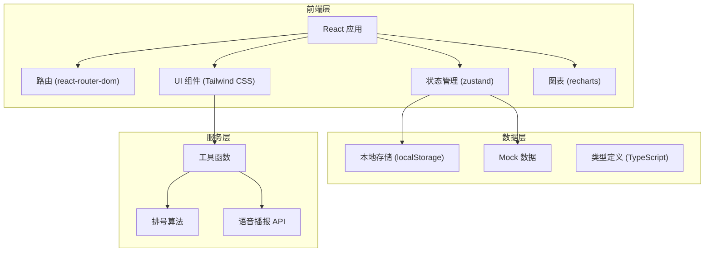
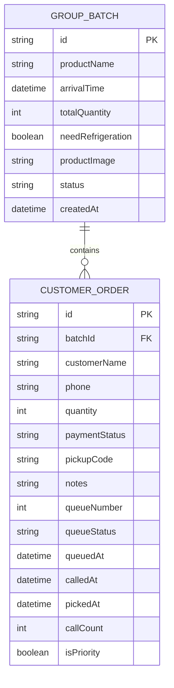

## 1. 架构设计



## 2. 技术栈描述

- **前端框架**：React@18 + TypeScript + Vite
- **状态管理**：zustand@4
- **路由**：react-router-dom@6
- **样式**：Tailwind CSS@3
- **图标**：lucide-react
- **图表**：recharts@2
- **数据持久化**：localStorage + zustand persist 中间件
- **初始化工具**：vite-init react-ts 模板

## 3. 路由定义

| 路由 | 页面 | 功能 |
|------|------|------|
| `/` | 数据看板 | 首页，展示当前叫号、未取统计、异常订单、时段压力 |
| `/batches` | 团购批次列表 | 团购批次管理，增删改查 |
| `/batches/new` | 新建团购批次 | 创建新的团购批次 |
| `/batches/:id/edit` | 编辑团购批次 | 修改团购批次信息 |
| `/batches/:id/orders` | 订单列表 | 某批次的订单管理 |
| `/batches/:id/orders/new` | 新建订单 | 录入顾客订单 |
| `/queue` | 排号叫号 | 取号排队和叫号操作界面 |
| `/display` | 叫号显示屏 | 大字号叫号展示页面 |

## 4. 数据模型

### 4.1 实体关系图



### 4.2 类型定义

```typescript
// 团购批次
interface GroupBatch {
  id: string;
  productName: string;
  arrivalTime: string;
  totalQuantity: number;
  needRefrigeration: boolean;
  productImage?: string;
  status: 'pending' | 'arrived' | 'completed';
  createdAt: string;
}

// 顾客订单
interface CustomerOrder {
  id: string;
  batchId: string;
  customerName: string;
  phone: string;
  quantity: number;
  paymentStatus: 'unpaid' | 'paid' | 'refunded';
  pickupCode: string;
  notes?: string;
  queueNumber?: number;
  queueStatus: 'not_queued' | 'waiting' | 'called' | 'picked' | 'timeout';
  queuedAt?: string;
  calledAt?: string;
  pickedAt?: string;
  callCount: number;
  isPriority: boolean;
}

// 队列状态
interface QueueState {
  currentNumber: number;
  waitingQueue: CustomerOrder[];
  calledOrder: CustomerOrder | null;
  lastCalledAt: string | null;
}
```

### 4.3 Mock 数据

应用启动时自动生成以下模拟数据用于演示：
- 3 个团购批次（含 1 个冷藏商品）
- 每个批次 15-25 个顾客订单
- 部分订单已排号等待

## 5. 核心模块设计

### 5.1 排号算法模块

```typescript
// 排号逻辑：冷藏商品优先插入队列前端
function enqueueOrder(order: CustomerOrder, queue: CustomerOrder[]): CustomerOrder[] {
  if (order.isPriority) {
    const nonPriorityIndex = queue.findIndex(o => !o.isPriority);
    if (nonPriorityIndex === -1) {
      return [...queue, order];
    }
    return [
      ...queue.slice(0, nonPriorityIndex),
      order,
      ...queue.slice(nonPriorityIndex)
    ];
  }
  return [...queue, order];
}

// 超时重排逻辑：叫号后3分钟未取，移至队尾
function handleTimeout(order: CustomerOrder, queue: CustomerOrder[]): CustomerOrder[] {
  const updatedOrder = {
    ...order,
    queueStatus: 'waiting' as const,
    callCount: order.callCount + 1,
    calledAt: undefined
  };
  return [...queue.filter(o => o.id !== order.id), updatedOrder];
}
```

### 5.2 状态管理 Store

```typescript
// zustand store 定义
interface AppState {
  batches: GroupBatch[];
  orders: CustomerOrder[];
  queueState: QueueState;
  selectedBatchId: string | null;
  // actions
  addBatch: (batch: Omit<GroupBatch, 'id' | 'createdAt'>) => void;
  updateBatch: (id: string, data: Partial<GroupBatch>) => void;
  deleteBatch: (id: string) => void;
  addOrder: (order: Omit<CustomerOrder, 'id' | 'pickupCode' | 'queueStatus' | 'callCount' | 'isPriority'>) => void;
  enqueue: (orderId: string) => void;
  callNext: () => void;
  markPicked: (orderId: string) => void;
  handleTimeout: () => void;
}
```

## 6. 项目文件结构

```
src/
├── components/
│   ├── BatchCard.tsx
│   ├── BatchForm.tsx
│   ├── OrderForm.tsx
│   ├── OrderTable.tsx
│   ├── QueueDisplay.tsx
│   ├── CallingScreen.tsx
│   ├── DashboardCard.tsx
│   ├── PressureChart.tsx
│   ├── Layout.tsx
│   └── Sidebar.tsx
├── pages/
│   ├── Dashboard.tsx
│   ├── BatchList.tsx
│   ├── BatchEdit.tsx
│   ├── OrderList.tsx
│   ├── OrderNew.tsx
│   ├── Queue.tsx
│   └── Display.tsx
├── store/
│   └── useAppStore.ts
├── types/
│   └── index.ts
├── utils/
│   ├── queue.ts
│   ├── pickupCode.ts
│   ├── speech.ts
│   └── mockData.ts
├── App.tsx
├── main.tsx
└── index.css
```
