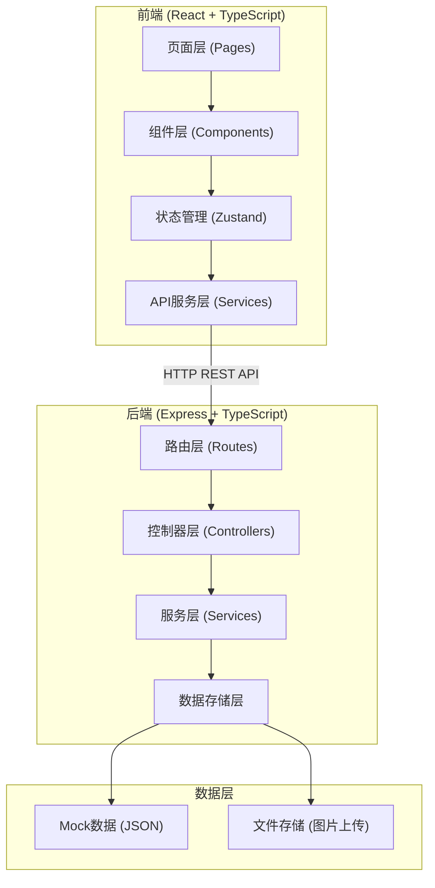
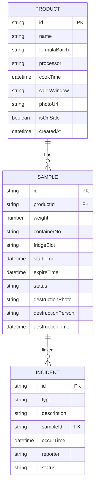

## 1. 架构设计



## 2. 技术描述
- **前端**: React@18 + TypeScript + Vite + TailwindCSS@3 + Zustand + React Router DOM@6 + Lucide React
- **后端**: Express@4 + TypeScript
- **数据存储**: Mock JSON数据（本地文件持久化），图片上传至本地public目录
- **图表**: Recharts（React图表库）
- **初始化工具**: vite-init

## 3. 路由定义

### 前端路由
| 路由 | 页面组件 | 功能描述 |
|------|---------|---------|
| / | Dashboard | 看板首页，数据概览 |
| /products | ProductList | 商品档案列表 |
| /products/new | ProductForm | 新增商品档案 |
| /products/:id | ProductDetail | 商品档案详情/编辑 |
| /samples | SampleList | 留样记录列表 |
| /samples/new | SampleForm | 新增留样记录 |
| /samples/:id | SampleDetail | 留样详情 |
| /incidents | IncidentList | 异常事件列表 |
| /incidents/new | IncidentForm | 新增异常事件 |
| /destruction | DestructionList | 销毁确认列表 |

### 后端API路由
| Method | Route | 功能描述 |
|--------|-------|---------|
| GET | /api/dashboard | 获取看板统计数据 |
| GET | /api/products | 获取商品档案列表 |
| GET | /api/products/:id | 获取商品详情 |
| POST | /api/products | 新增商品档案 |
| PUT | /api/products/:id | 更新商品档案 |
| DELETE | /api/products/:id | 删除商品档案 |
| GET | /api/samples | 获取留样记录列表 |
| GET | /api/samples/:id | 获取留样详情 |
| POST | /api/samples | 新增留样记录 |
| PUT | /api/samples/:id | 更新留样状态 |
| GET | /api/incidents | 获取异常事件列表 |
| GET | /api/incidents/:id | 获取异常事件详情 |
| POST | /api/incidents | 新增异常事件 |
| PUT | /api/incidents/:id | 更新异常事件 |
| GET | /api/destruction/pending | 获取待销毁列表 |
| POST | /api/destruction/:sampleId/confirm | 确认销毁 |
| POST | /api/upload | 图片上传接口 |

## 4. 数据模型

### 6.1 数据模型ER图



### 6.2 数据类型定义

```typescript
// shared/types/index.ts

export type ProductCategory = 'chicken_feet' | 'duck_neck' | 'tofu' | 'other';

export type SampleStatus = 'active' | 'expiring' | 'expired' | 'destroyed';

export type IncidentType = 'complaint' | 'odor' | 'temperature' | 'other';

export type IncidentStatus = 'pending' | 'investigating' | 'resolved';

export interface Product {
  id: string;
  name: string;
  category: ProductCategory;
  formulaBatch: string;
  processor: string;
  cookTime: string;
  salesWindow: string;
  photoUrl: string;
  isOnSale: boolean;
  hasSample: boolean;
  createdAt: string;
}

export interface Sample {
  id: string;
  productId: string;
  product?: Product;
  weight: number;
  containerNo: string;
  fridgeSlot: string;
  startTime: string;
  expireTime: string;
  status: SampleStatus;
  destructionPhoto?: string;
  destructionPerson?: string;
  destructionTime?: string;
}

export interface Incident {
  id: string;
  type: IncidentType;
  description: string;
  sampleId?: string;
  sample?: Sample;
  occurTime: string;
  reporter: string;
  status: IncidentStatus;
}

export interface DashboardStats {
  todaySamplesRequired: number;
  todaySamplesDone: number;
  pendingDestruction: number;
  activeIncidents: number;
  fridgeOccupancy: number;
  fridgeCapacity: number;
  categoryCompletion: {
    category: ProductCategory;
    name: string;
    required: number;
    done: number;
    completionRate: number;
  }[];
}
```
