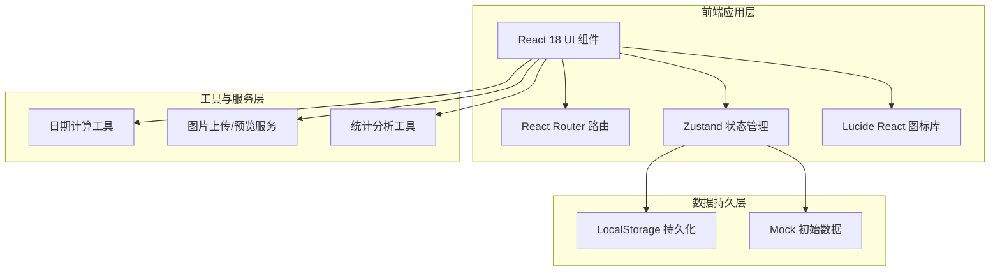
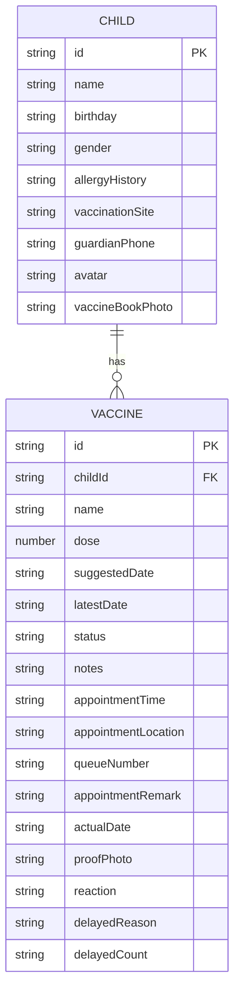

## 1. 架构设计



## 2. 技术描述

- **前端框架**：React@18 + TypeScript@5
- **构建工具**：Vite@5
- **样式方案**：Tailwind CSS@3
- **状态管理**：Zustand@4
- **路由方案**：React Router DOM@6
- **图标库**：Lucide React@0.344
- **后端服务**：无（纯前端应用，使用 LocalStorage 持久化）
- **数据库**：浏览器 LocalStorage + Mock 初始数据
- **初始化工具**：vite-init，使用 react-ts 模板

## 3. 路由定义

| 路由 | 页面 | 用途 |
|------|------|------|
| / | Dashboard | 总览仪表盘，提醒+统计+快捷入口 |
| /children | ChildrenList | 孩子档案列表 |
| /children/:id | ChildDetail | 单个孩子档案详情 |
| /children/new | ChildEdit | 新建孩子档案 |
| /children/:id/edit | ChildEdit | 编辑孩子档案 |
| /vaccines | VaccineList | 疫苗计划列表（支持筛选） |
| /vaccines/new | VaccineList（弹窗） | 新增疫苗（通过弹窗实现） |
| /statistics | Statistics | 数据统计页面 |

## 4. 数据模型

### 4.1 数据模型定义



### 4.2 类型定义

```typescript
// 孩子档案
interface Child {
  id: string;
  name: string;
  birthday: string; // YYYY-MM-DD
  gender: '男' | '女';
  allergyHistory: string; // 过敏史，逗号分隔或文本
  vaccinationSite: string; // 常规接种点
  guardianPhone: string;
  avatar: string; // base64 或图片地址
  vaccineBookPhoto: string; // base64 或图片地址
  createdAt: string;
}

// 疫苗状态枚举
type VaccineStatus = 'pending' | 'appointed' | 'completed' | 'overdue';

// 疫苗记录
interface Vaccine {
  id: string;
  childId: string;
  name: string; // 疫苗名称
  dose: number; // 剂次
  suggestedDate: string; // 建议接种日期 YYYY-MM-DD
  latestDate: string; // 最晚接种日期 YYYY-MM-DD
  status: VaccineStatus;
  notes: string; // 注意事项
  // 预约信息
  appointmentTime?: string; // 预约具体时间 YYYY-MM-DD HH:mm
  appointmentLocation?: string; // 接种地点
  queueNumber?: string; // 排队号
  appointmentRemark?: string; // 预约备注
  // 完成信息
  actualDate?: string; // 实际接种日期
  proofPhoto?: string; // 接种凭证照片 base64
  reaction?: string; // 接种反应
  // 延期信息
  delayedReason?: string; // 延期原因（生病等）
  delayedCount: number; // 延期次数
  createdAt: string;
}

// 统计数据结构
interface Statistics {
  totalChildren: number;
  totalVaccines: number;
  pendingVaccines: number;
  completedVaccines: number;
  overdueVaccines: number;
  upcomingVaccines: Vaccine[]; // 7天内
  monthlyDistribution: { month: string; count: number }[];
  delayedVaccines: Vaccine[];
  busiestMonth: string;
  perChildStats: {
    childId: string;
    childName: string;
    total: number;
    completed: number;
    pending: number;
    overdue: number;
  }[];
}
```

## 5. 目录结构

```
src/
├── components/           # 公共组件
│   ├── layout/          # 布局组件（Sidebar, Header）
│   ├── ui/              # 基础 UI 组件（Button, Card, Modal, Badge）
│   ├── child/           # 孩子档案相关组件
│   ├── vaccine/         # 疫苗相关组件
│   ├── reminder/        # 提醒卡片组件
│   └── statistics/      # 统计图表组件
├── pages/               # 页面组件
│   ├── Dashboard.tsx
│   ├── ChildrenList.tsx
│   ├── ChildDetail.tsx
│   ├── ChildEdit.tsx
│   ├── VaccineList.tsx
│   └── Statistics.tsx
├── store/               # Zustand Store
│   └── useAppStore.ts
├── hooks/               # 自定义 Hooks
│   ├── useStatistics.ts
│   └── useDateUtils.ts
├── utils/               # 工具函数
│   ├── date.ts
│   ├── storage.ts
│   └── id.ts
├── data/                # Mock 初始数据
│   └── mockData.ts
├── types/               # TypeScript 类型定义
│   └── index.ts
├── App.tsx
├── main.tsx
└── index.css
```

## 6. 状态管理设计

### Zustand Store 结构

```typescript
interface AppState {
  // 数据
  children: Child[];
  vaccines: Vaccine[];
  
  // 操作方法
  addChild: (child: Omit<Child, 'id' | 'createdAt'>) => void;
  updateChild: (id: string, data: Partial<Child>) => void;
  deleteChild: (id: string) => void;
  getChildById: (id: string) => Child | undefined;
  
  addVaccine: (vaccine: Omit<Vaccine, 'id' | 'createdAt' | 'delayedCount' | 'status'>) => void;
  updateVaccine: (id: string, data: Partial<Vaccine>) => void;
  deleteVaccine: (id: string) => void;
  getVaccinesByChildId: (childId: string) => Vaccine[];
  
  // 状态流转
  appointVaccine: (id: string, appointmentData: {...}) => void;
  completeVaccine: (id: string, completionData: {...}) => void;
  delayVaccine: (id: string, reason: string) => void;
  updateVaccineStatus: () => void; // 自动计算逾期状态
  
  // 持久化
  loadFromStorage: () => void;
  saveToStorage: () => void;
  resetWithMock: () => void;
}
```
