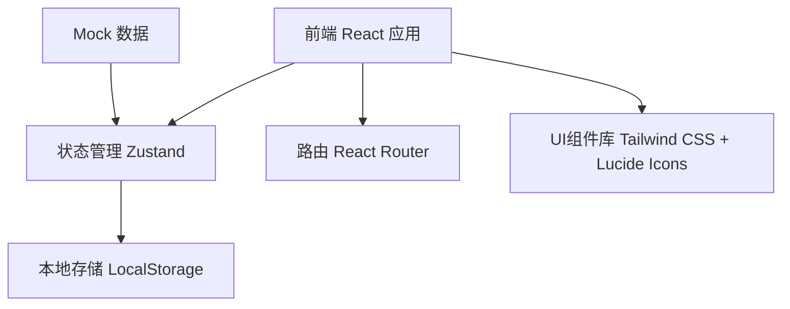
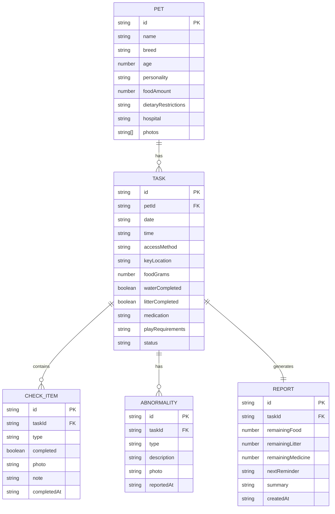

## 1. 架构设计



## 2. 技术描述

- **前端框架**：React@18 + TypeScript@5
- **构建工具**：Vite@5
- **状态管理**：Zustand@4
- **路由管理**：react-router-dom@6
- **样式方案**：Tailwind CSS@3
- **图标库**：lucide-react@0.344
- **后端**：无（纯前端应用，使用LocalStorage持久化数据）
- **数据库**：LocalStorage + Mock数据

## 3. 路由定义

| 路由 | 页面 | 用途 |
|------|------|------|
| `/` | 宠物资料页 | 展示宠物基本信息、健康信息和照片墙 |
| `/tasks` | 任务列表页 | 展示所有代喂任务及状态 |
| `/tasks/:id` | 任务详情页 | 打卡清单、照片上传、异常标记 |
| `/report/:id` | 日报页 | 展示本次代喂的总结报告 |

## 4. 数据模型

### 4.1 数据模型定义



### 4.2 TypeScript 类型定义

```typescript
interface Pet {
  id: string;
  name: string;
  breed: string;
  age: number;
  personality: string[];
  foodAmount: number;
  dietaryRestrictions: string[];
  hospital: {
    name: string;
    phone: string;
    address: string;
  };
  photos: string[];
}

interface Task {
  id: string;
  petId: string;
  date: string;
  time: string;
  accessMethod: string;
  keyLocation: string;
  foodGrams: number;
  medication: string;
  playRequirements: string;
  status: 'pending' | 'in-progress' | 'completed';
}

interface CheckItem {
  id: string;
  taskId: string;
  type: 'food' | 'water' | 'litter' | 'medication' | 'play';
  label: string;
  completed: boolean;
  photo?: string;
  note?: string;
  completedAt?: string;
}

interface Abnormality {
  id: string;
  taskId: string;
  type: 'vomit' | 'not-eating' | 'hiding' | 'scratch' | 'other';
  description: string;
  photo?: string;
  reportedAt: string;
}

interface Report {
  id: string;
  taskId: string;
  remainingFood: number;
  remainingLitter: number;
  remainingMedicine: number;
  nextReminder: string;
  summary: string;
  createdAt: string;
}
```

## 5. 项目结构

```
src/
├── components/          # 公共组件
│   ├── Layout.tsx       # 布局组件
│   ├── PetCard.tsx      # 宠物卡片
│   ├── TaskCard.tsx     # 任务卡片
│   ├── CheckListItem.tsx # 打卡清单项
│   ├── AbnormalityBadge.tsx # 异常标记
│   ├── PhotoUpload.tsx  # 照片上传组件
│   └── StatCard.tsx     # 统计卡片
├── pages/               # 页面组件
│   ├── PetProfile.tsx   # 宠物资料页
│   ├── TaskList.tsx     # 任务列表页
│   ├── TaskDetail.tsx   # 任务详情页
│   └── Report.tsx       # 日报页
├── store/               # 状态管理
│   └── usePetStore.ts   # Zustand store
├── types/               # 类型定义
│   └── index.ts
├── data/                # Mock数据
│   └── mockData.ts
├── utils/               # 工具函数
│   └── helpers.ts
├── App.tsx
├── main.tsx
└── index.css
```

## 6. 核心功能实现方案

### 6.1 宠物资料展示
- 使用Zustand管理宠物数据，从Mock数据初始化
- 照片墙使用CSS Grid实现错落布局
- 信息卡片使用图标+文字组合展示

### 6.2 任务管理
- 任务按日期排序，使用状态徽章区分待执行/进行中/已完成
- 点击任务卡片进入详情页，通过路由参数传递任务ID

### 6.3 打卡功能
- 每个清单项独立状态管理，点击勾选触发完成动画
- 照片上传使用FileReader读取本地图片，转为base64存储
- 打卡时间自动记录当前时间

### 6.4 异常标记
- 异常按钮点击后展开输入区域
- 已标记的异常显示红色脉冲动画
- 异常类型预设：呕吐、没吃、躲起来、抓伤、其他

### 6.5 日报生成
- 所有打卡项完成后，自动计算物资剩余
- 时间线展示完整的代喂过程
- 使用CSS conic-gradient实现圆形进度图
