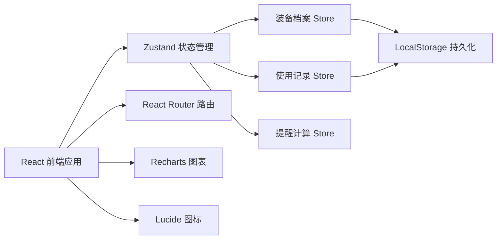
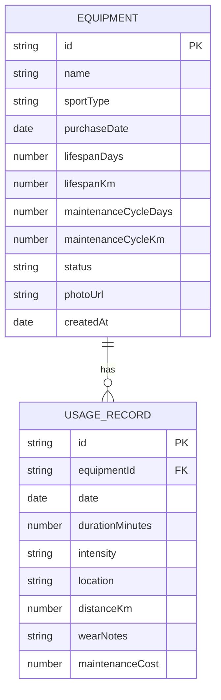

## 1. 架构设计



## 2. 技术描述

- **前端框架**：React@18 + TypeScript + Vite
- **样式方案**：TailwindCSS@3
- **路由管理**：react-router-dom@6
- **状态管理**：zustand
- **图表库**：recharts
- **图标库**：lucide-react
- **数据持久化**：LocalStorage（前端模拟后端）
- **初始化工具**：vite-init

## 3. 路由定义

| 路由 | 用途 |
|------|------|
| / | 首页仪表盘 - 保养提醒 + 统计数据 |
| /equipment | 装备档案列表页 |
| /equipment/:id | 装备详情页 |
| /equipment/new | 新增装备表单 |
| /usage | 使用记录列表页 |
| /usage/new | 新增使用记录表单 |

## 4. API 定义（本地模拟，无后端）

### 4.1 装备档案操作

```typescript
// 获取所有装备
function getAllEquipment(): Equipment[];

// 新增装备
function addEquipment(data: Omit<Equipment, 'id' | 'createdAt'>): Equipment;

// 更新装备
function updateEquipment(id: string, data: Partial<Equipment>): Equipment;

// 删除装备
function deleteEquipment(id: string): void;
```

### 4.2 使用记录操作

```typescript
// 获取所有使用记录
function getAllUsageRecords(): UsageRecord[];

// 获取某装备的使用记录
function getUsageRecordsByEquipment(equipmentId: string): UsageRecord[];

// 新增使用记录
function addUsageRecord(data: Omit<UsageRecord, 'id'>): UsageRecord;
```

### 4.3 提醒计算

```typescript
// 计算装备保养状态
function computeMaintenanceStatus(equipment: Equipment, records: UsageRecord[]): MaintenanceStatus;

// 获取即将到期装备（7天内）
function getUpcomingMaintenance(equipment: Equipment[], records: UsageRecord[]): Equipment[];

// 获取已超期装备
function getOverdueMaintenance(equipment: Equipment[], records: UsageRecord[]): Equipment[];
```

## 5. 数据模型

### 5.1 数据模型定义



### 6.2 数据类型定义

```typescript
export type SportType = 'running' | 'badminton' | 'yoga' | 'swimming' | 'cycling' | 'basketball' | 'football' | 'tennis' | 'fitness' | 'other';

export type EquipmentStatus = 'excellent' | 'good' | 'attention' | 'overdue' | 'retired';

export type IntensityLevel = 'low' | 'medium' | 'high';

export type MaintenanceAction = 'clean' | 'restring' | 'inflate' | 'replace' | 'retire';

export interface Equipment {
  id: string;
  name: string;
  sportType: SportType;
  purchaseDate: string;
  lifespanDays: number;
  lifespanKm: number | null;
  maintenanceCycleDays: number;
  maintenanceCycleKm: number | null;
  lastMaintenanceDate: string | null;
  status: EquipmentStatus;
  photoUrl: string | null;
  createdAt: string;
}

export interface UsageRecord {

  id: string;
  equipmentId: string;
  date: string;
  durationMinutes: number;
  intensity: IntensityLevel;
  location: string;
  distanceKm: number | null;
  wearNotes: string;
  maintenanceCost: number;
}

export interface MaintenanceStatus {
  equipmentId: string;
  daysUntilMaintenance: number;
  kmUntilMaintenance: number | null;
  daysUntilRetire: number;
  kmUntilRetire: number | null;
  isOverdue: boolean;
  isUpcoming: boolean;
  suggestedAction: MaintenanceAction;
  totalUsageDays: number;
  totalKm: number;
  totalCost: number;
}
```

### 6.3 初始模拟数据

- 预置 5-8 条装备档案（跑鞋、羽毛球拍、瑜伽垫、自行车头盔、篮球等）
- 预置 15-20 条使用记录，覆盖近 3 个月
- 确保至少包含：1 件超期装备、2 件即将到期装备、若干正常装备
