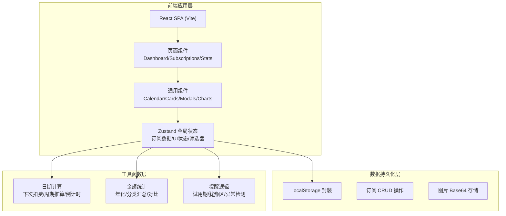
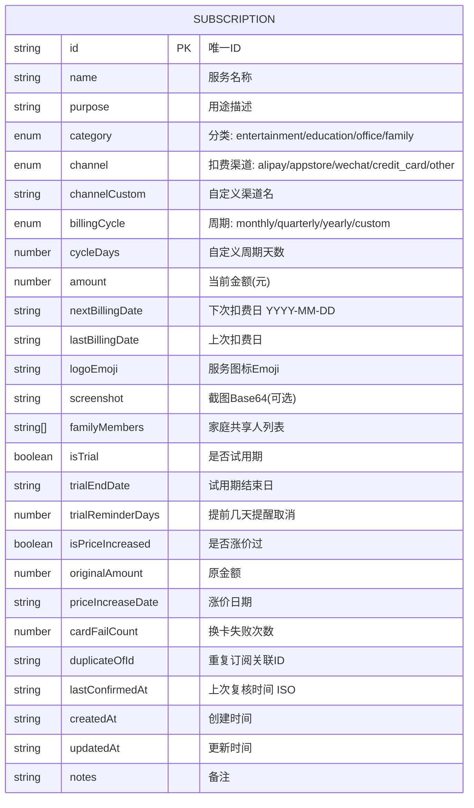

## 1. 架构设计



## 2. 技术描述

- **前端框架**：React@18 + TypeScript@5 + Vite@5
- **样式方案**：Tailwind CSS@3（自定义主题令牌）+ CSS 变量
- **状态管理**：Zustand@4（轻量全局 Store，含 localStorage 持久化中间件）
- **路由方案**：React Router DOM@6（Hash 路由，部署友好）
- **图标库**：Lucide React（线性图标，按需加载）
- **图表可视化**：Recharts（React 原生图表库，轻量）
- **日期处理**：date-fns（模块化、Tree-shakable，比 Moment 轻）
- **后端服务**：无后端，纯前端 + localStorage
- **初始化工具**：vite-init（react-ts 模板）

## 3. 路由定义

| 路由 | 页面 | 用途 |
|------|------|------|
| `/` | Dashboard | 首页仪表盘：月历 + 汇总 + 即将扣费 + 犹豫区 |
| `/subscriptions` | Subscriptions | 订阅列表：全部/分类筛选、复核、编辑入口 |
| `/stats` | Statistics | 统计分析：分类饼图、年化、智能建议 |
| `/subscriptions/new` | SubscriptionForm | 新增订阅（弹窗/独立页） |
| `/subscriptions/:id/edit` | SubscriptionForm | 编辑订阅 |

## 4. 数据模型

### 4.1 ER 图



### 4.2 TypeScript 类型定义

```typescript
export type Category = 'entertainment' | 'education' | 'office' | 'family' | 'other';
export type Channel = 'alipay' | 'appstore' | 'wechat' | 'credit_card' | 'paypal' | 'other';
export type BillingCycle = 'monthly' | 'quarterly' | 'yearly' | 'weekly' | 'custom';

export interface PriceHistory {
  date: string;
  from: number;
  to: number;
}

export interface Subscription {
  id: string;
  name: string;
  purpose: string;
  category: Category;
  channel: Channel;
  channelCustom?: string;
  billingCycle: BillingCycle;
  cycleDays?: number;
  amount: number;
  currency: string;
  nextBillingDate: string;
  lastBillingDate?: string;
  logoEmoji: string;
  screenshot?: string;
  familyMembers: string[];
  isTrial: boolean;
  trialEndDate?: string;
  trialReminderDays?: number;
  isPriceIncreased: boolean;
  priceHistory: PriceHistory[];
  cardFailCount: number;
  duplicateOfId?: string;
  lastConfirmedAt?: string;
  createdAt: string;
  updatedAt: string;
  notes?: string;
}

export interface SubscriptionFilters {
  category: Category | 'all';
  search: string;
  onlyUnconfirmed: boolean;
  onlyTrial: boolean;
}
```

## 5. Zustand Store 设计

```typescript
// useSubscriptionStore
interface State {
  subscriptions: Subscription[];
  filters: SubscriptionFilters;
  selectedMonth: string; // YYYY-MM
  modalState: { add: boolean; editId: string | null };
}

interface Actions {
  addSubscription: (data: Omit<Subscription, 'id' | 'createdAt' | 'updatedAt'>) => void;
  updateSubscription: (id: string, data: Partial<Subscription>) => void;
  deleteSubscription: (id: string) => void;
  confirmUsage: (id: string) => void; // 点击"还在用吗"
  setFilters: (filters: Partial<SubscriptionFilters>) => void;
  setSelectedMonth: (month: string) => void;
  getSubscriptionsByDate: (date: string) => Subscription[]; // 月历用
  getMonthlyTotal: (month: string) => number;
  getNextBillingDate: (sub: Subscription, fromDate?: Date) => string;
  getUnconfirmedSubscriptions: (months?: number) => Subscription[];
  getCategoryStats: () => CategoryStats[];
  getAnnualProjection: () => number;
}
```

## 6. 关键业务逻辑

### 6.1 下次扣费日期推算
- monthly: 当月同日 → 下月同日（月末特殊处理）
- quarterly: +3个月
- yearly: +1年
- weekly: +7天
- custom: +cycleDays天

### 6.2 犹豫区判定
```typescript
const THREE_MONTHS_MS = 90 * 24 * 60 * 60 * 1000;
const isInDoubtZone = (sub: Subscription) => {
  if (!sub.lastConfirmedAt) return Date.now() - new Date(sub.createdAt).getTime() > THREE_MONTHS_MS;
  return Date.now() - new Date(sub.lastConfirmedAt).getTime() > THREE_MONTHS_MS;
};
```

### 6.3 年化计算
```typescript
const getAnnualAmount = (sub: Subscription) => {
  switch (sub.billingCycle) {
    case 'weekly': return sub.amount * 52;
    case 'monthly': return sub.amount * 12;
    case 'quarterly': return sub.amount * 4;
    case 'yearly': return sub.amount;
    case 'custom': return sub.amount * (365 / (sub.cycleDays || 30));
  }
};
```
