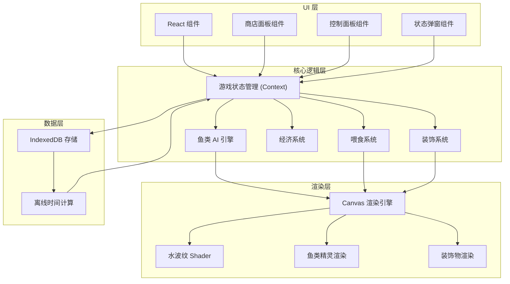
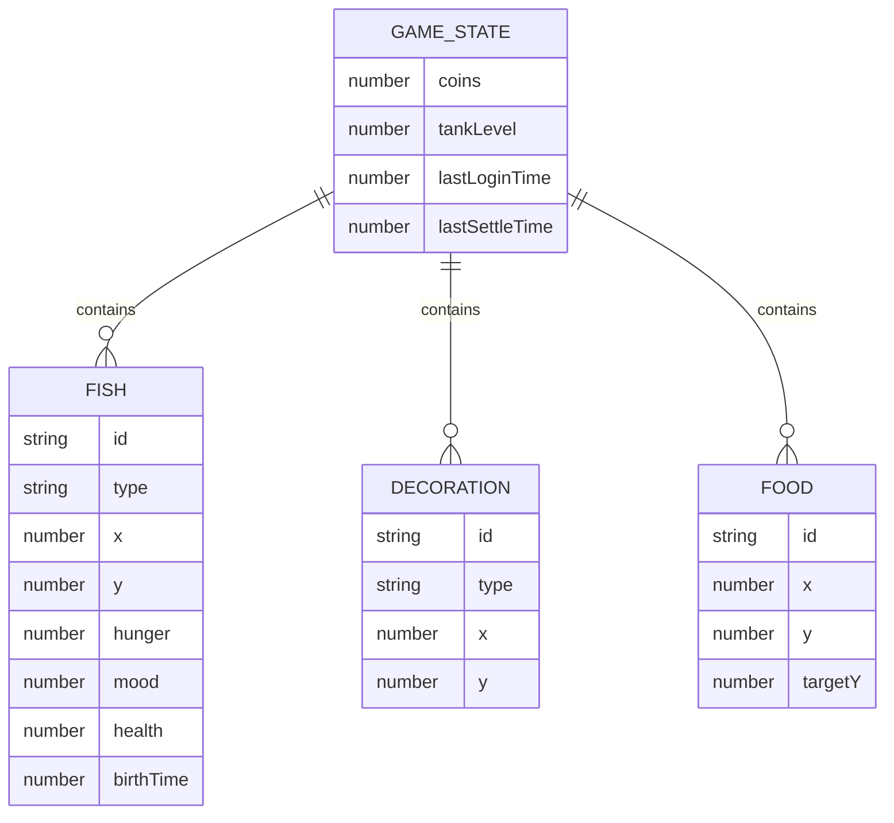

## 1. 架构设计



## 2. 技术描述

- **前端框架**：React@18 + TypeScript + Vite
- **样式方案**：TailwindCSS@3
- **渲染引擎**：HTML5 Canvas 2D
- **状态管理**：React Context + useReducer
- **数据存储**：IndexedDB (idb 库)
- **动画系统**：requestAnimationFrame 游戏循环
- **构建工具**：Vite@5

## 3. 目录结构

```
src/
├── components/
│   ├── GameCanvas.tsx        # 鱼缸画布主组件
│   ├── ShopPanel.tsx         # 商店面板
│   ├── ControlBar.tsx        # 底部控制栏
│   ├── FishStatusModal.tsx   # 鱼类状态弹窗
│   └── DecorationItem.tsx    # 装饰物组件
├── game/
│   ├── engine/
│   │   ├── GameLoop.ts       # 游戏主循环
│   │   ├── FishAI.ts         # 鱼类AI寻路
│   │   └── Renderer.ts       # Canvas 渲染器
│   ├── entities/
│   │   ├── Fish.ts           # 鱼类实体类
│   │   ├── Food.ts           # 食物实体类
│   │   └── Decoration.ts     # 装饰物实体类
│   └── systems/
│       ├── EconomySystem.ts  # 经济系统
│       ├── FeedingSystem.ts  # 喂食系统
│       └── StatusSystem.ts   # 状态系统
├── store/
│   ├── GameContext.tsx       # 游戏状态 Context
│   ├── GameReducer.ts        # 状态 Reducer
│   └── types.ts              # 类型定义
├── db/
│   ├── indexedDB.ts          # IndexedDB 封装
│   └── migrations.ts         # 数据迁移
└── utils/
    ├── constants.ts          # 常量定义
    └── helpers.ts            # 工具函数
```

## 4. 数据模型

### 4.1 ER 图



### 4.2 类型定义

```typescript
// 鱼类类型
type FishType = 'goldfish' | 'guppy' | 'betta' | 'clownfish' | 'butterflyCarp' | 'octopus';

// 装饰物类型
type DecorationType = 
  | 'seaweed1' | 'seaweed2' | 'seaweed3'
  | 'coral1' | 'coral2'
  | 'rock1' | 'rock2' | 'rock3'
  | 'shipwreck' | 'submarine' | 'treasure'
  | 'shell1' | 'shell2' | 'pipe';

// 鱼类实体
interface Fish {
  id: string;
  type: FishType;
  x: number;
  y: number;
  vx: number;
  vy: number;
  targetX: number;
  targetY: number;
  hunger: number;      // 0-100
  mood: number;        // 0-100
  health: number;      // 0-100
  birthTime: number;
  size: 'small' | 'medium' | 'large';
  speed: number;
}

// 装饰物实体
interface Decoration {
  id: string;
  type: DecorationType;
  x: number;
  y: number;
}

// 食物实体
interface Food {
  id: string;
  x: number;
  y: number;
  targetY: number;
  eaten: boolean;
}

// 游戏状态
interface GameState {
  coins: number;
  tankLevel: number;
  fish: Fish[];
  decorations: Decoration[];
  food: Food[];
  lastLoginTime: number;
  lastSettleTime: number;
}
```

## 5. 核心算法

### 5.1 鱼类 AI 寻路算法

```
每帧更新:
1. 如果附近有食物：设置目标为食物位置，加速游动
2. 如果有目标点且到达：随机生成新的目标点
3. 随机概率改变方向（模拟自然游动）
4. 边界检测：碰到鱼缸边缘时反弹
5. 速度根据状态调整：饥饿时速度降低，心情好时速度加快
```

### 5.2 离线时间计算

```
页面加载时:
1. 从 IndexedDB 读取 lastLoginTime
2. 计算当前时间与 lastLoginTime 的时间差
3. 按比例计算饥饿值衰减、心情值变化
4. 计算期间经过的完整天数，执行每日结算
5. 更新 lastLoginTime 为当前时间
```

### 5.3 每日结算逻辑

```
每天 00:00 结算:
1. 每条鱼根据健康值产蛋（健康值越高产蛋越多）
2. 产蛋价值 = 基础产蛋价值 × (健康值 / 100)
3. 累加所有鱼的产蛋价值到金币
4. 饥饿值、心情值进行每日衰减
5. 健康值根据饥饿值和心情值计算变化
```
