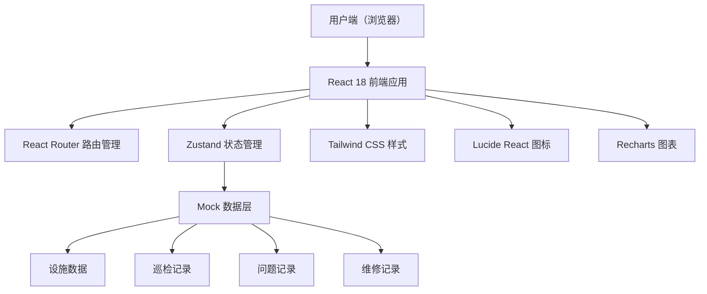
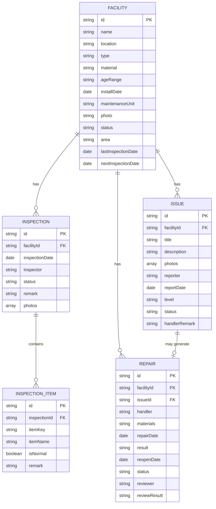

## 1. 架构设计



## 2. 技术说明

- **前端框架**：React 18 + TypeScript
- **构建工具**：Vite 5
- **样式方案**：Tailwind CSS 3
- **状态管理**：Zustand
- **路由管理**：React Router DOM 6
- **图标库**：Lucide React
- **图表库**：Recharts
- **后端**：无后端，使用 Mock 数据 + LocalStorage 持久化

## 3. 路由定义

| 路由 | 页面 | 说明 |
|-------|------|------|
| / | DashboardPage | 数据看板首页 |
| /facilities | FacilitiesPage | 设施档案列表 |
| /facilities/:id | FacilityDetailPage | 设施详情页 |
| /facilities/new | FacilityFormPage | 新增设施 |
| /inspections | InspectionsPage | 巡检管理列表 |
| /inspections/:id | InspectionDetailPage | 巡检详情/执行巡检 |
| /issues | IssuesPage | 问题中心列表 |
| /issues/new | IssueReportPage | 居民问题上报 |
| /repairs | RepairsPage | 维修记录列表 |
| /repairs/:id | RepairDetailPage | 维修处理详情 |

## 4. 数据模型

### 4.1 数据模型定义



### 4.2 核心数据结构定义

```typescript
// 设施状态
type FacilityStatus = 'normal' | 'needs_repair' | 'out_of_service';

// 设施类型
type FacilityType = 'slide' | 'swing' | 'climbing_frame' | 'seesaw' | 'carousel' | 'other';

// 巡检项
type InspectionItemKey = 'handrail' | 'pedal' | 'slide_surface' | 'guardrail' | 'floor_mat' | 'screw' | 'water_logging' | 'sharp_edge';

// 问题等级
type IssueLevel = 'minor' | 'needs_repair' | 'out_of_service';

// 问题状态
type IssueStatus = 'pending' | 'confirmed' | 'resolved' | 'closed';

// 维修状态
type RepairStatus = 'pending' | 'in_progress' | 'completed' | 'reviewed';

// 设施
interface Facility {
  id: string;
  name: string;
  location: string;
  type: FacilityType;
  material: string;
  ageRange: string;
  installDate: string;
  maintenanceUnit: string;
  photo: string;
  status: FacilityStatus;
  area: string;
  lastInspectionDate?: string;
  nextInspectionDate?: string;
  createdAt: string;
  updatedAt: string;
}

// 巡检记录
interface InspectionRecord {
  id: string;
  facilityId: string;
  inspectionDate: string;
  inspector: string;
  status: 'pending' | 'completed';
  remark?: string;
  photos: string[];
  items: InspectionItem[];
  createdAt: string;
}

// 巡检项结果
interface InspectionItem {
  key: InspectionItemKey;
  name: string;
  isNormal: boolean;
  remark?: string;
  photo?: string;
}

// 问题记录
interface IssueRecord {
  id: string;
  facilityId: string;
  title: string;
  description: string;
  photos: string[];
  reporter: string;
  reportDate: string;
  level?: IssueLevel;
  status: IssueStatus;
  handlerRemark?: string;
  handledAt?: string;
}

// 维修记录
interface RepairRecord {
  id: string;
  facilityId: string;
  issueId?: string;
  title: string;
  handler: string;
  materials: string;
  repairDate: string;
  result: string;
  reopenDate?: string;
  status: RepairStatus;
  reviewer?: string;
  reviewResult?: string;
  reviewDate?: string;
  createdAt: string;
}
```

## 5. 项目结构

```
/
├── src/
│   ├── components/          # 通用组件
│   │   ├── Layout/          # 布局组件
│   │   ├── Cards/           # 卡片组件
│   │   ├── Forms/           # 表单组件
│   │   ├── Charts/          # 图表组件
│   │   └── Status/          # 状态徽章等
│   ├── pages/               # 页面组件
│   │   ├── DashboardPage.tsx
│   │   ├── FacilitiesPage.tsx
│   │   ├── FacilityDetailPage.tsx
│   │   ├── FacilityFormPage.tsx
│   │   ├── InspectionsPage.tsx
│   │   ├── InspectionDetailPage.tsx
│   │   ├── IssuesPage.tsx
│   │   ├── IssueReportPage.tsx
│   │   ├── RepairsPage.tsx
│   │   └── RepairDetailPage.tsx
│   ├── store/               # Zustand 状态
│   │   ├── facilityStore.ts
│   │   ├── inspectionStore.ts
│   │   ├── issueStore.ts
│   │   └── repairStore.ts
│   ├── data/                # Mock 数据
│   │   └── mockData.ts
│   ├── types/               # TypeScript 类型定义
│   │   └── index.ts
│   ├── utils/               # 工具函数
│   │   └── index.ts
│   ├── App.tsx
│   ├── main.tsx
│   └── index.css
├── api/                     # （预留）后端 API
├── .trae/
│   └── documents/
│       ├── PRD.md
│       └── TECHNICAL_ARCHITECTURE.md
├── index.html
├── package.json
├── vite.config.ts
├── tailwind.config.js
├── postcss.config.js
└── tsconfig.json
```
