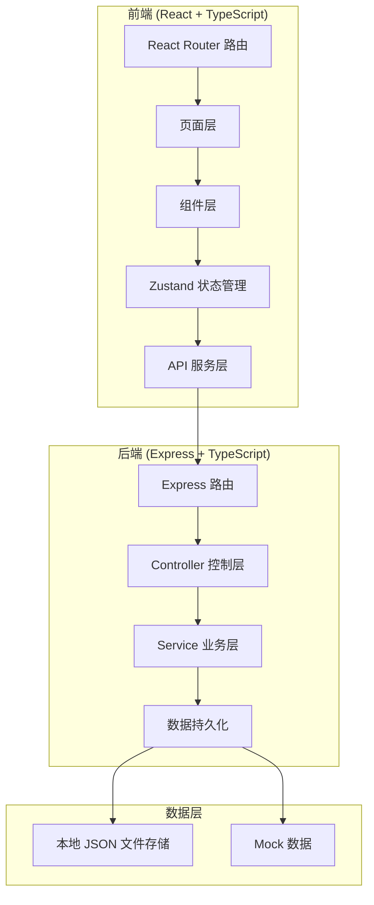
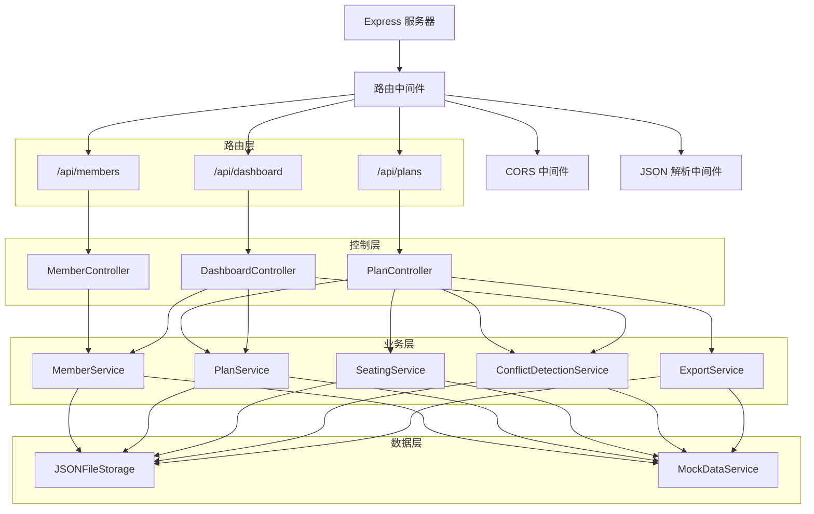
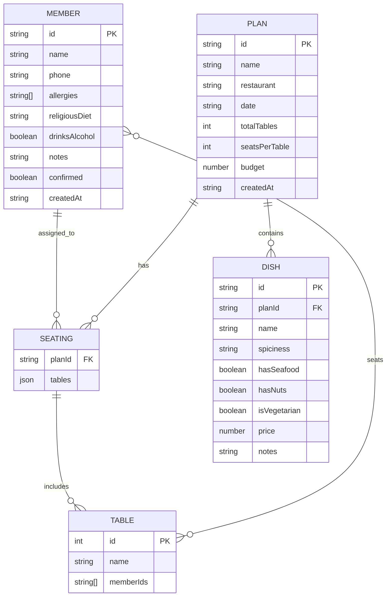

## 1. 架构设计



## 2. 技术选型

- **前端**：React@18 + TypeScript + Vite + TailwindCSS@3 + React Router + Zustand + lucide-react
- **后端**：Express@4 + TypeScript + ts-node
- **数据存储**：本地 JSON 文件（简单易用，适合单机使用场景）
- **初始化工具**：vite-init
- **技术栈理由**：
  - React + TypeScript 提供类型安全和组件化开发
  - Zustand 轻量级状态管理，适合中小型应用
  - Express 轻量级后端，配合本地 JSON 存储无需数据库
  - TailwindCSS 提供高效的样式开发体验

## 3. 路由定义

| 路由路径 | 页面组件 | 功能描述 |
|----------|----------|----------|
| `/` | Dashboard | 看板首页，展示统计和预警 |
| `/members` | MemberList | 成员档案列表 |
| `/members/new` | MemberForm | 新增成员 |
| `/members/:id/edit` | MemberForm | 编辑成员 |
| `/plans` | PlanList | 餐厅方案列表 |
| `/plans/new` | PlanForm | 新建方案 |
| `/plans/:id` | PlanDetail | 方案详情（菜品管理） |
| `/plans/:id/edit` | PlanForm | 编辑方案 |
| `/plans/:id/seating` | SeatingArrangement | 智能分桌 |
| `/plans/:id/export` | ExportCenter | 导出中心 |

## 4. API 定义

### 4.1 类型定义

```typescript
// 成员相关
interface Member {
  id: string;
  name: string;
  phone: string;
  allergies: string[];       // 过敏源：海鲜、坚果、辣等
  religiousDiet: string;     // 宗教忌口：清真、素食等
  drinksAlcohol: boolean;    // 是否喝酒
  notes: string;             // 备注
  confirmed: boolean;        // 是否已确认
  createdAt: string;
}

// 菜品相关
interface Dish {
  id: string;
  name: string;
  spiciness: 'none' | 'mild' | 'medium' | 'hot';
  hasSeafood: boolean;
  hasNuts: boolean;
  isVegetarian: boolean;
  price: number;
  notes: string;
}

// 餐厅方案
interface Plan {
  id: string;
  name: string;
  restaurant: string;
  date: string;
  totalTables: number;
  seatsPerTable: number;
  dishes: Dish[];
  drinks: {
    alcoholic: string[];
    nonAlcoholic: string[];
  };
  budget: number;
  createdAt: string;
}

// 分桌记录
interface Seating {
  planId: string;
  tables: Table[];
}

interface Table {
  id: number;
  name: string;
  memberIds: string[];
}

// 冲突检测结果
interface Conflict {
  type: 'allergy' | 'vegetarian' | 'religious' | 'seating';
  severity: 'high' | 'medium' | 'low';
  message: string;
  tableId?: number;
  memberIds?: string[];
  dishId?: string;
  suggestion: string;
}
```

### 4.2 接口列表

| 方法 | 路径 | 描述 |
|------|------|------|
| GET | `/api/members` | 获取所有成员 |
| GET | `/api/members/:id` | 获取单个成员 |
| POST | `/api/members` | 新增成员 |
| PUT | `/api/members/:id` | 更新成员 |
| DELETE | `/api/members/:id` | 删除成员 |
| PATCH | `/api/members/:id/confirm` | 标记成员确认 |
| GET | `/api/plans` | 获取所有方案 |
| GET | `/api/plans/:id` | 获取方案详情 |
| POST | `/api/plans` | 新建方案 |
| PUT | `/api/plans/:id` | 更新方案 |
| DELETE | `/api/plans/:id` | 删除方案 |
| GET | `/api/plans/:id/seating` | 获取分桌方案 |
| POST | `/api/plans/:id/seating` | 生成分桌方案 |
| PUT | `/api/plans/:id/seating` | 保存分桌调整 |
| GET | `/api/plans/:id/conflicts` | 获取冲突检测结果 |
| GET | `/api/dashboard/stats` | 获取看板统计数据 |

## 5. 服务器架构



## 6. 数据模型

### 6.1 ER 图



### 6.2 数据文件结构

```
data/
  ├── members.json       # 成员数据
  ├── plans.json         # 方案数据
  └── seating/           # 分桌数据
      └── {planId}.json
```

### 6.3 核心业务逻辑

**冲突检测算法**：
1. 遍历每一桌的成员和菜品
2. 检查成员过敏项与菜品属性是否匹配（海鲜过敏 + 海鲜菜 = 高风险）
3. 统计每桌素食人数，对比素食菜品数量
4. 检查宗教忌口与菜品的匹配
5. 检查不喝酒成员与酒水配置

**智能分桌算法**：
1. 计算总人数与桌数的分配比例
2. 优先将高风险成员（严重过敏、特殊宗教忌口）分散到不同桌
3. 尽量均衡分配素食者到各桌
4. 剩余成员随机均匀分配
5. 运行冲突检测，迭代优化直到满足条件

## 7. 项目结构

```
trae0601-2/
├── src/                          # 前端源码
│   ├── components/               # 公共组件
│   │   ├── Layout/              # 布局组件
│   │   ├── ui/                  # 基础UI组件
│   │   ├── MemberCard.tsx       # 成员卡片
│   │   ├── DishCard.tsx         # 菜品卡片
│   │   ├── TableSeat.tsx        # 桌位组件
│   │   └── ConflictAlert.tsx    # 冲突提示
│   ├── pages/                    # 页面组件
│   │   ├── Dashboard/           # 看板
│   │   ├── Members/             # 成员管理
│   │   ├── Plans/               # 方案管理
│   │   ├── Seating/             # 分桌
│   │   └── Export/              # 导出
│   ├── store/                    # Zustand 状态管理
│   │   ├── useMemberStore.ts
│   │   ├── usePlanStore.ts
│   │   └── useSeatingStore.ts
│   ├── services/                 # API 服务
│   │   ├── memberService.ts
│   │   ├── planService.ts
│   │   └── seatingService.ts
│   ├── utils/                    # 工具函数
│   │   ├── conflictDetector.ts  # 冲突检测
│   │   ├── seatingAlgorithm.ts  # 分桌算法
│   │   └── exportGenerator.ts   # 导出生成
│   ├── types/                    # 类型定义
│   │   └── index.ts
│   ├── App.tsx
│   ├── main.tsx
│   └── router.tsx
├── api/                          # 后端源码
│   ├── controllers/              # 控制器
│   ├── services/                 # 业务逻辑
│   ├── storage/                  # 数据存储
│   ├── middleware/               # 中间件
│   ├── routes/                   # 路由
│   └── server.ts                 # 入口
├── shared/                       # 共享类型
│   └── types.ts
├── data/                         # 数据文件
├── public/                       # 静态资源
└── package.json
```
