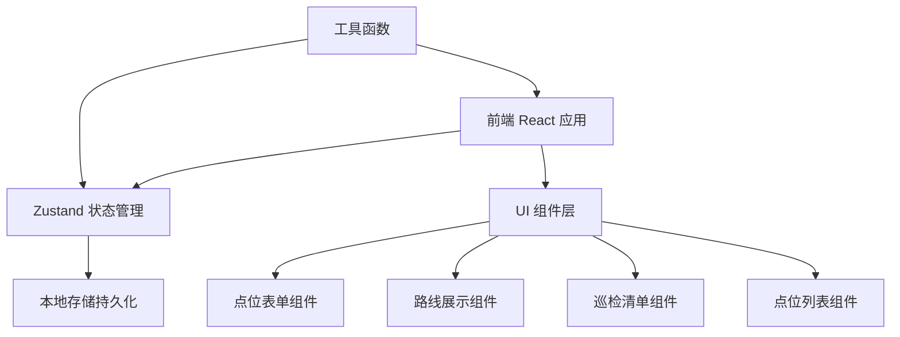
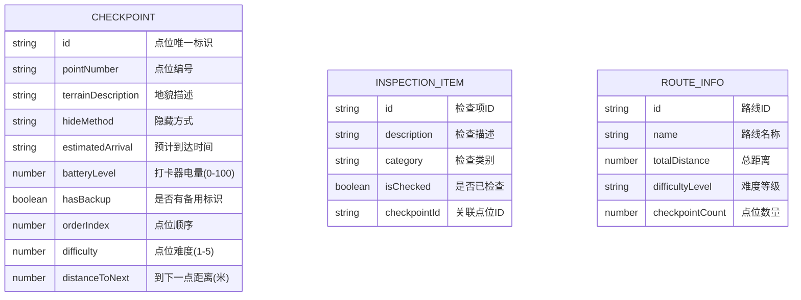

## 1. 架构设计



## 2. 技术选型

- **前端框架**：React@18 + TypeScript
- **构建工具**：Vite@5
- **样式方案**：Tailwind CSS@3
- **状态管理**：Zustand
- **图标库**：Lucide React
- **数据持久化**：LocalStorage
- **路由**：React Router DOM@6

## 3. 路由定义

| 路由 | 页面用途 |
|-------|---------|
| / | 检查点布置主页面 |

## 4. 数据模型

### 4.1 数据模型定义



### 4.2 TypeScript 类型定义

```typescript
interface Checkpoint {
  id: string;
  pointNumber: string;
  terrainDescription: string;
  hideMethod: string;
  estimatedArrival: string;
  batteryLevel: number;
  hasBackup: boolean;
  orderIndex: number;
  difficulty: number;
  distanceToNext: number;
}

interface InspectionItem {
  id: string;
  description: string;
  category: 'location' | 'device' | 'backup' | 'safety';
  isChecked: boolean;
  checkpointId?: string;
}

interface RouteInfo {
  totalDistance: number;
  difficultyLevel: 'easy' | 'medium' | 'hard' | 'extreme';
  averageDistance: number;
  withdrawalOrder: string[];
}
```

## 5. 目录结构

```
src/
├── components/
│   ├── CheckpointForm.tsx      # 检查点录入表单
│   ├── CheckpointList.tsx      # 检查点列表
│   ├── RouteDisplay.tsx        # 路线信息展示
│   ├── InspectionChecklist.tsx # 巡检清单
│   └── Header.tsx              # 页面头部
├── store/
│   └── useCheckpointStore.ts   # Zustand状态管理
├── types/
│   └── index.ts                # 类型定义
├── utils/
│   └── helpers.ts              # 工具函数
├── pages/
│   └── CheckpointLayout.tsx    # 主页面
├── App.tsx
├── main.tsx
└── index.css
```
