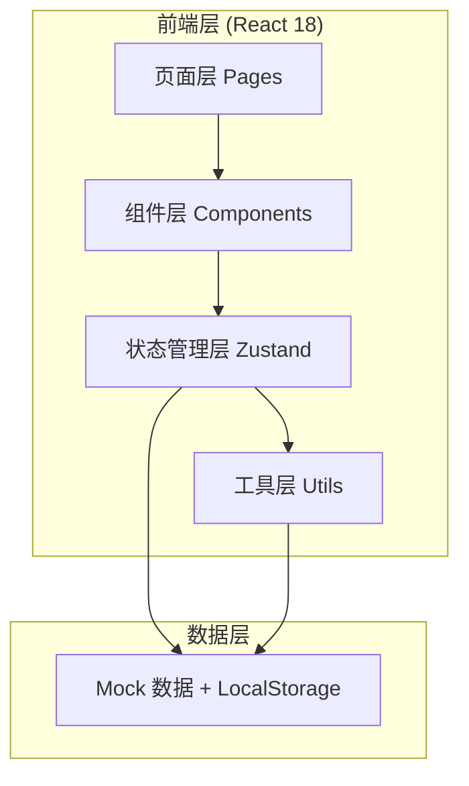
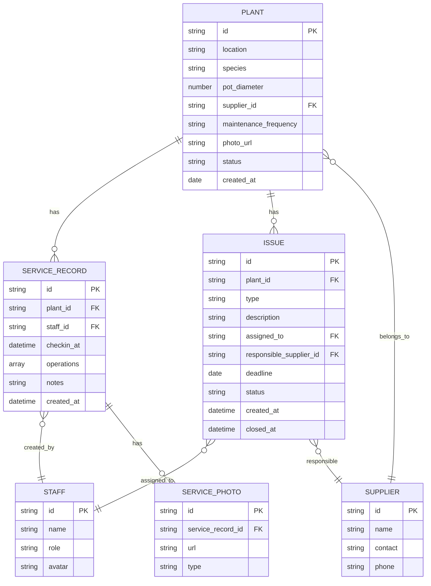

## 1. 架构设计



## 2. 技术描述

- **前端框架**：React 18 + TypeScript
- **构建工具**：Vite
- **样式方案**：Tailwind CSS 3
- **状态管理**：Zustand
- **路由**：React Router DOM v6
- **图表**：Recharts
- **图标**：Lucide React
- **数据持久化**：LocalStorage（模拟后端）
- **后端**：无（纯前端 Mock 数据）

## 3. 路由定义

| 路由 | 用途 |
|------|------|
| / | 仪表盘首页（概览 + 快捷入口） |
| /plants | 绿植档案列表 |
| /plants/:id | 绿植详情 + 养护历史 |
| /plants/new | 新增绿植档案 |
| /service | 养护服务记录（打卡 + 操作记录） |
| /issues | 问题追踪看板 |
| /stats | 统计报表 |

## 4. 数据模型

### 4.1 实体关系图



### 4.2 核心 TypeScript 类型定义

```typescript
type PlantStatus = 'healthy' | 'warning' | 'problem';
type IssueStatus = 'pending' | 'processing' | 'closed';
type OperationType = 'watering' | 'pruning' | 'fertilizing' | 'repotting' | 'pest_control';

interface Plant {
  id: string;
  location: string;
  species: string;
  potDiameter: number;
  supplierId: string;
  maintenanceFrequency: string;
  photoUrl: string;
  status: PlantStatus;
  createdAt: string;
}

interface ServiceRecord {
  id: string;
  plantId: string;
  staffId: string;
  checkinAt: string;
  operations: OperationType[];
  notes: string;
  photos: ServicePhoto[];
  createdAt: string;
}

interface ServicePhoto {
  id: string;
  url: string;
  type: 'before' | 'after' | 'detail';
}

interface Issue {
  id: string;
  plantId: string;
  type: string;
  description: string;
  assignedTo: string;
  responsibleSupplierId: string;
  deadline: string;
  status: IssueStatus;
  createdAt: string;
  closedAt?: string;
}

interface Supplier {
  id: string;
  name: string;
  contact: string;
  phone: string;
}

interface Staff {
  id: string;
  name: string;
  role: 'admin' | 'maintenance';
  avatar: string;
}
```

## 5. 目录结构

```
src/
├── components/          # 可复用组件
│   ├── layout/         # 布局组件（Sidebar, Header）
│   ├── plant/          # 绿植相关组件（PlantCard, PlantForm）
│   ├── service/        # 服务相关组件（CheckInPanel, OperationSelector）
│   ├── issue/          # 问题相关组件（IssueCard, IssueKanban）
│   ├── stats/          # 统计图表组件
│   └── ui/             # 基础 UI 组件（Button, Modal, Tag）
├── pages/              # 页面组件
│   ├── Dashboard.tsx
│   ├── PlantList.tsx
│   ├── PlantDetail.tsx
│   ├── PlantNew.tsx
│   ├── ServiceRecord.tsx
│   ├── IssueTrack.tsx
│   └── Statistics.tsx
├── store/              # Zustand 状态管理
│   └── index.ts
├── types/              # TypeScript 类型定义
│   └── index.ts
├── utils/              # 工具函数
│   ├── mock.ts         # Mock 数据生成
│   └── date.ts         # 日期处理
├── App.tsx
├── main.tsx
└── index.css
```
