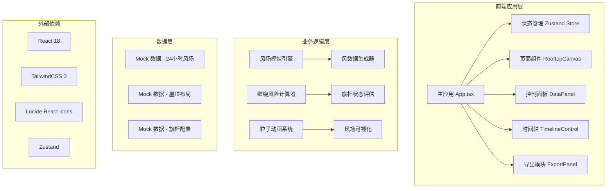
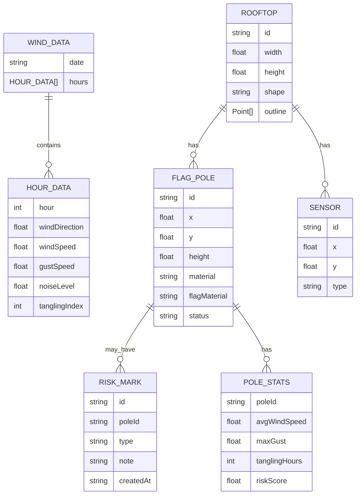

## 1. 架构设计



## 2. 技术描述

- **前端框架**: React@18 + TypeScript@5
- **构建工具**: Vite@5
- **样式方案**: TailwindCSS@3 + CSS Variables
- **状态管理**: Zustand
- **图标库**: lucide-react
- **数据来源**: 内置 Mock 数据（24小时风场模拟数据、屋顶布局、旗杆配置）
- **后端服务**: 无（纯前端应用，本地运行）

## 3. 目录结构

```
src/
├── components/
│   ├── RooftopCanvas/       # 屋顶平面画布组件
│   │   ├── index.tsx        # 主画布组件
│   │   ├── FlagPole.tsx     # 旗杆组件
│   │   ├── Sensor.tsx       # 传感器组件
│   │   ├── WindParticles.tsx# 风场粒子动画
│   │   └── RooftopShape.tsx # 屋顶轮廓组件
│   ├── DataPanel/           # 数据面板组件
│   │   ├── index.tsx        # 主面板
│   │   ├── RealtimeData.tsx # 实时数据展示
│   │   └── PoleDetail.tsx   # 旗杆详情
│   ├── TimelineControl/     # 时间轴控制组件
│   │   ├── index.tsx        # 时间轴主组件
│   │   └── PlayControls.tsx # 播放控制按钮
│   ├── RiskMarker/          # 风险标记组件
│   │   ├── index.tsx        # 标记工具
│   │   └── MarkerMenu.tsx   # 右键菜单
│   ├── ExportPanel/         # 导出面板
│   │   └── index.tsx        # 导出功能
│   └── ui/                  # 通用 UI 组件
│       ├── Card.tsx
│       ├── Button.tsx
│       └── Slider.tsx
├── store/
│   └── useWindStore.ts      # Zustand 状态管理
├── hooks/
│   ├── useWindSimulation.ts # 风场模拟 Hook
│   ├── useTimeline.ts       # 时间轴控制 Hook
│   └── useParticleSystem.ts # 粒子系统 Hook
├── utils/
│   ├── windCalculator.ts    # 风场计算工具
│   ├── riskAssessment.ts    # 风险评估工具
│   └── exportUtils.ts       # 导出工具
├── data/
│   ├── mockWindData.ts      # 24小时风场 Mock 数据
│   ├── mockRooftop.ts       # 屋顶布局 Mock 数据
│   └── mockPoles.ts         # 旗杆配置 Mock 数据
├── types/
│   └── index.ts             # TypeScript 类型定义
├── App.tsx                  # 应用入口
├── main.tsx                 # React 挂载点
└── index.css                # 全局样式与 Tailwind
```

## 4. 路由定义

| 路由 | 页面 | 说明 |
|------|------|------|
| / | 主页面 | 风场模拟主画布、控制面板、时间轴 |

单页应用，无复杂路由。

## 5. 数据模型

### 5.1 数据模型定义



### 5.2 TypeScript 类型定义

```typescript
// 风场数据类型
export interface HourlyWindData {
  hour: number;
  windDirection: number; // 0-360 度
  windSpeed: number; // m/s
  gustSpeed: number; // m/s
  noiseLevel: number; // dB
  tanglingIndex: number; // 0-100 缠绕指数
}

export interface WindData24h {
  date: string;
  hours: HourlyWindData[];
}

// 屋顶布局类型
export interface Point {
  x: number;
  y: number;
}

export interface Rooftop {
  id: string;
  name: string;
  width: number;
  height: number;
  outline: Point[];
}

// 旗杆类型
export type PoleStatus = 'normal' | 'warning' | 'danger';
export type PoleMaterial = 'aluminum' | 'steel' | 'fiberglass';
export type FlagMaterial = 'polyester' | 'nylon' | 'cotton';
export type RiskType = 'reduce_height' | 'change_material' | 'relocate';

export interface FlagPole {
  id: string;
  x: number;
  y: number;
  height: number; // 米
  poleMaterial: PoleMaterial;
  flagMaterial: FlagMaterial;
  status: PoleStatus;
}

// 传感器类型
export interface Sensor {
  id: string;
  x: number;
  y: number;
  type: 'anemometer' | 'wind_vane' | 'noise';
}

// 风险标记类型
export interface RiskMark {
  id: string;
  poleId: string;
  type: RiskType;
  note: string;
  createdAt: string;
}

// 旗杆统计数据
export interface PoleStats {
  poleId: string;
  avgWindSpeed: number;
  maxGustSpeed: number;
  tanglingHours: number;
  avgTanglingIndex: number;
  riskScore: number; // 0-100
}

// 应用状态
export interface AppState {
  currentHour: number;
  isPlaying: boolean;
  playbackSpeed: number;
  selectedPoleId: string | null;
  riskMarks: RiskMark[];
  zoom: number;
  pan: Point;
}
```

## 6. 核心算法

### 6.1 缠绕风险计算
```
缠绕指数 = f(风速, 风向变化率, 阵风系数, 旗杆高度, 旗面材质)
其中：
- 风速权重: 0.35
- 风向变化率权重: 0.4
- 阵风系数权重: 0.2
- 材质阻尼系数: 0.05
```

### 6.2 粒子系统
- 粒子数量: 根据当前风速动态调整 (50-200 个)
- 粒子速度: 与风速成正比 (v = k * windSpeed)
- 粒子方向: 沿风向角度的反方向 (风吹来的反方向)
- 生命周期: 3-5 秒，淡出效果

### 6.3 风险等级评定
| 风险分数 | 等级 | 颜色 | 建议 |
|---------|------|------|------|
| 0-30 | 低 | 绿色 | 正常使用 |
| 31-60 | 中 | 橙色 | 建议监测 |
| 61-100 | 高 | 红色 | 需要调整 |
