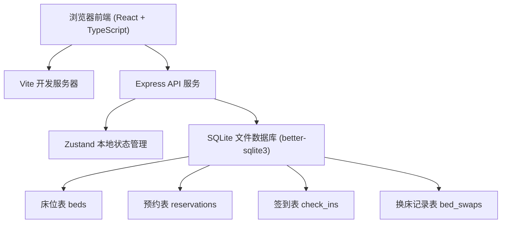
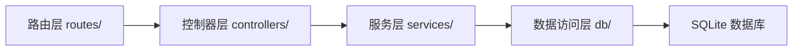
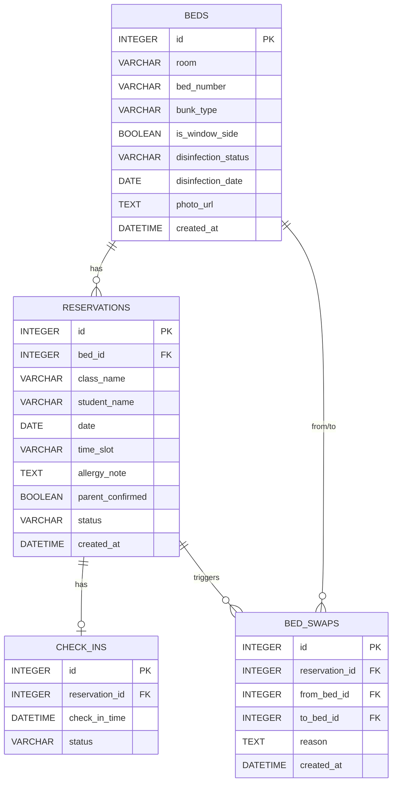

## 1. 架构设计



## 2. 技术说明

- 前端：React@18 + TypeScript + Vite
- 样式：TailwindCSS@3
- 状态管理：Zustand
- 后端：Express@4 + TypeScript
- 数据库：SQLite (better-sqlite3)，本地文件存储，适合小型管理系统
- 图表：recharts
- 图标：lucide-react
- 路由：react-router-dom

## 3. 路由定义

| 路由 | 用途 |
|-------|---------|
| / | 首页仪表盘，统计概览 |
| /beds | 床位管理列表 |
| /beds/new | 新增床位 |
| /beds/:id/edit | 编辑床位 |
| /reservations | 预约管理列表 |
| /reservations/new | 新增预约 |
| /check-in | 当日签到管理 |
| /statistics | 统计分析页面 |

## 4. API 定义

### 4.1 床位接口
```typescript
// GET /api/beds - 获取床位列表（支持筛选）
interface Bed {
  id: number;
  room: string;
  bedNumber: string;
  bunkType: 'upper' | 'lower';
  isWindowSide: boolean;
  disinfectionStatus: 'completed' | 'pending' | 'expired';
  disinfectionDate: string | null;
  photoUrl: string | null;
  createdAt: string;
}

// POST /api/beds - 新增床位
// PUT /api/beds/:id - 更新床位
// DELETE /api/beds/:id - 删除床位
// PATCH /api/beds/:id/disinfection - 更新消毒状态
```

### 4.2 预约接口
```typescript
// GET /api/reservations - 获取预约列表（支持按日期/班级筛选）
interface Reservation {
  id: number;
  bedId: number;
  className: string;
  studentName: string;
  date: string;
  timeSlot: 'morning' | 'afternoon' | 'full';
  allergyNote: string;
  parentConfirmed: boolean;
  status: 'pending' | 'checked_in' | 'absent' | 'swapped';
  createdAt: string;
}

// POST /api/reservations - 新增预约（含冲突校验）
// POST /api/reservations/check-conflict - 检查床位是否可预约
// DELETE /api/reservations/:id - 取消预约
```

### 4.3 签到接口
```typescript
// GET /api/check-ins?date=YYYY-MM-DD - 获取当日签到列表
interface CheckInRecord {
  id: number;
  reservationId: number;
  checkInTime: string | null;
  status: 'pending' | 'checked_in' | 'absent';
}

// POST /api/check-ins/:reservationId/check-in - 签到
// POST /api/check-ins/:reservationId/absent - 标记未到
// POST /api/check-ins/:reservationId/swap - 临时换床
```

### 4.4 统计接口
```typescript
// GET /api/statistics/overview - 首页概览数据
// GET /api/statistics/class-usage?startDate=&endDate= - 班级使用量
// GET /api/statistics/vacancy?date= - 空床率
// GET /api/statistics/disinfection-missed - 消毒漏检床位
```

## 5. 服务端架构



## 6. 数据模型

### 6.1 ER 图



### 6.2 DDL

```sql
-- 床位表
CREATE TABLE IF NOT EXISTS beds (
  id INTEGER PRIMARY KEY AUTOINCREMENT,
  room TEXT NOT NULL,
  bed_number TEXT NOT NULL,
  bunk_type TEXT NOT NULL CHECK (bunk_type IN ('upper', 'lower')),
  is_window_side INTEGER NOT NULL DEFAULT 0,
  disinfection_status TEXT NOT NULL DEFAULT 'pending' CHECK (disinfection_status IN ('completed', 'pending', 'expired')),
  disinfection_date TEXT,
  photo_url TEXT,
  created_at TEXT NOT NULL DEFAULT (datetime('now')),
  UNIQUE(room, bed_number)
);

-- 预约表
CREATE TABLE IF NOT EXISTS reservations (
  id INTEGER PRIMARY KEY AUTOINCREMENT,
  bed_id INTEGER NOT NULL,
  class_name TEXT NOT NULL,
  student_name TEXT NOT NULL,
  date TEXT NOT NULL,
  time_slot TEXT NOT NULL DEFAULT 'full' CHECK (time_slot IN ('morning', 'afternoon', 'full')),
  allergy_note TEXT,
  parent_confirmed INTEGER NOT NULL DEFAULT 0,
  status TEXT NOT NULL DEFAULT 'pending' CHECK (status IN ('pending', 'checked_in', 'absent', 'swapped')),
  created_at TEXT NOT NULL DEFAULT (datetime('now')),
  FOREIGN KEY (bed_id) REFERENCES beds(id),
  UNIQUE(bed_id, date, time_slot)
);

-- 签到表
CREATE TABLE IF NOT EXISTS check_ins (
  id INTEGER PRIMARY KEY AUTOINCREMENT,
  reservation_id INTEGER NOT NULL UNIQUE,
  check_in_time TEXT,
  status TEXT NOT NULL DEFAULT 'pending' CHECK (status IN ('pending', 'checked_in', 'absent')),
  FOREIGN KEY (reservation_id) REFERENCES reservations(id)
);

-- 换床记录表
CREATE TABLE IF NOT EXISTS bed_swaps (
  id INTEGER PRIMARY KEY AUTOINCREMENT,
  reservation_id INTEGER NOT NULL,
  from_bed_id INTEGER NOT NULL,
  to_bed_id INTEGER NOT NULL,
  reason TEXT,
  created_at TEXT NOT NULL DEFAULT (datetime('now')),
  FOREIGN KEY (reservation_id) REFERENCES reservations(id),
  FOREIGN KEY (from_bed_id) REFERENCES beds(id),
  FOREIGN KEY (to_bed_id) REFERENCES beds(id)
);

-- 索引
CREATE INDEX IF NOT EXISTS idx_reservations_date ON reservations(date);
CREATE INDEX IF NOT EXISTS idx_reservations_class ON reservations(class_name);
CREATE INDEX IF NOT EXISTS idx_beds_disinfection ON beds(disinfection_status);
```
