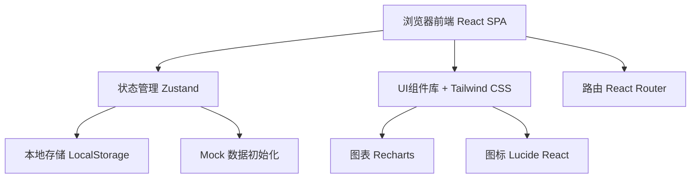
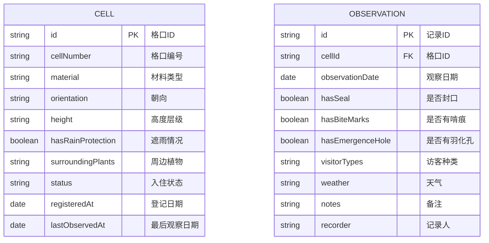

## 1. 架构设计



## 2. 技术描述

- **前端框架**：React@18 + TypeScript@5 + Vite@5
- **UI样式**：Tailwind CSS@3 + PostCSS@8
- **状态管理**：Zustand@4
- **路由管理**：React Router DOM@6
- **图表组件**：Recharts@2
- **图标组件**：Lucide React@0.344
- **数据存储**：LocalStorage（纯前端，无需后端）
- **初始化工具**：vite-init
- **后端服务**：无（纯前端应用）
- **数据库**：无（使用浏览器本地存储 + Mock数据）

## 3. 路由定义

| 路由 | 页面组件 | 用途 |
|------|----------|------|
| / | ObservationPage | 入住观察主页 - 小格地图、状态总览、材料提醒 |
| /cells | CellManagementPage | 格口管理页 - 格口列表、登记表单 |
| /record | DailyRecordPage | 每日记录页 - 观察表单、记录历史 |
| /analysis | AnalysisPage | 数据分析页 - 趋势图表、材料偏好统计 |

## 4. 数据模型

### 4.1 数据模型定义



### 4.2 类型定义

```typescript
// 格口材料类型
type CellMaterial = 
  | 'bamboo'      // 竹子
  | 'wood'        // 木头
  | 'pinecone'    // 松果
  | 'straw'       // 稻草
  | 'hollowStem'  // 空心茎
  | 'bark'        // 树皮
  | 'stone'       // 石块
  | 'moss'        // 苔藓
  | 'corrugated'  // 瓦楞纸
  | 'drilledWood' // 钻孔木

// 朝向类型
type Orientation = 'north' | 'south' | 'east' | 'west' | 'northeast' | 'northwest' | 'southeast' | 'southwest'

// 高度层级
type HeightLevel = 'ground' | 'low' | 'middle' | 'high'

// 入住状态
type OccupancyStatus = 'empty' | 'underObservation' | 'occupied'

// 访客种类
type VisitorType = 'bee' | 'ladybug' | 'butterfly' | 'beetle' | 'spider' | 'ant' | 'other'

// 天气类型
type WeatherType = 'sunny' | 'cloudy' | 'rainy' | 'windy' | 'stormy'

// 格口实体
interface Cell {
  id: string
  cellNumber: string
  material: CellMaterial
  orientation: Orientation
  height: HeightLevel
  hasRainProtection: boolean
  surroundingPlants: string[]
  status: OccupancyStatus
  registeredAt: string
  lastObservedAt: string | null
}

// 观察记录实体
interface Observation {
  id: string
  cellId: string
  observationDate: string
  hasSeal: boolean
  hasBiteMarks: boolean
  hasEmergenceHole: boolean
  visitorTypes: VisitorType[]
  weather: WeatherType
  notes: string
  recorder: string
}

// 材料使用提醒
interface MaterialAlert {
  material: CellMaterial
  materialName: string
  unusedDays: number
  cellCount: number
  suggestion: string
}
```

### 4.3 Mock 数据

系统将预置24个格口的Mock数据，覆盖不同材料、朝向、高度组合，并包含最近30天的观察记录。

## 5. 项目结构

```
src/
├── components/           # 可复用组件
│   ├── CellGrid.tsx      # 小格地图组件
│   ├── CellCard.tsx      # 格口卡片组件
│   ├── CellForm.tsx      # 格口登记表单
│   ├── ObservationForm.tsx  # 观察记录表单
│   ├── ObservationTimeline.tsx  # 观察时间线
│   ├── StatusStats.tsx   # 状态统计卡片
│   ├── MaterialAlert.tsx # 材料提醒组件
│   ├── TrendChart.tsx    # 趋势图表
│   └── MaterialChart.tsx # 材料偏好图表
├── hooks/                # 自定义Hooks
│   └── useInsectHotel.ts # 昆虫旅馆业务逻辑
├── pages/                # 页面组件
│   ├── ObservationPage.tsx
│   ├── CellManagementPage.tsx
│   ├── DailyRecordPage.tsx
│   └── AnalysisPage.tsx
├── store/                # 状态管理
│   └── useHotelStore.ts  # Zustand Store
├── types/                # 类型定义
│   └── index.ts
├── utils/                # 工具函数
│   ├── mockData.ts       # Mock数据生成
│   ├── storage.ts        # 本地存储
│   └── dateUtils.ts      # 日期工具
├── App.tsx               # 应用根组件
├── main.tsx              # 入口文件
└── index.css             # 全局样式
```

## 6. 核心算法

### 6.1 入住状态判定算法

根据连续观察记录判定格口入住状态：
- **空置(empty)**：连续7天无任何入住迹象
- **观察中(underObservation)**：出现啃痕/封口等初期迹象
- **已入住(occupied)**：出现羽化孔或连续3天观察到访客

### 6.2 材料使用提醒算法

1. 按材料类型分组统计格口
2. 计算每种材料的平均空置天数
3. 超过14天无任何入住迹象的材料触发提醒
4. 根据格口朝向和周边植物给出更换建议

### 6.3 入住变化趋势计算

按日期聚合所有格口的入住状态变化，生成30天趋势数据。
