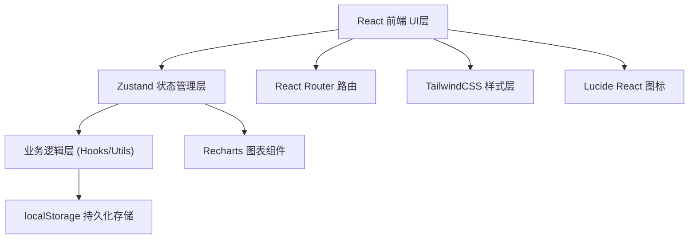
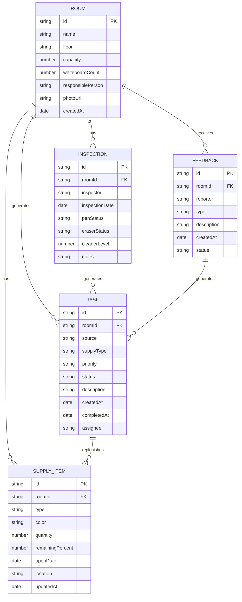

# 会议室白板笔补给系统 - 技术架构文档

## 1. 架构设计
本系统为纯前端应用，使用 React + TypeScript + Vite 构建，采用 zustand 进行状态管理，使用 localStorage 持久化数据。



## 2. 技术说明
- **前端框架**: React@18 + TypeScript
- **构建工具**: Vite@5
- **样式方案**: TailwindCSS@3
- **状态管理**: Zustand
- **路由管理**: React Router DOM@6
- **图表库**: Recharts
- **图标库**: Lucide React
- **数据持久化**: localStorage + 预置 Mock 数据
- **初始化工具**: vite-init

## 3. 路由定义
| 路由 | 用途 |
|------|------|
| / | 仪表盘首页 - 数据概览 |
| /rooms | 会议室列表 |
| /rooms/new | 新增会议室 |
| /rooms/:id | 会议室详情/编辑 |
| /inventory | 库存总览 |
| /inventory/:roomId | 会议室库存详情 |
| /inspection | 巡检任务列表 |
| /inspection/:roomId | 执行巡检 |
| /tasks | 补给任务列表 |
| /tasks/:id | 补给任务详情 |
| /feedback | 员工扫码反馈（手机端） |
| /statistics | 统计报表 |

## 4. 数据模型

### 4.1 ER 图


### 4.2 数据类型定义

```typescript
// 用品类型
type SupplyType = 'blackPen' | 'redPen' | 'bluePen' | 'eraser' | 'cleaner' | 'magnet';

// 板擦状态
type EraserStatus = 'clean' | 'normal' | 'replace';

// 任务优先级
type TaskPriority = 'low' | 'medium' | 'high' | 'urgent';

// 任务状态
type TaskStatus = 'pending' | 'in_progress' | 'completed';

// 任务来源
type TaskSource = 'inspection' | 'feedback' | 'low_stock' | 'manual';

// 反馈类型
type FeedbackType = 'pen_empty' | 'supply_missing' | 'other';

interface Room {
  id: string;
  name: string;
  floor: string;
  capacity: number;
  whiteboardCount: number;
  responsiblePerson: string;
  photoUrl: string;
  createdAt: string;
}

interface SupplyItem {
  id: string;
  roomId: string;
  type: SupplyType;
  color?: string;
  quantity: number;
  remainingPercent?: number;
  openDate?: string;
  location: string;
  updatedAt: string;
}

interface Inspection {
  id: string;
  roomId: string;
  inspector: string;
  inspectionDate: string;
  penStatus: Record<string, boolean>;
  eraserStatus: EraserStatus;
  cleanerLevel: number;
  notes: string;
}

interface Task {
  id: string;
  roomId: string;
  source: TaskSource;
  supplyType: SupplyType;
  priority: TaskPriority;
  status: TaskStatus;
  description: string;
  createdAt: string;
  completedAt?: string;
  assignee: string;
}

interface Feedback {
  id: string;
  roomId: string;
  reporter: string;
  type: FeedbackType;
  description: string;
  createdAt: string;
  status: 'pending' | 'resolved';
}
```

## 5. 项目目录结构
```
src/
├── components/          # 可复用组件
│   ├── Layout.tsx       # 主布局组件
│   ├── Sidebar.tsx      # 侧边导航
│   ├── Header.tsx       # 顶部导航
│   ├── StatCard.tsx     # 统计卡片
│   ├── RoomCard.tsx     # 会议室卡片
│   ├── SupplyCard.tsx   # 用品库存卡片
│   ├── TaskCard.tsx     # 任务卡片
│   └── StatusBadge.tsx  # 状态标签
├── pages/               # 页面组件
│   ├── Dashboard.tsx
│   ├── RoomList.tsx
│   ├── RoomForm.tsx
│   ├── RoomDetail.tsx
│   ├── InventoryList.tsx
│   ├── InventoryDetail.tsx
│   ├── InspectionList.tsx
│   ├── InspectionForm.tsx
│   ├── TaskList.tsx
│   ├── TaskDetail.tsx
│   ├── FeedbackForm.tsx
│   └── Statistics.tsx
├── store/               # Zustand 状态管理
│   └── index.ts
├── data/                # Mock 数据
│   └── mockData.ts
├── types/               # TypeScript 类型定义
│   └── index.ts
├── utils/               # 工具函数
│   ├── helpers.ts
│   └── constants.ts
├── App.tsx
├── main.tsx
└── index.css
```

## 6. 状态管理设计
使用 Zustand 创建单一 store，管理所有业务数据：

```typescript
interface AppState {
  rooms: Room[];
  supplies: SupplyItem[];
  inspections: Inspection[];
  tasks: Task[];
  feedbacks: Feedback[];
  
  // Room actions
  addRoom: (room: Omit<Room, 'id' | 'createdAt'>) => void;
  updateRoom: (id: string, data: Partial<Room>) => void;
  deleteRoom: (id: string) => void;
  
  // Supply actions
  updateSupply: (id: string, data: Partial<SupplyItem>) => void;
  checkLowStock: () => void;
  
  // Inspection actions
  addInspection: (inspection: Omit<Inspection, 'id'>) => void;
  
  // Task actions
  addTask: (task: Omit<Task, 'id' | 'createdAt'>) => void;
  updateTask: (id: string, data: Partial<Task>) => void;
  
  // Feedback actions
  addFeedback: (feedback: Omit<Feedback, 'id' | 'createdAt' | 'status'>) => void;
}
```
