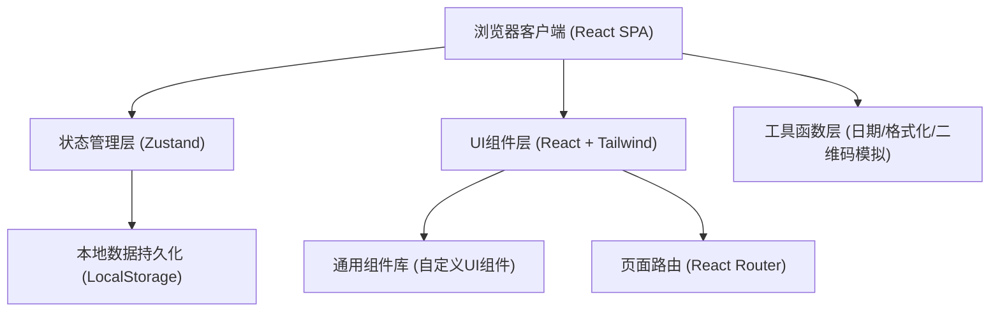
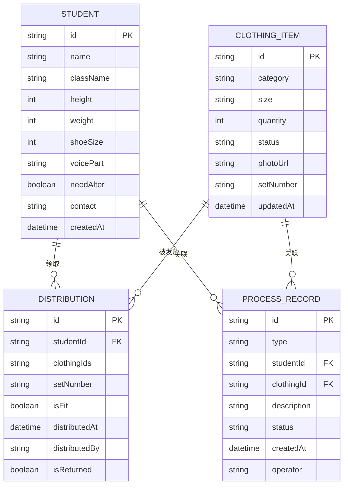

## 1. 架构设计



## 2. 技术描述
- **前端**：React@18 + TypeScript + Vite
- **样式**：TailwindCSS@3 + 自定义CSS变量主题系统
- **状态管理**：Zustand（轻量级状态管理，内置中间件持久化到LocalStorage）
- **路由**：React Router DOM@6
- **图标**：lucide-react
- **图表**：recharts（用于仪表板数据可视化）
- **后端**：无（纯前端，数据持久化在浏览器LocalStorage）
- **初始化工具**：vite-init (react-ts 模板)

## 3. 路由定义
| 路由 | 页面组件 | 用途 |
|------|----------|------|
| / | Dashboard | 仪表板看板：统计概览、预警、进度 |
| /students | StudentList | 学生档案列表 |
| /students/new | StudentForm | 新增学生 |
| /students/:id | StudentForm | 编辑学生 |
| /inventory | InventoryList | 服装库存总览 |
| /inventory/:category | InventoryList | 按分类查看库存 |
| /distribute | DistributeCenter | 服装发放中心 |
| /records | RecordsCenter | 流程记录中心（改衣/换码/遗失/归还） |

## 4. 数据模型

### 4.1 ER图



### 4.2 TypeScript类型定义

```typescript
// 声部分类
type VoicePart = '女高音' | '女低音' | '男高音' | '男低音' | '童声';

// 服装分类
type ClothingCategory = '上衣' | '裙裤' | '鞋子' | '领结' | '发饰';

// 服装状态
type ClothingStatus = '完好' | '待修' | '改衣中' | '遗失' | '清洗中';

// 流程记录类型
type RecordType = '改衣' | '换码' | '遗失' | '归还清洗';

// 学生档案
interface Student {
  id: string;
  name: string;
  className: string;
  height: number;
  weight: number;
  shoeSize: number;
  voicePart: VoicePart;
  needAlter: boolean;
  contact: string;
  createdAt: string;
}

// 服装库存
interface ClothingItem {
  id: string;
  category: ClothingCategory;
  size: string;
  quantity: number;
  status: ClothingStatus;
  photoUrl?: string;
  setNumber?: string;
  updatedAt: string;
}

// 发放记录
interface Distribution {
  id: string;
  studentId: string;
  clothingIds: string[];
  setNumber: string;
  isFit: boolean;
  distributedAt: string;
  distributedBy: string;
  isReturned: boolean;
}

// 流程记录
interface ProcessRecord {
  id: string;
  type: RecordType;
  studentId: string;
  clothingId?: string;
  description: string;
  status: '待处理' | '处理中' | '已完成';
  createdAt: string;
  operator: string;
}
```

## 5. 状态管理设计

使用 Zustand 创建单一 Store，包含：
- `students`: Student[] - 学生档案列表
- `clothingItems`: ClothingItem[] - 服装库存列表  
- `distributions`: Distribution[] - 发放记录
- `processRecords`: ProcessRecord[] - 流程记录
- CRUD操作方法（增删改查）
- 统计计算方法（仪表板数据聚合）
- persist 中间件持久化到 localStorage

## 6. 目录结构

```
src/
├── components/          # 可复用UI组件
│   ├── Layout/         # 布局组件 (Sidebar, Header)
│   ├── ui/             # 基础UI (Button, Card, Modal, Input)
│   ├── Dashboard/      # 仪表板专用组件
│   ├── Student/        # 学生模块组件
│   ├── Inventory/      # 库存模块组件
│   ├── Distribute/     # 发放模块组件
│   └── Records/        # 记录模块组件
├── pages/              # 页面级组件
│   ├── Dashboard.tsx
│   ├── StudentList.tsx
│   ├── StudentForm.tsx
│   ├── InventoryList.tsx
│   ├── DistributeCenter.tsx
│   └── RecordsCenter.tsx
├── store/              # Zustand状态管理
│   └── useAppStore.ts
├── types/              # TypeScript类型定义
│   └── index.ts
├── utils/              # 工具函数
│   ├── mockData.ts     # 初始化模拟数据
│   ├── formatters.ts   # 日期/数字格式化
│   └── recommend.ts    # 尺码推荐算法
├── App.tsx
├── main.tsx
└── index.css
```
