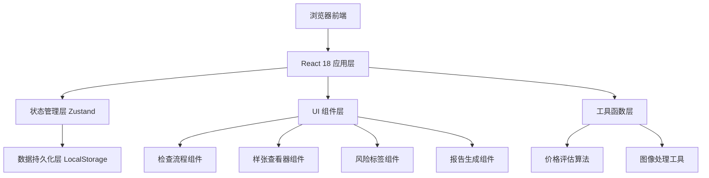
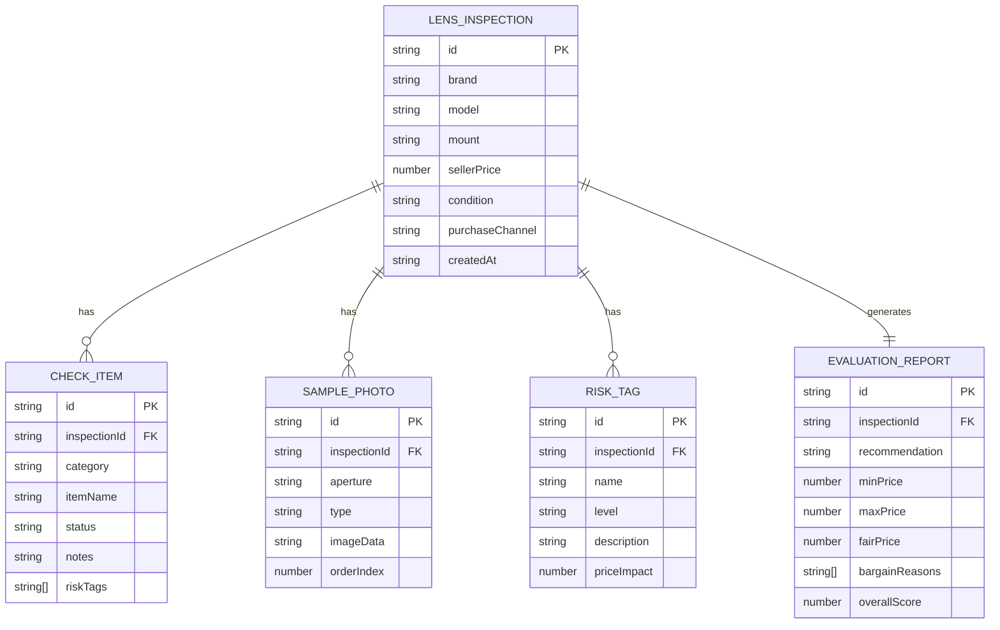

## 1. 架构设计



## 2. 技术描述

- **前端框架**：React 18 + TypeScript
- **构建工具**：Vite
- **样式方案**：Tailwind CSS 3
- **状态管理**：Zustand
- **路由**：React Router DOM v6
- **图标库**：lucide-react
- **图像处理**：Canvas API（原生实现，无需额外依赖）
- **数据持久化**：LocalStorage

## 3. 路由定义

| 路由 | 用途 |
|-------|---------|
| `/` | 首页：镜头信息录入、历史记录列表 |
| `/inspection/:id` | 检查流程页：7步检查项引导 |
| `/inspection/:id/samples` | 样张对比页：放大查看与对比 |
| `/inspection/:id/report` | 评估报告页：购买建议、价格评估、砍价理由 |

## 4. 数据模型

### 4.1 数据模型定义



### 4.2 TypeScript 类型定义

```typescript
export type RiskLevel = 'low' | 'medium' | 'high';
export type CheckStatus = 'pass' | 'warning' | 'fail' | 'untested';
export type PurchaseRecommendation = 'buy' | 'caution' | 'avoid';
export type SampleType = 'center' | 'corner_tl' | 'corner_tr' | 'corner_bl' | 'corner_br' | 'vignetting';

export interface LensInfo {
  id: string;
  brand: string;
  model: string;
  mount: string;
  sellerPrice: number;
  condition: string;
  purchaseChannel: string;
  createdAt: string;
}

export interface CheckItem {
  id: string;
  category: 'appearance' | 'optics' | 'aperture' | 'af' | 'extreme_focus';
  itemName: string;
  status: CheckStatus;
  notes: string;
}

export interface SamplePhoto {
  id: string;
  aperture: string;
  type: SampleType;
  imageData: string;
  orderIndex: number;
}

export interface RiskTag {
  id: string;
  name: string;
  level: RiskLevel;
  description: string;
  priceImpact: number;
}

export interface EvaluationReport {
  recommendation: PurchaseRecommendation;
  minPrice: number;
  maxPrice: number;
  fairPrice: number;
  bargainReasons: string[];
  overallScore: number;
}

export interface Inspection {
  lensInfo: LensInfo;
  checkItems: CheckItem[];
  samplePhotos: SamplePhoto[];
  riskTags: RiskTag[];
  report?: EvaluationReport;
}
```

## 5. 价格评估算法

基于卖家报价和风险标签计算可接受价格：

- **基础折扣**：根据外观成色给出基础折扣（95新 95折，9新 85折，8成新及以下 75折）
- **高风险项**：每项减价 15-25%（如霉斑、脱膜、对焦漂移）
- **中风险项**：每项减价 8-15%（如轻微划痕、少量灰尘）
- **低风险项**：每项减价 2-5%（如轻微掉漆、外观使用痕迹）
- **综合得分**：加权计算后给出最终建议价格区间
