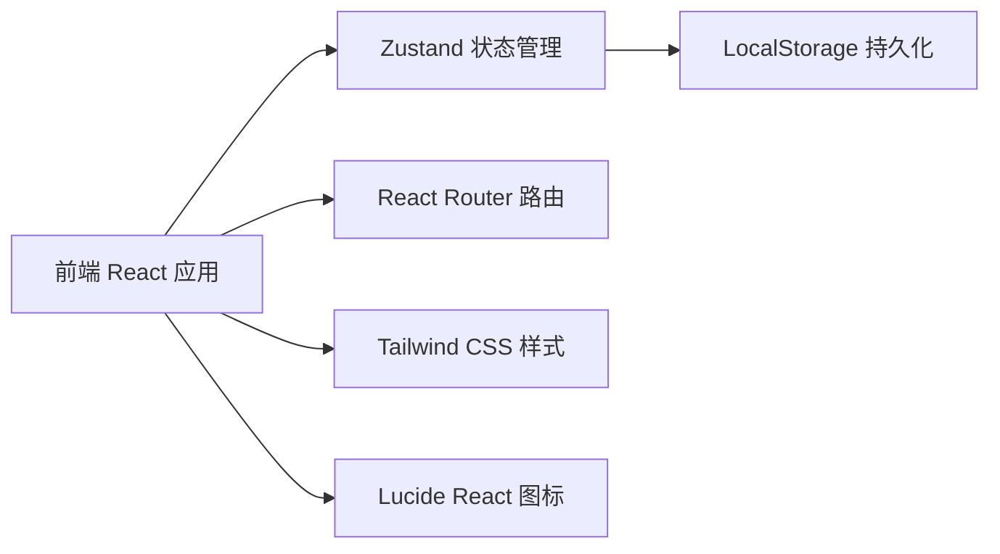
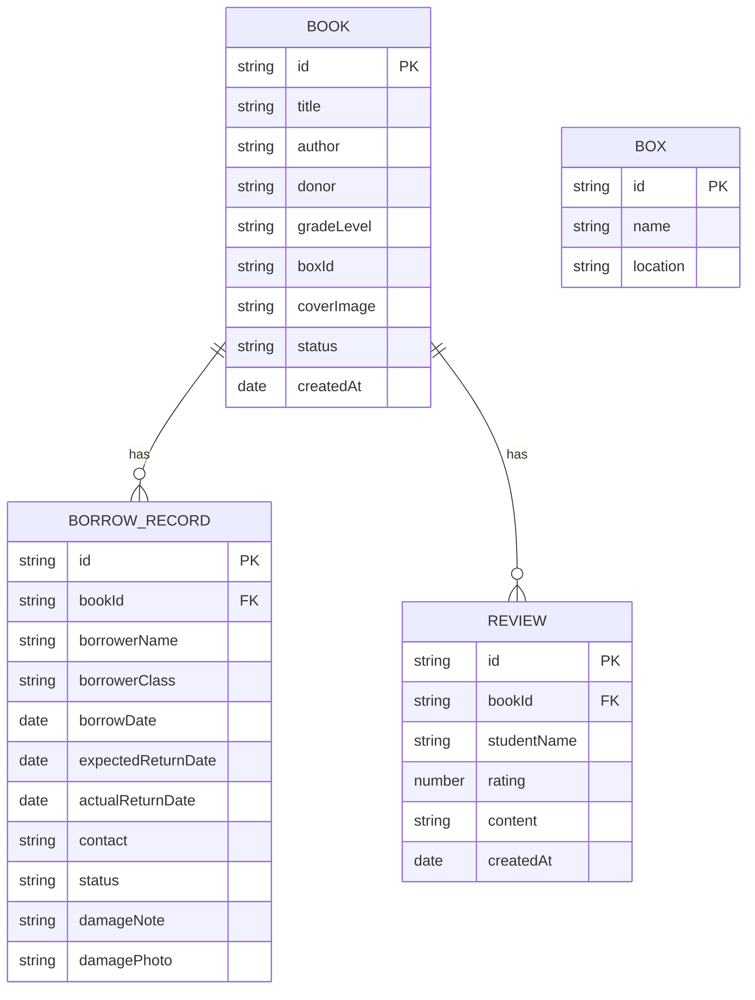

## 1. 架构设计



## 2. 技术描述
- 前端：React@18 + TypeScript + Tailwind CSS@3 + Vite
- 初始化工具：vite-init
- 后端：无（纯前端应用，数据通过 LocalStorage 持久化，使用 mock 数据）
- 状态管理：Zustand
- 路由：React Router DOM
- 图标：Lucide React

## 3. 路由定义
| 路由 | 用途 |
|-------|---------|
| / | 看板首页（四象限展示：在箱、借出、逾期、破损） |
| /books | 图书管理列表 |
| /books/:id | 图书详情页 |
| /stats | 统计中心（受欢迎类别、箱子流转速度） |

## 4. 数据模型

### 4.1 数据模型定义



### 4.2 类型定义

```typescript
type BookStatus = 'in_box' | 'borrowed' | 'overdue' | 'damaged';

interface Book {
  id: string;
  title: string;
  author: string;
  donor: string;
  gradeLevel: string;
  boxId: string;
  coverImage: string;
  status: BookStatus;
  createdAt: string;
}

type BorrowStatus = 'borrowing' | 'returned' | 'overdue' | 'damaged';

interface BorrowRecord {
  id: string;
  bookId: string;
  borrowerName: string;
  borrowerClass: string;
  borrowDate: string;
  expectedReturnDate: string;
  actualReturnDate?: string;
  contact: string;
  status: BorrowStatus;
  damageNote?: string;
  damagePhoto?: string;
}

interface Review {
  id: string;
  bookId: string;
  studentName: string;
  rating: number;
  content: string;
  createdAt: string;
}

interface Box {
  id: string;
  name: string;
  location: string;
}
```

## 5. 状态管理 (Zustand Store)

Store 包含：
- books: Book[] - 所有图书
- borrowRecords: BorrowRecord[] - 借阅记录
- reviews: Review[] - 短评
- boxes: Box[] - 漂流箱列表
- Actions:
  - addBook / updateBook / deleteBook
  - borrowBook / returnBook / returnDamagedBook
  - addReview
  - getBooksByStatus(status)
  - getBorrowRecordsByBook(bookId)
  - getReviewsByBook(bookId)
  - getPopularCategories()
  - getBoxTurnoverRate()
