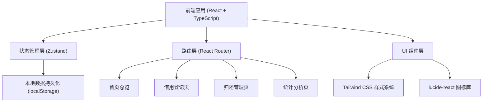
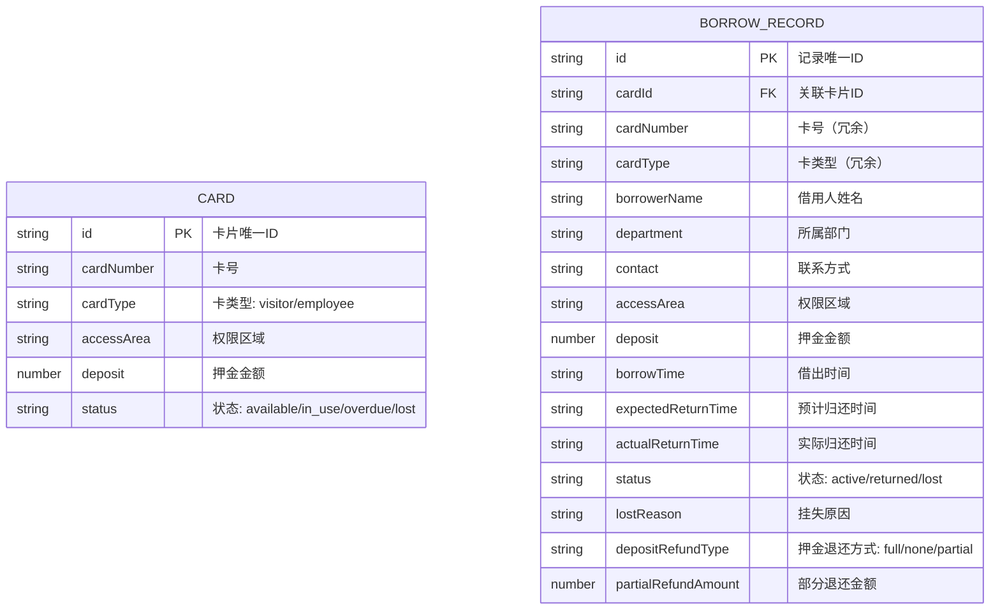

## 1. 架构设计



## 2. 技术描述

- **前端框架**: React@18 + TypeScript + Vite
- **初始化工具**: vite-init (react-ts 模板)
- **路由**: react-router-dom@6
- **状态管理**: zustand
- **样式方案**: tailwindcss@3
- **图标库**: lucide-react
- **数据持久化**: localStorage (前端模拟数据，无需后端)
- **后端**: 无（纯前端应用）
- **数据库**: 无（使用 localStorage 模拟）

## 3. 路由定义

| 路由 | 用途 |
|-------|---------|
| / | 首页总览 - 卡片状态统计与快速操作 |
| /borrow | 借用登记 - 新借卡片登记表单 |
| /return | 归还管理 - 卡号查询、归还确认、挂失流程 |
| /statistics | 统计分析 - 借用趋势、超时统计、部门排行 |

## 4. 数据模型

### 4.1 数据模型定义 (ER 图)



### 4.2 类型定义 (TypeScript)

```typescript
type CardType = 'visitor' | 'employee';
type CardStatus = 'available' | 'in_use' | 'overdue' | 'lost';
type RecordStatus = 'active' | 'returned' | 'lost';
type DepositRefundType = 'full' | 'none' | 'partial';

interface Card {
  id: string;
  cardNumber: string;
  cardType: CardType;
  accessArea: string;
  deposit: number;
  status: CardStatus;
}

interface BorrowRecord {
  id: string;
  cardId: string;
  cardNumber: string;
  cardType: CardType;
  borrowerName: string;
  department: string;
  contact: string;
  accessArea: string;
  deposit: number;
  borrowTime: string;
  expectedReturnTime: string;
  actualReturnTime?: string;
  status: RecordStatus;
  lostReason?: string;
  depositRefundType?: DepositRefundType;
  partialRefundAmount?: number;
}

interface DepartmentStats {
  department: string;
  count: number;
}

interface DailyStats {
  date: string;
  visitorCount: number;
  employeeCount: number;
}
```

### 4.3 初始 Mock 数据

系统初始化时预置以下测试数据：
- 10 张可借卡片（5 张访客卡、5 张员工临时卡）
- 3 条使用中的借用记录
- 5 条历史归还记录
- 1 条挂失记录
- 涵盖近 14 天的借用数据用于统计展示
