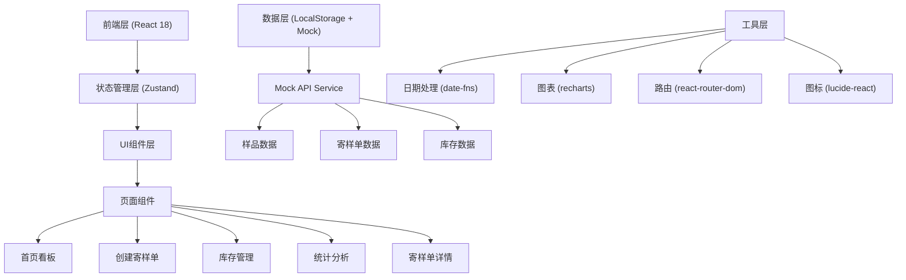
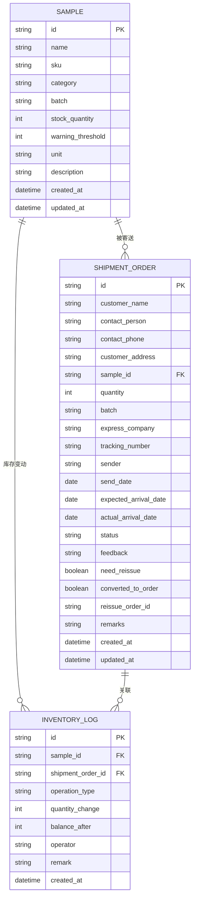

## 1. 架构设计



## 2. 技术描述

- **前端框架**：React 18 + TypeScript
- **构建工具**：Vite 5
- **样式方案**：Tailwind CSS 3
- **状态管理**：Zustand（轻量级，适合中小型应用）
- **路由管理**：React Router DOM 6
- **图表库**：Recharts（React原生图表库）
- **图标库**：Lucide React
- **日期处理**：date-fns
- **数据持久化**：LocalStorage + Mock数据（无需后端，前端独立运行）
- **代码规范**：ESLint + Prettier

## 3. 路由定义

| 路由路径 | 页面名称 | 主要功能 |
|----------|----------|----------|
| `/` | 首页看板 | 状态分组展示寄样单列表 |
| `/create` | 创建寄样单 | 填写寄样信息，创建新寄样单 |
| `/inventory` | 库存管理 | 样品库存列表、入库操作 |
| `/statistics` | 统计分析 | 寄样排行、转化率、超时分析 |
| `/order/:id` | 寄样单详情 | 查看详情、更新状态、记录反馈 |

## 4. 数据模型

### 4.1 数据模型ER图



### 4.2 类型定义（TypeScript）

```typescript
// 寄样单状态
type ShipmentStatus = 'pending' | 'shipping' | 'delivered' | 'followup';

// 快递公司枚举
type ExpressCompany = 'sf' | 'jd' | 'yt' | 'zt' | 'yd' | 'ems' | 'other';

// 样品信息
interface Sample {
  id: string;
  name: string;
  sku: string;
  category: string;
  batch: string;
  stockQuantity: number;
  warningThreshold: number;
  unit: string;
  description: string;
  createdAt: string;
  updatedAt: string;
}

// 寄样单
interface ShipmentOrder {
  id: string;
  customerName: string;
  contactPerson: string;
  contactPhone: string;
  customerAddress: string;
  sampleId: string;
  sampleName: string;
  quantity: number;
  batch: string;
  expressCompany: ExpressCompany;
  trackingNumber: string;
  sender: string;
  sendDate: string | null;
  expectedArrivalDate: string | null;
  actualArrivalDate: string | null;
  status: ShipmentStatus;
  feedback: string;
  needReissue: boolean;
  convertedToOrder: boolean;
  reissueOrderId: string | null;
  remarks: string;
  createdAt: string;
  updatedAt: string;
}

// 库存变动记录
interface InventoryLog {
  id: string;
  sampleId: string;
  shipmentOrderId: string | null;
  operationType: 'in' | 'out' | 'adjust';
  quantityChange: number;
  balanceAfter: number;
  operator: string;
  remark: string;
  createdAt: string;
}

// 统计数据
interface StatisticsData {
  totalShipments: number;
  pendingCount: number;
  shippingCount: number;
  deliveredCount: number;
  followupCount: number;
  conversionRate: number;
  reissueRate: number;
  overdueCount: number;
  topSamples: { sampleName: string; count: number }[];
  monthlyTrend: { month: string; shipments: number; conversions: number }[];
  expressPerformance: { company: string; total: number; overdue: number; rate: number }[];
}
```

### 4.3 Mock数据说明

初始化时预置以下数据：
- 20个常见样品（电子元器件、包装材料、成品样品等）
- 30条寄样单历史数据（覆盖各状态）
- 50条库存变动记录
- 所有数据通过LocalStorage持久化，刷新页面不丢失

## 5. 核心Store设计

### 5.1 Store分层结构

```
src/store/
├── useStore.ts          # 主Store入口
├── types.ts             # 类型定义
├── mockData.ts          # Mock初始数据
└── utils.ts             # 工具函数
```

### 5.2 Store方法定义

```typescript
interface StoreState {
  // 数据
  samples: Sample[];
  shipmentOrders: ShipmentOrder[];
  inventoryLogs: InventoryLog[];
  
  // 操作方法
  createShipmentOrder: (data: Omit<ShipmentOrder, 'id' | 'status' | 'createdAt' | 'updatedAt'>) => void;
  updateShipmentStatus: (id: string, status: ShipmentStatus, data?: Partial<ShipmentOrder>) => void;
  recordFeedback: (id: string, feedback: string, needReissue: boolean, convertedToOrder: boolean) => void;
  markAsFollowup: (id: string) => void;
  
  // 库存操作
  addSample: (sample: Omit<Sample, 'id' | 'createdAt' | 'updatedAt'>) => void;
  updateStock: (sampleId: string, quantity: number, operator: string, remark: string) => void;
  
  // 查询方法
  getOrdersByStatus: (status: ShipmentStatus) => ShipmentOrder[];
  getOverdueOrders: () => ShipmentOrder[];
  getStatistics: (startDate?: string, endDate?: string) => StatisticsData;
  searchOrders: (keyword: string) => ShipmentOrder[];
  
  // 持久化
  loadFromStorage: () => void;
  saveToStorage: () => void;
}
```

## 6. 目录结构

```
src/
├── assets/              # 静态资源
├── components/          # 通用组件
│   ├── Layout/          # 布局组件
│   ├── StatusCard/      # 状态卡片
│   ├── ShipmentCard/    # 寄样单卡片
│   ├── StatusBadge/     # 状态标签
│   ├── Modal/           # 弹窗组件
│   └── Toast/           # 提示组件
├── pages/               # 页面组件
│   ├── Dashboard/       # 首页看板
│   ├── CreateOrder/     # 创建寄样单
│   ├── Inventory/       # 库存管理
│   ├── Statistics/      # 统计分析
│   └── OrderDetail/     # 寄样单详情
├── store/               # 状态管理
├── hooks/               # 自定义Hooks
├── utils/               # 工具函数
│   ├── date.ts          # 日期处理
│   ├── express.ts       # 快递公司映射
│   └── storage.ts       # 本地存储
├── App.tsx              # 根组件
├── main.tsx             # 入口文件
└── index.css            # 全局样式
```
