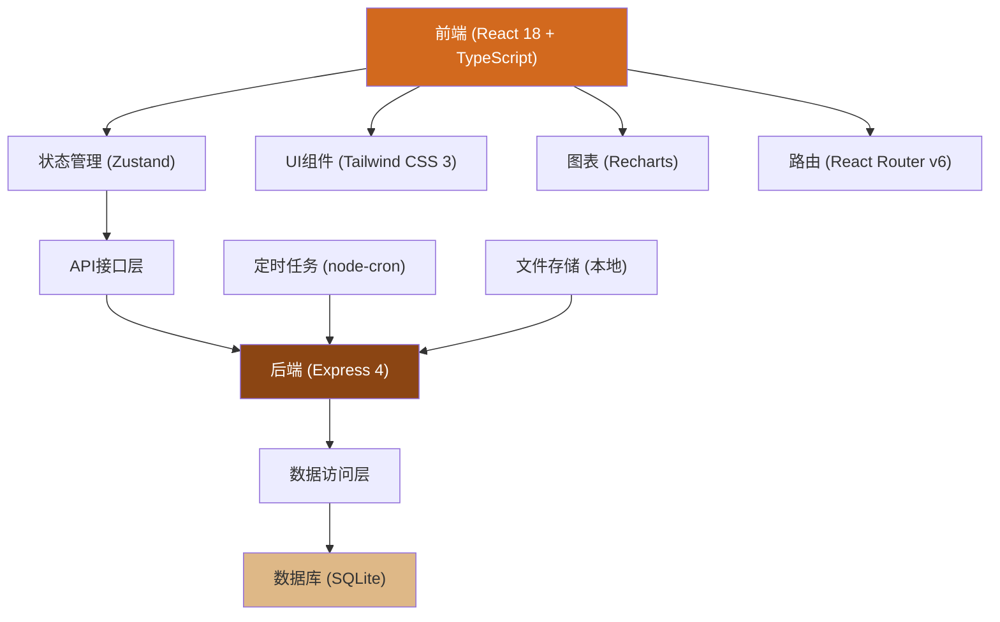
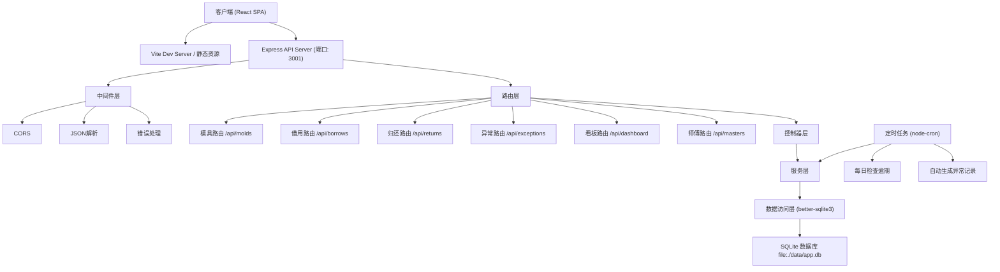
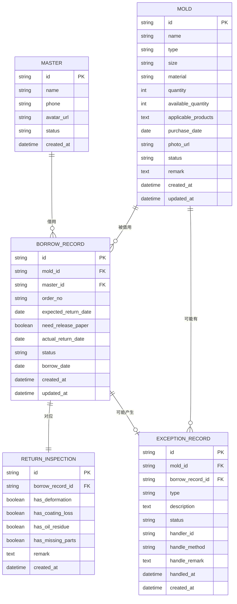

## 1. 架构设计



## 2. 技术描述
- 前端：React@18 + TypeScript + Vite + TailwindCSS@3 + Zustand + React Router v6 + Recharts + lucide-react
- 后端：Express@4 + TypeScript
- 数据库：SQLite（本地存储，无需额外服务，适合单店使用）
- 初始化工具：vite-init，使用 react-express-ts 模板

## 3. 路由定义
| 路由 | 页面 | 权限 |
|------|------|------|
| / | 数据看板 | 店长/师傅 |
| /molds | 模具档案列表 | 店长/师傅 |
| /molds/new | 新增模具 | 店长 |
| /molds/:id | 模具详情 | 店长/师傅 |
| /molds/:id/edit | 编辑模具 | 店长 |
| /borrow | 借用列表 | 店长/师傅 |
| /borrow/new | 新建借用 | 店长/师傅 |
| /return | 归还列表 | 店长/师傅 |
| /return/:id | 归还检查 | 店长 |
| /exception | 异常列表 | 店长 |
| /exception/:id/handle | 异常处理 | 店长 |
| /masters | 师傅管理 | 店长 |
| /settings | 系统设置 | 店长 |

## 4. API 定义

### 4.1 TypeScript 类型定义

```typescript
// 模具类型
type MoldType = 'toast_box' | 'pound_cake' | 'mousse_ring' | 'other';
type MoldMaterial = 'aluminum' | 'stainless_steel' | 'non_stick' | 'silicone' | 'other';
type MoldStatus = 'available' | 'borrowed' | 'maintenance' | 'damaged' | 'lost';

// 模具
interface Mold {
  id: string;
  name: string;
  type: MoldType;
  size: string;
  material: MoldMaterial;
  quantity: number;
  availableQuantity: number;
  applicableProducts: string[];
  purchaseDate: string;
  photoUrl?: string;
  status: MoldStatus;
  createdAt: string;
  updatedAt: string;
  remark?: string;
}

// 师傅
interface Master {
  id: string;
  name: string;
  phone: string;
  avatarUrl?: string;
  status: 'active' | 'inactive';
  createdAt: string;
}

// 借用记录
interface BorrowRecord {
  id: string;
  moldId: string;
  masterId: string;
  orderNo: string;
  expectedReturnDate: string;
  needReleasePaper: boolean;
  actualReturnDate?: string;
  status: 'borrowed' | 'returned' | 'overdue' | 'exception';
  borrowDate: string;
  createdAt: string;
  updatedAt: string;
}

// 归还检查
interface ReturnInspection {
  id: string;
  borrowRecordId: string;
  hasDeformation: boolean;
  hasCoatingLoss: boolean;
  hasOilResidue: boolean;
  hasMissingParts: boolean;
  remark: string;
  createdAt: string;
}

// 异常记录
type ExceptionType = 'high_temp_damage' | 'long_term_overdue' | 'damage_on_return';
type ExceptionStatus = 'pending' | 'processing' | 'resolved';

interface ExceptionRecord {
  id: string;
  moldId: string;
  borrowRecordId?: string;
  type: ExceptionType;
  description: string;
  status: ExceptionStatus;
  handlerId?: string;
  handleMethod?: 'repair' | 'scrap' | 'compensation' | 'other';
  handleRemark?: string;
  handledAt?: string;
  createdAt: string;
}

// 看板统计
interface DashboardStats {
  totalMolds: number;
  availableMolds: number;
  borrowedMolds: number;
  exceptionMolds: number;
  overdueCount: number;
  conflictCount: number;
}

// 常用尺寸统计
interface UsageBySize {
  type: string;
  size: string;
  borrowCount: number;
}

// 采购建议
interface PurchaseSuggestion {
  moldId: string;
  name: string;
  type: string;
  size: string;
  currentQuantity: number;
  suggestQuantity: number;
  reason: string;
}
```

### 4.2 API 接口定义

```typescript
// 模具接口
GET /api/molds?type=&size=&material=&status=
GET /api/molds/:id
POST /api/molds
PUT /api/molds/:id
DELETE /api/molds/:id

// 师傅接口
GET /api/masters
GET /api/masters/:id
POST /api/masters
PUT /api/masters/:id

// 借用接口
GET /api/borrows?masterId=&status=
GET /api/borrows/:id
POST /api/borrows
PUT /api/borrows/:id

// 归还接口
POST /api/returns/:borrowId
GET /api/returns/pending

// 异常接口
GET /api/exceptions?status=
POST /api/exceptions
PUT /api/exceptions/:id/handle

// 看板接口
GET /api/dashboard/stats
GET /api/dashboard/conflicts
GET /api/dashboard/overdue
GET /api/dashboard/usage-by-size
GET /api/dashboard/purchase-suggestions
```

## 5. 服务器架构图



## 6. 数据模型

### 6.1 ER 图



### 6.2 DDL 语句

```sql
-- 师傅表
CREATE TABLE masters (
  id TEXT PRIMARY KEY,
  name TEXT NOT NULL,
  phone TEXT,
  avatar_url TEXT,
  status TEXT NOT NULL DEFAULT 'active',
  created_at DATETIME DEFAULT CURRENT_TIMESTAMP
);

-- 模具表
CREATE TABLE molds (
  id TEXT PRIMARY KEY,
  name TEXT NOT NULL,
  type TEXT NOT NULL,
  size TEXT NOT NULL,
  material TEXT NOT NULL,
  quantity INTEGER NOT NULL DEFAULT 1,
  available_quantity INTEGER NOT NULL DEFAULT 1,
  applicable_products TEXT,
  purchase_date DATE,
  photo_url TEXT,
  status TEXT NOT NULL DEFAULT 'available',
  remark TEXT,
  created_at DATETIME DEFAULT CURRENT_TIMESTAMP,
  updated_at DATETIME DEFAULT CURRENT_TIMESTAMP
);

CREATE INDEX idx_molds_type ON molds(type);
CREATE INDEX idx_molds_status ON molds(status);

-- 借用记录表
CREATE TABLE borrow_records (
  id TEXT PRIMARY KEY,
  mold_id TEXT NOT NULL,
  master_id TEXT NOT NULL,
  order_no TEXT NOT NULL,
  expected_return_date DATE NOT NULL,
  need_release_paper BOOLEAN NOT NULL DEFAULT 0,
  actual_return_date DATE,
  status TEXT NOT NULL DEFAULT 'borrowed',
  borrow_date DATE NOT NULL,
  created_at DATETIME DEFAULT CURRENT_TIMESTAMP,
  updated_at DATETIME DEFAULT CURRENT_TIMESTAMP,
  FOREIGN KEY (mold_id) REFERENCES molds(id),
  FOREIGN KEY (master_id) REFERENCES masters(id)
);

CREATE INDEX idx_borrow_mold ON borrow_records(mold_id);
CREATE INDEX idx_borrow_master ON borrow_records(master_id);
CREATE INDEX idx_borrow_status ON borrow_records(status);
CREATE INDEX idx_borrow_expected ON borrow_records(expected_return_date);

-- 归还检查表
CREATE TABLE return_inspections (
  id TEXT PRIMARY KEY,
  borrow_record_id TEXT NOT NULL,
  has_deformation BOOLEAN NOT NULL DEFAULT 0,
  has_coating_loss BOOLEAN NOT NULL DEFAULT 0,
  has_oil_residue BOOLEAN NOT NULL DEFAULT 0,
  has_missing_parts BOOLEAN NOT NULL DEFAULT 0,
  remark TEXT,
  created_at DATETIME DEFAULT CURRENT_TIMESTAMP,
  FOREIGN KEY (borrow_record_id) REFERENCES borrow_records(id)
);

-- 异常记录表
CREATE TABLE exception_records (
  id TEXT PRIMARY KEY,
  mold_id TEXT NOT NULL,
  borrow_record_id TEXT,
  type TEXT NOT NULL,
  description TEXT NOT NULL,
  status TEXT NOT NULL DEFAULT 'pending',
  handler_id TEXT,
  handle_method TEXT,
  handle_remark TEXT,
  handled_at DATETIME,
  created_at DATETIME DEFAULT CURRENT_TIMESTAMP,
  FOREIGN KEY (mold_id) REFERENCES molds(id),
  FOREIGN KEY (borrow_record_id) REFERENCES borrow_records(id)
);

CREATE INDEX idx_exception_mold ON exception_records(mold_id);
CREATE INDEX idx_exception_status ON exception_records(status);

-- 初始数据
INSERT INTO masters (id, name, phone) VALUES
('m1', '李师傅', '13800138001'),
('m2', '王师傅', '13800138002'),
('m3', '张师傅', '13800138003');

INSERT INTO molds (id, name, type, size, material, quantity, available_quantity, applicable_products, purchase_date, status) VALUES
('mol1', '450g吐司盒', 'toast_box', '450g', 'non_stick', 5, 3, '北海道吐司、白吐司', '2024-01-15', 'available'),
('mol2', '250g吐司盒', 'toast_box', '250g', 'non_stick', 4, 4, '小吐司、餐包', '2024-02-20', 'available'),
('mol3', '12cm慕斯圈', 'mousse_ring', '12cm', 'stainless_steel', 6, 6, '慕斯蛋糕、芝士蛋糕', '2024-03-10', 'available'),
('mol4', '8寸圆形模', 'pound_cake', '8寸', 'aluminum', 3, 2, '磅蛋糕、水果蛋糕', '2024-01-05', 'available'),
('mol5', '6寸心形模', 'pound_cake', '6寸', 'non_stick', 2, 2, '心形蛋糕、情人节专款', '2024-02-14', 'available');

INSERT INTO borrow_records (id, mold_id, master_id, order_no, expected_return_date, need_release_paper, borrow_date, status) VALUES
('b1', 'mol1', 'm1', 'ORD202406001', '2024-06-20', 1, '2024-06-18', 'borrowed'),
('b2', 'mol1', 'm2', 'ORD202406002', '2024-06-21', 0, '2024-06-18', 'borrowed'),
('b3', 'mol4', 'm3', 'ORD202406003', '2024-06-15', 1, '2024-06-12', 'overdue');
```
