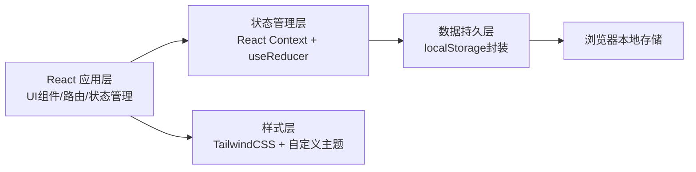
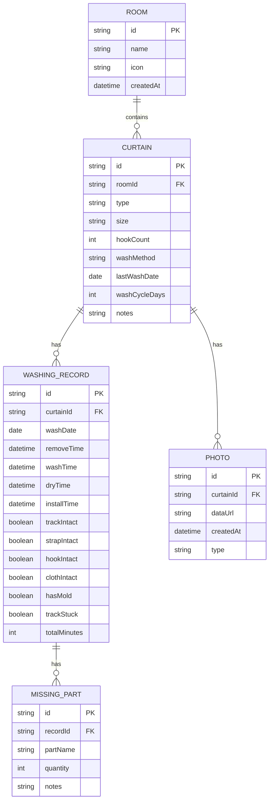
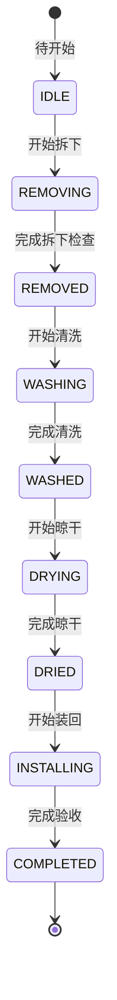

## 1. 架构设计

本应用为纯前端单页应用，使用本地存储持久化数据，无需后端服务。



## 2. 技术描述

- **前端框架**：React@18 + TypeScript
- **构建工具**：Vite@5
- **样式方案**：TailwindCSS@3 + PostCSS
- **路由管理**：React Router DOM@6
- **状态管理**：React Context + useReducer（轻量状态管理）
- **数据存储**：localStorage（本地持久化）
- **图表库**：Recharts（轻量级React图表库）
- **图标库**：Lucide React（简洁线性图标）
- **日期处理**：date-fns（轻量级日期工具库）
- **初始化方式**：npm create vite@latest -- --template react-ts

## 3. 目录结构

```
src/
├── components/          # 公共组件
│   ├── Layout/         # 布局组件（导航、侧边栏）
│   ├── Card/           # 卡片组件
│   ├── Form/           # 表单组件
│   ├── Modal/          # 弹窗组件
│   └── Progress/       # 进度条组件
├── pages/              # 页面组件
│   ├── Dashboard/      # 首页仪表板
│   ├── Rooms/          # 房间管理
│   ├── CurtainDetail/  # 窗帘详情
│   ├── WashingFlow/    # 清洗流程
│   └── Statistics/     # 数据统计
├── context/            # 状态管理
│   └── AppContext.tsx
├── types/              # TypeScript类型定义
│   └── index.ts
├── utils/              # 工具函数
│   ├── storage.ts      # localStorage封装
│   ├── date.ts         # 日期处理
│   └── statistics.ts   # 统计计算
├── data/               # 模拟数据
│   └── mockData.ts
├── hooks/              # 自定义Hooks
│   ├── useReminder.ts  # 提醒逻辑
│   └── useWashing.ts   # 清洗流程逻辑
├── App.tsx             # 根组件
├── main.tsx            # 入口文件
└── index.css           # 全局样式
```

## 4. 路由定义

| 路由 | 页面 | 用途 |
|------|------|------|
| `/` | Dashboard | 首页仪表板，概览与提醒 |
| `/rooms` | Rooms | 房间列表管理 |
| `/rooms/:roomId` | RoomDetail | 房间窗帘详情 |
| `/rooms/:roomId/curtain/:curtainId` | CurtainDetail | 单条窗帘详情 |
| `/rooms/:roomId/curtain/:curtainId/wash` | WashingFlow | 清洗流程向导 |
| `/statistics` | Statistics | 数据统计页面 |

## 5. 数据模型

### 5.1 实体关系图



### 5.2 TypeScript 类型定义

```typescript
// 房间
interface Room {
  id: string;
  name: string;
  icon: string;
  createdAt: string;
}

// 窗帘类型
type CurtainType = 'cloth' | 'sheer' | 'blackout' | 'roller' | 'bamboo';

// 窗帘
interface Curtain {
  id: string;
  roomId: string;
  name: string;
  type: CurtainType;
  size: {
    width: number;
    height: number;
  };
  hookCount: number;
  washMethod: 'machine' | 'hand' | 'dryclean' | 'spot';
  lastWashDate: string | null;
  washCycleDays: number;
  notes: string;
  hasMold: boolean;
  trackStuck: boolean;
}

// 拆下检查表
interface RemovalCheck {
  trackIntact: boolean;
  strapIntact: boolean;
  hookIntact: boolean;
  clothIntact: boolean;
  notes: string;
}

// 清洗记录
interface WashingRecord {
  id: string;
  curtainId: string;
  startDate: string;
  removalTime: string | null;
  washTime: string | null;
  dryTime: string | null;
  installTime: string | null;
  removalCheck: RemovalCheck;
  dryingMethod: 'natural' | 'machine' | 'shade';
  ironed: boolean;
  missingParts: MissingPart[];
  totalMinutes: number;
  completed: boolean;
}

// 缺失配件
interface MissingPart {
  id: string;
  name: string;
  quantity: number;
  notes: string;
}

// 照片
interface Photo {
  id: string;
  curtainId: string;
  dataUrl: string;
  createdAt: string;
  type: 'before' | 'after' | 'damage';
}

// 提醒
interface Reminder {
  id: string;
  type: 'overdue' | 'mold' | 'track' | 'missing';
  curtainId: string;
  roomId: string;
  message: string;
  date: string;
  priority: 'high' | 'medium' | 'low';
}
```

## 6. 核心功能实现要点

### 6.1 智能提醒逻辑
- 基于 `washCycleDays` 和 `lastWashDate` 计算下次清洗日期
- 超过30天未洗标记为"超时未洗"（可配置）
- `hasMold` 和 `trackStuck` 字段生成专项提醒
- 缺失配件 `missingParts` 生成采购提醒

### 6.2 清洗流程状态机


### 6.3 数据统计计算
- 待清洗房间数：统计 `nextWashDate < today` 的窗帘所在房间
- 缺失配件总数：汇总所有 `missingParts.quantity`
- 清洗耗时：`installTime - removalTime` 转换为分钟
- 平均耗时：历史记录总耗时 / 记录数

### 6.4 本地存储策略
- 使用 `localStorage` 分区存储：`rooms`, `curtains`, `records`, `photos`
- 应用启动时从 `localStorage` 加载数据到 Context
- 每次数据变更自动同步到 `localStorage`
- 提供数据导出/导入功能（JSON格式）
