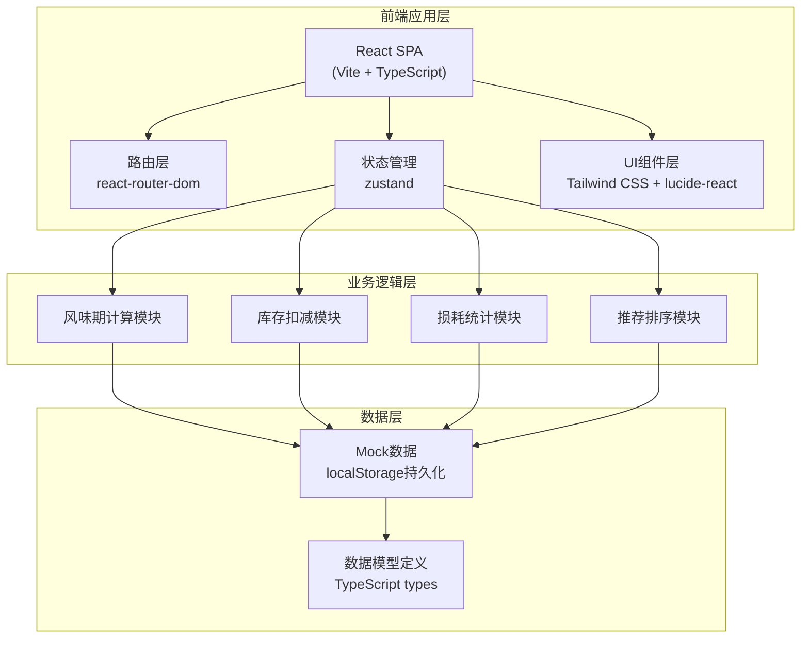
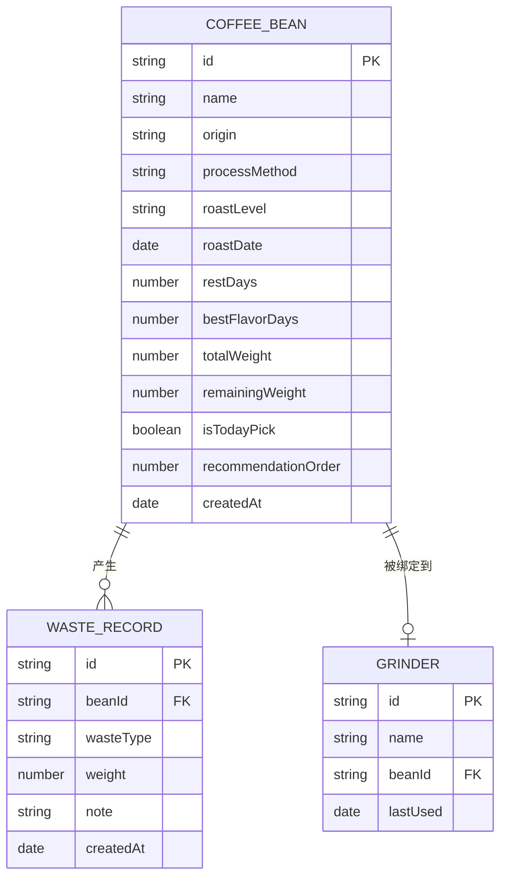

# 咖啡豆风味管理系统 技术架构文档

## 1. 架构设计



## 2. 技术描述

- **前端框架**: React@18 + TypeScript
- **构建工具**: Vite@5
- **路由**: react-router-dom@6
- **状态管理**: zustand@4
- **样式**: Tailwind CSS@3
- **图标**: lucide-react
- **拖拽**: @dnd-kit/core + @dnd-kit/sortable
- **数据存储**: localStorage 持久化 + Mock 数据
- **初始化方式**: vite-init react-ts 模板

## 3. 路由定义

| 路由 | 页面 | 说明 |
|-------|------|------|
| `/` | 吧台风味窗口 | 豆子卡片列表、主推设置、快捷操作 |
| `/grinders` | 磨豆机面板 | 磨豆机列表、出杯扣减操作 |
| `/waste` | 损耗记录 | 损耗记录表单、历史记录 |
| `/manager` | 店长看板 | 消耗分析、临期预警、浪费统计、推荐排序 |

## 4. 数据模型

### 4.1 ER图



### 4.2 数据类型定义

```typescript
// 咖啡豆
interface CoffeeBean {
  id: string;
  name: string;           // 豆子名称/产区
  origin: string;         // 产地国家/地区
  processMethod: '水洗' | '日晒' | '蜜处理' | '厌氧';
  roastLevel: '浅烘' | '中浅烘' | '中烘' | '中深烘' | '深烘';
  roastDate: string;      // 烘焙日期 ISO
  restDays: number;       // 建议养豆天数
  bestFlavorDays: number; // 最佳风味期天数
  totalWeight: number;    // 总重量(g)
  remainingWeight: number; // 剩余重量(g)
  isTodayPick: boolean;   // 是否今日主推
  recommendationOrder: number; // 本周推荐排序
  createdAt: string;
}

// 磨豆机
interface Grinder {
  id: string;
  name: string;
  beanId: string | null;  // 当前绑定的豆子
  lastUsed: string | null;
}

// 损耗记录
interface WasteRecord {
  id: string;
  beanId: string;
  wasteType: '试机' | '撒漏' | '校磨';
  weight: number;         // 损耗克数
  note?: string;
  createdAt: string;
}

// 风味状态枚举
type FlavorStatus = 'resting' | 'best' | 'nearExpiry' | 'expired';
```

### 4.3 业务计算规则

1. **风味状态判断**:
   - 养豆中 (resting): 烘焙日 + 养豆天数 > 今日
   - 最佳风味 (best): 烘焙日 + 养豆天数 ≤ 今日 ≤ 烘焙日 + 最佳风味天数
   - 临期 (nearExpiry): 烘焙日 + 最佳风味天数 < 今日 ≤ 烘焙日 + 最佳风味天数 + 3天
   - 超期 (expired): 烘焙日 + 最佳风味天数 + 3天 < 今日

2. **今日主推限制**:
   - 只有状态为 best 的豆子才能设为今日主推
   - 同一时间只能有一支主推豆

3. **消耗速度计算**:
   - 日消耗 = (初始重量 - 剩余重量) / 入库天数
   - 预计售罄日 = 剩余重量 / 日消耗

## 5. 项目目录结构

```
src/
├── components/          # 可复用组件
│   ├── BeanCard.tsx     # 豆子卡片
│   ├── GrinderCard.tsx  # 磨豆机卡片
│   ├── StatusBadge.tsx  # 状态徽章
│   ├── Modal.tsx        # 弹窗组件
│   └── StatCard.tsx     # 统计卡片
├── pages/               # 页面组件
│   ├── BarView.tsx      # 吧台风味窗口
│   ├── GrinderView.tsx  # 磨豆机面板
│   ├── WasteView.tsx    # 损耗记录
│   └── ManagerView.tsx  # 店长看板
├── store/               # 状态管理
│   └── useCoffeeStore.ts
├── utils/               # 工具函数
│   ├── dateUtils.ts     # 日期计算
│   ├── flavorUtils.ts   # 风味期计算
│   └── mockData.ts      # Mock数据
├── types/               # 类型定义
│   └── index.ts
├── App.tsx
├── main.tsx
└── index.css
```

## 6. 状态管理设计

使用 zustand 管理全局状态：

```typescript
interface CoffeeState {
  beans: CoffeeBean[];
  grinders: Grinder[];
  wasteRecords: WasteRecord[];
  
  // 操作方法
  setTodayPick: (beanId: string) => void;
  dispenseCoffee: (grinderId: string, grams: number) => void;
  recordWaste: (beanId: string, type: WasteType, grams: number, note?: string) => void;
  bindGrinder: (grinderId: string, beanId: string) => void;
  updateRecommendationOrder: (beanIds: string[]) => void;
  addBean: (bean: Omit<CoffeeBean, 'id' | 'createdAt'>) => void;
}
```
