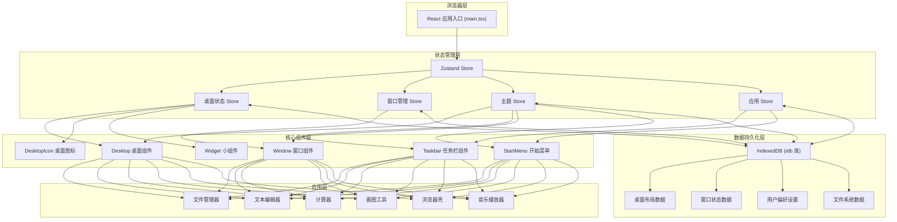

## 1. 架构设计



## 2. 技术描述

- **前端框架**：React@18 + TypeScript
- **构建工具**：Vite@5
- **样式方案**：TailwindCSS@3 + CSS Variables（主题切换）
- **状态管理**：Zustand（轻量级状态管理，支持持久化）
- **数据库**：IndexedDB（使用 idb 库封装）
- **拖拽库**：@dnd-kit/core（图标拖拽、窗口拖拽）
- **图标库**：lucide-react（现代主题）+ 自定义像素图标（Win95 主题）

## 3. 核心目录结构

```
src/
├── components/
│   ├── desktop/
│   │   ├── Desktop.tsx          # 桌面容器
│   │   ├── DesktopIcon.tsx      # 桌面图标
│   │   └── Widget.tsx           # 小组件容器
│   ├── taskbar/
│   │   ├── Taskbar.tsx          # 任务栏
│   │   ├── StartMenu.tsx        # 开始菜单
│   │   ├── SystemTray.tsx       # 系统托盘
│   │   └── Clock.tsx            # 时间显示
│   └── window/
│       ├── Window.tsx           # 窗口容器
│       ├── WindowTitlebar.tsx   # 窗口标题栏
│       └── WindowControls.tsx   # 窗口控制按钮
├── apps/
│   ├── FileManager/             # 文件管理器
│   ├── TextEditor/              # 文本编辑器
│   ├── Calculator/              # 计算器
│   ├── Paint/                   # 画图工具
│   ├── Browser/                 # 浏览器壳
│   └── MusicPlayer/             # 音乐播放器
├── stores/
│   ├── useDesktopStore.ts       # 桌面状态
│   ├── useWindowStore.ts        # 窗口管理
│   ├── useThemeStore.ts         # 主题状态
│   └── useAppStore.ts           # 应用注册表
├── hooks/
│   ├── useDraggable.ts          # 拖拽 Hook
│   └── useIndexedDB.ts          # IndexedDB Hook
├── types/
│   └── index.ts                 # 类型定义
├── utils/
│   ├── idb.ts                   # IndexedDB 封装
│   └── themes.ts                # 主题配置
├── App.tsx
├── main.tsx
└── index.css
```

## 4. 数据模型

### 4.1 类型定义

```typescript
// 主题类型
type ThemeType = 'light' | 'dark' | 'win95';

// 桌面图标
interface DesktopIcon {
  id: string;
  appId: string;
  name: string;
  x: number;
  y: number;
}

// 窗口状态
interface WindowState {
  id: string;
  appId: string;
  title: string;
  x: number;
  y: number;
  width: number;
  height: number;
  isMinimized: boolean;
  isMaximized: boolean;
  zIndex: number;
}

// 应用配置
interface AppConfig {
  id: string;
  name: string;
  icon: string;
  component: React.ComponentType;
  defaultWidth: number;
  defaultHeight: number;
}

// 用户偏好
interface UserPreferences {
  theme: ThemeType;
  background: string;
  iconSize: 'small' | 'medium' | 'large';
}
```

### 4.2 IndexedDB 存储结构

| Object Store | Key | 存储内容 |
|-------------|-----|---------|
| desktopIcons | id | 桌面图标位置数据 |
| windows | id | 打开的窗口状态 |
| preferences | theme | 用户偏好设置 |
| files | id | 文件管理器的虚拟文件系统 |

## 5. 核心技术方案

### 5.1 窗口管理方案
- 使用 zustand 管理所有窗口状态
- z-index 采用递增策略，点击窗口时分配最高 z-index
- 拖拽使用原生鼠标事件 + transform 实现高性能拖拽
- 边框缩放使用 8 个定位的拖拽手柄实现

### 5.2 主题切换方案
- 使用 CSS Variables 定义所有颜色和间距
- 通过在 body 上添加 data-theme 属性切换主题
- 所有组件使用 CSS 变量而非固定色值

### 5.3 数据持久化方案
- 使用 idb 库封装 IndexedDB 操作
- 状态变更时自动保存（防抖处理）
- 应用启动时从 IndexedDB 加载数据到 store

### 5.4 应用注册方案
- 采用注册机制，所有应用在 apps 目录中导出配置
- 应用组件按需加载（React.lazy）
- 支持通过 appId 动态启动应用
