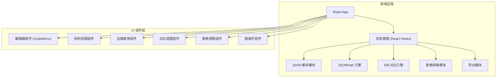

## 1. 架构设计



## 2. 技术描述

- **前端框架**：React@18 + TypeScript
- **构建工具**：Vite@5
- **样式方案**：TailwindCSS@3
- **代码编辑器**：@uiw/react-codemirror + json 语言支持
- **图标库**：lucide-react
- **JSONPath**：jsonpath-plus
- **Diff 算法**：diff
- **YAML 转换**：yaml
- **右键菜单**：自定义实现

## 3. 路由定义

| 路由 | 用途 |
|-------|---------|
| / | 主应用（单页应用，无多路由） |

## 4. 核心模块设计

### 4.1 JSON 解析模块
- 输入：JSON 字符串
- 输出：解析后的 JS 对象 + 错误信息
- 功能：实时验证、格式化、压缩

### 4.2 JSONPath 引擎
- 输入：JSON 对象 + JSONPath 表达式
- 输出：匹配节点路径数组
- 功能：高亮匹配节点、滚动定位

### 4.3 Diff 对比引擎
- 输入：两个 JSON 对象
- 输出：差异描述数组（新增/删除/修改）
- 功能：深度对比、递归检测

### 4.4 表格转换模块
- 输入：JSON 数组
- 输出：表格数据（列定义 + 行数据）
- 功能：自动提取字段、扁平化嵌套对象

### 4.5 导出模块
- 输入：JSON 对象 + 格式选项
- 输出：格式化字符串（JSON/YAML）
- 功能：缩进配置、下载文件

## 5. 组件树结构

```
App
├── Header
│   ├── ModeTabs (视图/对比/表格)
│   ├── SearchBar (JSONPath搜索)
│   └── ExportMenu
├── JsonViewMode
│   ├── SplitPane
│   │   ├── JsonEditor (左侧)
│   │   └── TreeView (右侧)
│   │       └── TreeNode (递归)
│   └── ContextMenu
├── CompareMode
│   ├── SplitPane
│   │   ├── JsonEditor (左侧)
│   │   └── JsonEditor (右侧)
│   └── DiffHighlighter
└── TableMode
    ├── TableView
    │   ├── TableHeader
    │   └── TableRow
    └── TableControls
```
