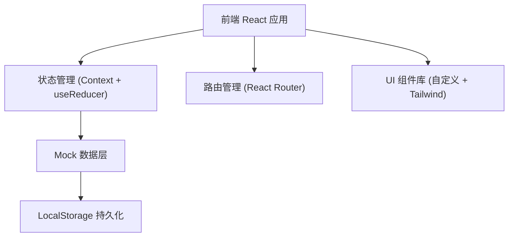

## 1. 架构设计



## 2. 技术说明

- **前端框架**：React@18 + TypeScript
- **构建工具**：Vite@5
- **样式方案**：TailwindCSS@3 + PostCSS
- **路由**：react-router-dom@6
- **图表**：recharts（数据统计可视化）
- **状态管理**：React Context + useReducer（轻量级，避免过度工程化）
- **数据持久化**：LocalStorage（模拟后端存储）
- **图标**：lucide-react
- **后端**：无，使用 Mock 数据 + LocalStorage 实现全功能演示

## 3. 路由定义

| 路由 | 用途 |
|------|------|
| `/` | 柜格总览页（首页），展示所有柜格及状态 |
| `/borrow/:bookId` | 借书页面，填写借阅信息 |
| `/return` | 还书页面，选择归还方式和柜格 |
| `/donate` | 捐书页面，填写书籍信息并提交审核 |
| `/teacher` | 班主任视图，本班未归还名单 |
| `/admin` | 管理员视图，数据仪表盘 + 捐书审核 |
| `/admin/review` | 捐书审核列表页 |

## 4. 数据模型

### 4.1 数据模型定义

```mermaid
erDiagram
    CABINET ||--o{ BOOK : "存放"
    BOOK ||--o{ BORROW_RECORD : "被借阅"
    BOOK }o--|| DONATION : "来自"
    STUDENT ||--o{ BORROW_RECORD : "借阅"
    TEACHER }o--|| CLASS : "管理"
    STUDENT }o--|| CLASS : "属于"
    DONATION }o--|| STUDENT : "捐赠"
    ADMIN ||--o{ DONATION : "审核"

    CABINET {
        string id PK "柜格编号"
        string name "柜格名称"
        int capacity "总容量"
        int currentCount "当前数量"
        string location "位置描述"
    }

    BOOK {
        string id PK
        string title "书名"
        string author "作者"
        string isbn "ISBN"
        string cover "封面图URL"
        string suitableGrade "适合年级"
        string category "分类"
        string status "available/borrowed/damaged/offline"
        string cabinetId FK "所在柜格"
        string donationId FK "捐赠ID"
    }

    BORROW_RECORD {
        string id PK
        string bookId FK
        string studentName
        string className
        date borrowDate
        date expectedReturnDate
        date actualReturnDate
        string status "borrowed/returned/overdue"
    }

    DONATION {
        string id PK
        string bookTitle
        string bookAuthor
        string cover
        string suitableGrade
        string category
        string donorName
        string donorClass
        string status "pending/approved/rejected"
        string rejectReason
        date submitDate
        date reviewDate
    }

    CLASS {
        string id PK
        string name "班级名称 e.g. 三年级2班"
        string grade "年级 e.g. 三年级"
    }

    STUDENT {
        string id PK
        string name
        string classId FK
    }

    TEACHER {
        string id PK
        string name
        string classId FK "管理的班级"
    }

    ADMIN {
        string id PK
        string name
    }
```

### 4.2 核心数据类型（TypeScript）

```typescript
// 柜格
interface Cabinet {
  id: string;
  name: string;
  capacity: number;
  location: string;
  books: Book[];
}

// 书籍
interface Book {
  id: string;
  title: string;
  author: string;
  isbn?: string;
  cover: string;
  suitableGrade: string;
  category: string;
  status: 'available' | 'borrowed' | 'damaged' | 'offline';
  cabinetId: string;
  donorName: string;
  donorClass: string;
}

// 借阅记录
interface BorrowRecord {
  id: string;
  bookId: string;
  bookTitle: string;
  studentName: string;
  className: string;
  borrowDate: string;
  expectedReturnDate: string;
  actualReturnDate?: string;
  status: 'borrowed' | 'returned' | 'overdue';
}

// 捐赠申请
interface Donation {
  id: string;
  bookTitle: string;
  bookAuthor: string;
  cover: string;
  suitableGrade: string;
  category: string;
  donorName: string;
  donorClass: string;
  status: 'pending' | 'approved' | 'rejected';
  rejectReason?: 'damaged' | 'duplicate' | 'inappropriate';
  submitDate: string;
  reviewDate?: string;
}
```

## 5. 目录结构

```
src/
├── components/          # 可复用组件
│   ├── CabinetCard.tsx     # 柜格卡片
│   ├── CabinetDrawer.tsx   # 柜格详情抽屉
│   ├── BookCard.tsx        # 书籍卡片
│   ├── Layout.tsx          # 布局（导航栏）
│   └── StatusBadge.tsx     # 状态标签
├── pages/               # 页面组件
│   ├── CabinetOverview.tsx # 柜格总览
│   ├── BorrowPage.tsx      # 借书
│   ├── ReturnPage.tsx      # 还书
│   ├── DonatePage.tsx      # 捐书
│   ├── TeacherView.tsx     # 班主任视图
│   ├── AdminDashboard.tsx  # 管理员仪表盘
│   └── AdminReview.tsx     # 捐书审核
├── context/             # 状态管理
│   └── AppContext.tsx      # 全局状态
├── data/                # Mock 数据
│   └── mockData.ts         # 初始数据
├── types/               # TypeScript 类型定义
│   └── index.ts
├── utils/               # 工具函数
│   ├── storage.ts          # LocalStorage 封装
│   └── helpers.ts          # 通用工具
├── App.tsx
├── main.tsx
└── index.css
```

## 6. 核心业务规则实现

1. **柜格容量校验**：借书时 `cabinet.currentCount - 1`，还书时若换柜需校验目标柜格 `currentCount < capacity`
2. **逾期判定**：`expectedReturnDate < today && status === 'borrowed'` → 标记为 `overdue`
3. **捐书重复检测**：按 ISBN 或 书名+作者 匹配现有书籍，重复数 ≥ 3 给出风险提示
4. **年级内容适合度**：根据书籍分类和适合年级自动判断，小学低年级不适合包含暴力/言情等内容的分类
