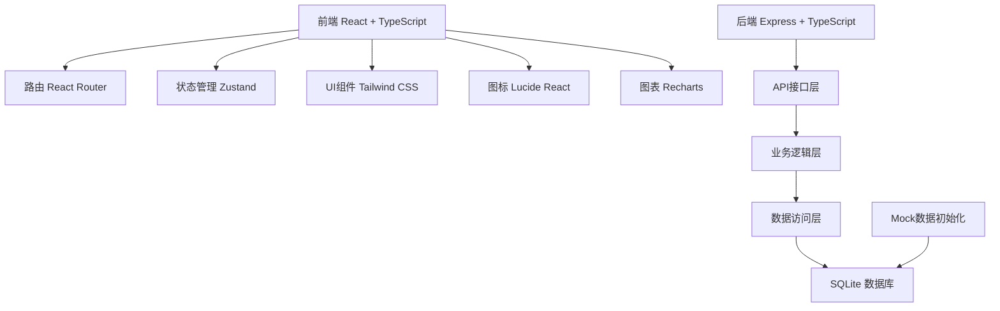
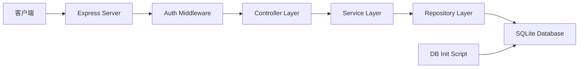
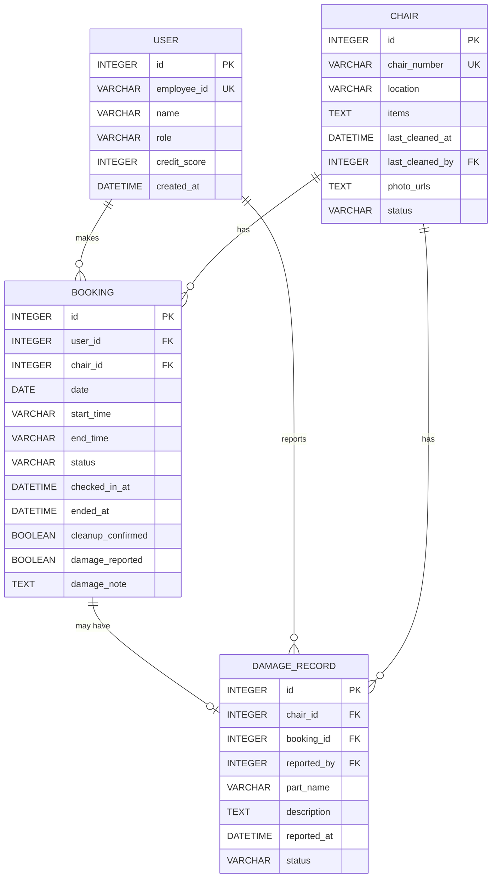

## 1. 架构设计



## 2. 技术描述

- **前端**：React@18 + TypeScript + Vite + TailwindCSS@3 + Zustand + React Router DOM + Recharts + Lucide React
- **后端**：Express@4 + TypeScript + SQLite + better-sqlite3
- **初始化工具**：vite-init react-express-ts 模板
- **数据库**：SQLite（本地文件存储，适合中小规模场景）
- **Mock数据**：系统启动时自动初始化10张躺椅、50条预约记录、10名员工数据

## 3. 路由定义

| 路由路径 | 页面名称 | 权限 |
|---------|----------|------|
| /login | 登录页 | 公开 |
| / | 预约首页 | 员工 |
| /my-bookings | 我的预约 | 员工 |
| /checkin/:bookingId | 签到页面 | 员工 |
| /using/:bookingId | 使用中页面 | 员工 |
| /cleanup/:bookingId | 清洁确认 | 员工 |
| /chair/:chairId | 躺椅详情 | 员工/行政 |
| /profile | 个人中心 | 员工 |
| /admin | 行政看板 | 行政 |
| /admin/chairs | 躺椅管理 | 行政 |

## 4. API 定义

### 类型定义

```typescript
// 用户
interface User {
  id: number;
  employeeId: string;
  name: string;
  role: 'employee' | 'admin';
  creditScore: number;
  createdAt: string;
}

// 躺椅
interface Chair {
  id: number;
  chairNumber: string;
  location: string;
  items: string[];
  lastCleanedAt: string | null;
  lastCleanedBy: number | null;
  photoUrls: string[];
  status: 'available' | 'in_use' | 'dirty' | 'maintenance';
}

// 预约
interface Booking {
  id: number;
  userId: number;
  chairId: number;
  date: string;
  startTime: string;
  endTime: string;
  status: 'pending' | 'checked_in' | 'completed' | 'no_show' | 'cancelled';
  checkedInAt: string | null;
  endedAt: string | null;
  cleanupConfirmed: boolean;
  damageReported: boolean;
  damageNote: string | null;
}

// 损坏记录
interface DamageRecord {
  id: number;
  chairId: number;
  bookingId: number;
  reportedBy: number;
  partName: string;
  description: string;
  reportedAt: string;
  status: 'reported' | 'repaired';
}
```

### 接口列表

| 方法 | 路径 | 描述 |
|------|------|------|
| POST | /api/auth/login | 登录 |
| GET | /api/chairs | 获取躺椅列表 |
| GET | /api/chairs/:id | 获取躺椅详情 |
| GET | /api/bookings/available | 获取可预约时段 |
| POST | /api/bookings | 创建预约 |
| GET | /api/bookings/my | 获取我的预约 |
| POST | /api/bookings/:id/checkin | 签到 |
| POST | /api/bookings/:id/end | 结束使用 |
| POST | /api/bookings/:id/cleanup | 提交清洁确认 |
| GET | /api/admin/stats/usage | 使用率统计 |
| GET | /api/admin/stats/popular-times | 热门时段 |
| GET | /api/admin/stats/no-shows | 爽约名单 |
| GET | /api/admin/stats/damages | 易损部件统计 |

## 5. 服务器架构图



## 6. 数据模型

### 6.1 ER图



### 6.2 DDL 语句

```sql
CREATE TABLE users (
    id INTEGER PRIMARY KEY AUTOINCREMENT,
    employee_id VARCHAR(20) UNIQUE NOT NULL,
    name VARCHAR(50) NOT NULL,
    role VARCHAR(20) NOT NULL DEFAULT 'employee',
    credit_score INTEGER NOT NULL DEFAULT 100,
    created_at DATETIME DEFAULT CURRENT_TIMESTAMP
);

CREATE TABLE chairs (
    id INTEGER PRIMARY KEY AUTOINCREMENT,
    chair_number VARCHAR(10) UNIQUE NOT NULL,
    location VARCHAR(100) NOT NULL,
    items TEXT NOT NULL,
    last_cleaned_at DATETIME,
    last_cleaned_by INTEGER REFERENCES users(id),
    photo_urls TEXT NOT NULL,
    status VARCHAR(20) NOT NULL DEFAULT 'available'
);

CREATE TABLE bookings (
    id INTEGER PRIMARY KEY AUTOINCREMENT,
    user_id INTEGER NOT NULL REFERENCES users(id),
    chair_id INTEGER NOT NULL REFERENCES chairs(id),
    date DATE NOT NULL,
    start_time VARCHAR(5) NOT NULL,
    end_time VARCHAR(5) NOT NULL,
    status VARCHAR(20) NOT NULL DEFAULT 'pending',
    checked_in_at DATETIME,
    ended_at DATETIME,
    cleanup_confirmed BOOLEAN NOT NULL DEFAULT 0,
    damage_reported BOOLEAN NOT NULL DEFAULT 0,
    damage_note TEXT,
    UNIQUE(chair_id, date, start_time)
);

CREATE TABLE damage_records (
    id INTEGER PRIMARY KEY AUTOINCREMENT,
    chair_id INTEGER NOT NULL REFERENCES chairs(id),
    booking_id INTEGER REFERENCES bookings(id),
    reported_by INTEGER NOT NULL REFERENCES users(id),
    part_name VARCHAR(50) NOT NULL,
    description TEXT,
    reported_at DATETIME DEFAULT CURRENT_TIMESTAMP,
    status VARCHAR(20) NOT NULL DEFAULT 'reported'
);

CREATE INDEX idx_bookings_user ON bookings(user_id);
CREATE INDEX idx_bookings_chair_date ON bookings(chair_id, date);
CREATE INDEX idx_bookings_status ON bookings(status);
CREATE INDEX idx_damages_chair ON damage_records(chair_id);
CREATE INDEX idx_damages_part ON damage_records(part_name);
```

### 6.3 初始化数据

系统启动时自动插入：
- 10张躺椅（编号LC-001 ~ LC-010）
- 10名员工（工号E001 ~ E010，初始信用分100）
- 1名行政管理员（工号ADMIN001）
- 50条历史预约记录（含已完成、爽约、进行中状态）
- 10条损坏记录（用于易损部件统计展示）
