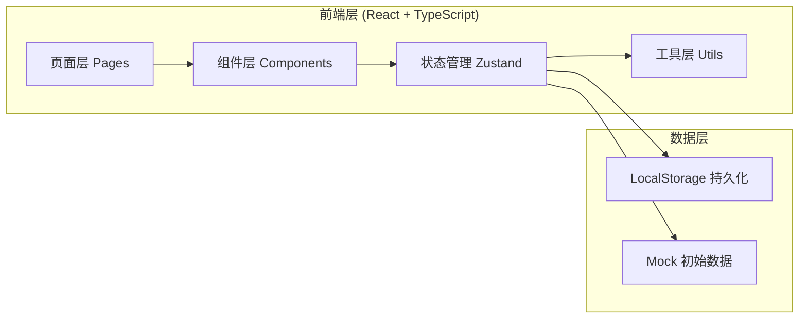
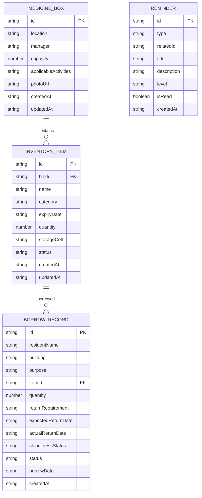

## 1. 架构设计



## 2. 技术描述

- **前端**：React@18 + TypeScript + Vite + TailwindCSS@3 + React Router DOM + Zustand
- **初始化工具**：vite-init
- **后端**：无（纯前端应用，数据持久化到 LocalStorage）
- **数据库**：浏览器 LocalStorage，内置 Mock 数据
- **图标**：Lucide React
- **日期处理**：dayjs

## 3. 路由定义

| 路由 | 页面 | 用途 |
|------|------|------|
| `/` | Dashboard | 数据看板：今日借用、待归还、临期物品、补货建议 |
| `/medicine-boxes` | MedicineBoxList | 药箱档案列表 |
| `/medicine-boxes/new` | MedicineBoxForm | 新增药箱档案 |
| `/medicine-boxes/:id/edit` | MedicineBoxForm | 编辑药箱档案 |
| `/inventory` | InventoryList | 物品库存管理 |
| `/inventory/new` | InventoryForm | 新增物品入库 |
| `/inventory/:id/edit` | InventoryForm | 编辑物品信息 |
| `/borrows` | BorrowList | 借用记录列表 |
| `/borrows/new` | BorrowForm | 新建借用登记 |
| `/reminders` | ReminderList | 提醒中心 |

## 4. 数据模型

### 4.1 数据模型定义



### 4.2 类型定义

```typescript
// 药箱
interface MedicineBox {
  id: string;
  location: string;
  manager: string;
  capacity: number;
  applicableActivities: string;
  photoUrl: string;
  createdAt: string;
  updatedAt: string;
}

// 物品类别
type ItemCategory = 'band-aid' | 'gauze' | 'iodine-swab' | 'ice-pack' | 'thermometer' | 'blood-pressure-monitor';

// 库存物品状态
type ItemStatus = 'normal' | 'expired' | 'damaged' | 'low-stock';

// 库存物品
interface InventoryItem {
  id: string;
  boxId: string;
  name: string;
  category: ItemCategory;
  expiryDate: string;
  quantity: number;
  storageCell: string;
  status: ItemStatus;
  createdAt: string;
  updatedAt: string;
}

// 借用状态
type BorrowStatus = 'borrowing' | 'returned' | 'overdue';

// 借用记录
interface BorrowRecord {
  id: string;
  residentName: string;
  building: string;
  purpose: string;
  itemId: string;
  itemName: string;
  category: ItemCategory;
  quantity: number;
  returnRequirement: string;
  expectedReturnDate: string;
  actualReturnDate: string | null;
  cleanlinessStatus: 'clean' | 'needs-cleaning' | 'damaged' | null;
  status: BorrowStatus;
  borrowDate: string;
  createdAt: string;
}

// 提醒类型
type ReminderType = 'expiry' | 'damage' | 'low-stock' | 'overdue-return';
type ReminderLevel = 'info' | 'warning' | 'danger';

// 提醒
interface Reminder {
  id: string;
  type: ReminderType;
  relatedId: string;
  title: string;
  description: string;
  level: ReminderLevel;
  isRead: boolean;
  createdAt: string;
}
```

### 4.3 初始 Mock 数据

- 3 个药箱（活动室入口、多功能厅、健身室）
- 每箱 6 类物品各若干，包含不同效期和数量
- 5-8 条借用记录（部分已归还、部分借用中、部分逾期）
- 若干提醒数据
