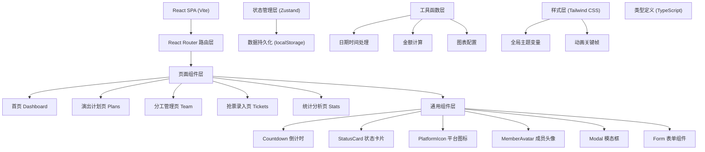
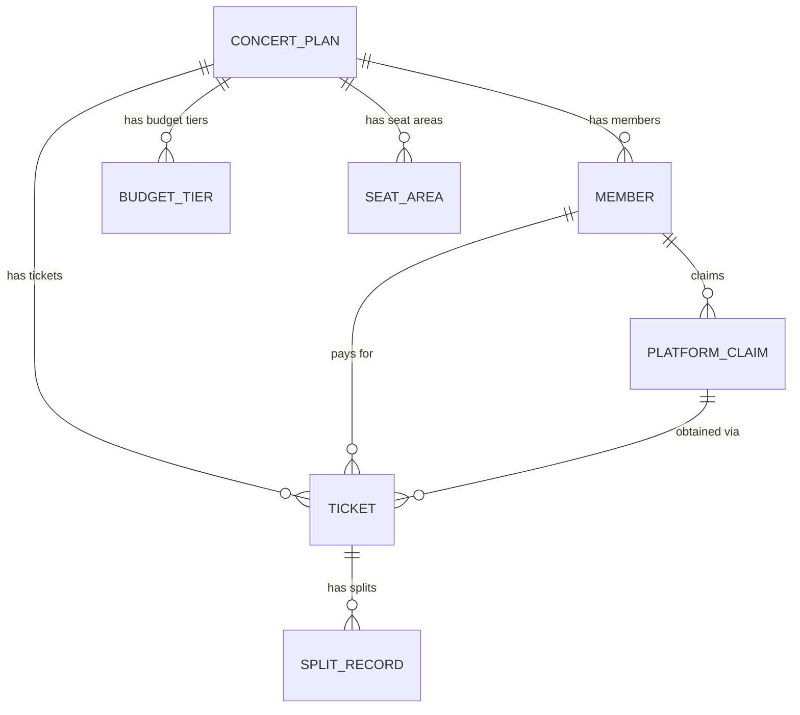

## 1. 架构设计



## 2. 技术描述

- **前端框架**：React@18 + TypeScript
- **构建工具**：Vite@5
- **路由管理**：React Router DOM@6
- **状态管理**：Zustand（轻量级，适合本地应用）
- **样式方案**：Tailwind CSS@3 + CSS 变量
- **图表库**：Recharts（React 原生图表，轻量且美观）
- **图标库**：Lucide React（现代简约图标）
- **动画库**：Framer Motion（流畅的 React 动画）
- **数据存储**：localStorage + 自定义序列化
- **后端服务**：无（纯前端本地应用，数据存储在浏览器）
- **Mock 数据**：内置示例数据，首次访问自动填充

## 3. 路由定义

| 路由 | 页面 | 用途 |
|------|------|------|
| `/` | 首页 Dashboard | 倒计时看板、状态卡片、快速操作 |
| `/plans` | 演出计划页 | 演出计划列表、创建/编辑计划 |
| `/plans/:id` | 计划详情页 | 单个演出计划的完整信息、成员分工 |
| `/team` | 分工管理页 | 成员管理、平台认领、账号状态 |
| `/tickets` | 抢票录入页 | 录入抢票结果、分摊计算 |
| `/stats` | 统计分析页 | 成功率、预算、平台热力榜 |

## 4. 数据模型

### 4.1 实体关系图



### 4.2 TypeScript 类型定义

```typescript
// 演出计划
interface ConcertPlan {
  id: string;
  artist: string;
  artistImage?: string;
  city: string;
  venue: string;
  concertDate: string;
  saleStartTime: string;
  status: 'upcoming' | 'ongoing' | 'completed';
  budgetTiers: BudgetTier[];
  preferredAreas: SeatArea[];
  memberIds: string[];
  createdAt: string;
}

// 预算档位
interface BudgetTier {
  id: string;
  name: string;
  minPrice: number;
  maxPrice: number;
}

// 座位区域
interface SeatArea {
  id: string;
  name: string;
  priority: number;
}

// 成员
interface Member {
  id: string;
  name: string;
  avatar?: string;
  color: string;
  platformClaims: PlatformClaim[];
  backupPlan?: string;
  maxTickets: number;
}

// 平台认领
interface PlatformClaim {
  id: string;
  platform: PlatformType;
  isVerified: boolean;
  hasPrivilegeCode: boolean;
  accountStatus: 'normal' | 'warning' | 'blocked';
}

// 平台类型
type PlatformType = 'damai' | 'maoyan' | 'piaoxingqiu' | 'fenwandao' | 'others';

// 抢票记录
interface TicketRecord {
  id: string;
  planId: string;
  platform: PlatformType;
  memberId: string; // 付款人
  seatInfo: string;
  price: number;
  paymentScreenshot?: string;
  status: 'success' | 'pending_transfer' | 'failed';
  splitRecords: SplitRecord[];
  obtainedAt: string;
}

// 分摊记录
interface SplitRecord {
  memberId: string;
  amount: number;
  isPaid: boolean;
}

// 统计数据
interface Statistics {
  totalAttempts: number;
  successCount: number;
  successRate: number;
  overBudgetAmount: number;
  platformStats: PlatformStat[];
}

interface PlatformStat {
  platform: PlatformType;
  attempts: number;
  success: number;
  successRate: number;
}
```

### 4.3 存储结构

localStorage 键名：`concert-ticket-app-data`

```json
{
  "plans": [],
  "members": [],
  "tickets": [],
  "settings": {
    "theme": "dark",
    "notifications": true
  }
}
```

## 5. 核心模块说明

### 5.1 倒计时模块
- 使用 `useEffect` + `setInterval` 实现实时倒计时
- 自动计算距离开票时间的天/时/分/秒
- 最后10分钟触发红色警告动画
- 支持多个计划的倒计时同时显示

### 5.2 状态管理 (Zustand Store)
```typescript
interface AppState {
  plans: ConcertPlan[];
  members: Member[];
  tickets: TicketRecord[];
  addPlan: (plan: Omit<ConcertPlan, 'id' | 'createdAt'>) => void;
  updatePlan: (id: string, updates: Partial<ConcertPlan>) => void;
  deletePlan: (id: string) => void;
  addMember: (member: Omit<Member, 'id'>) => void;
  updateMember: (id: string, updates: Partial<Member>) => void;
  addTicket: (ticket: Omit<TicketRecord, 'id' | 'obtainedAt'>) => void;
  updateTicket: (id: string, updates: Partial<TicketRecord>) => void;
  calculateStats: () => Statistics;
}
```

### 5.3 分摊计算逻辑
- 等额分摊：总价 ÷ 参与人数
- 按人头分摊：根据每人需要的票数计算
- 自定义分摊：支持手动输入每人金额
- 实时更新：修改金额时自动重新计算

### 5.4 统计分析模块
- 成功率计算：成功数 / 总尝试数
- 超预算计算：实际价格 - 对应档位最高预算
- 平台排行榜：按成功率降序排列
- 趋势分析：按时间维度展示成功率变化

## 6. 性能优化

1. **数据持久化防抖**：使用 `debounce` 合并多次状态更新，减少 localStorage 写入频率
2. **组件懒加载**：使用 `React.lazy` 和 `Suspense` 实现路由级代码分割
3. **动画性能**：使用 `transform` 和 `opacity` 属性实现 GPU 加速动画
4. **列表虚拟化**：当数据量较大时，使用虚拟滚动优化长列表渲染
5. **Memo 优化**：对计算密集型组件使用 `React.memo`、`useMemo`、`useCallback`

## 7. 浏览器兼容性

- 支持现代浏览器：Chrome ≥ 90、Firefox ≥ 88、Safari ≥ 14
- 使用 CSS 变量和 `backdrop-filter`，需提供降级方案
- localStorage 检测，不可用时提示用户
