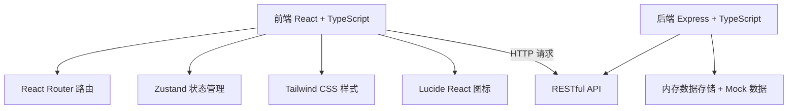
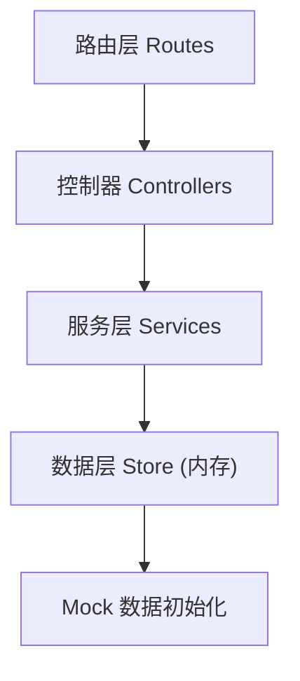
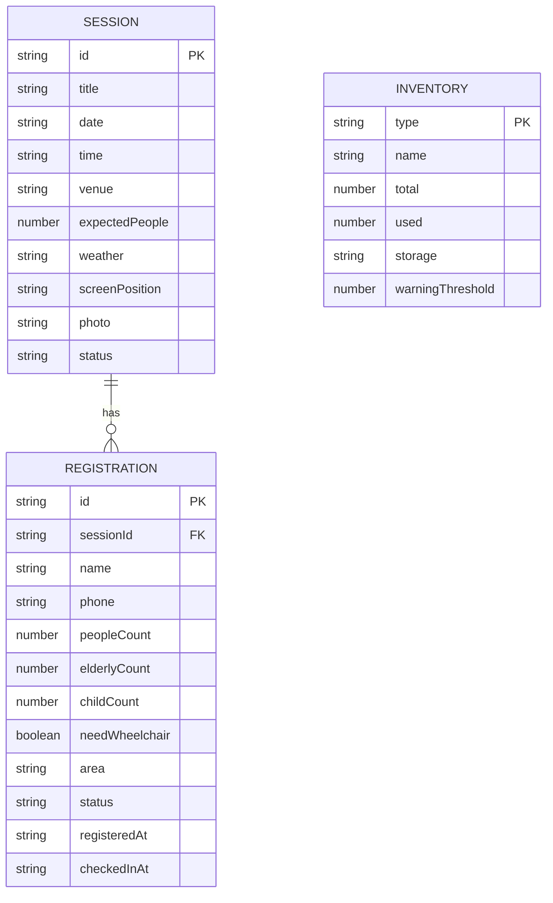

## 1. 架构设计



## 2. 技术说明
- 前端：React@18 + TypeScript + TailwindCSS@3 + Vite + Zustand + React Router DOM + Lucide React
- 后端：Express@4 + TypeScript
- 初始化工具：vite-init（react-express-ts 模板）
- 数据存储：内存存储（开发演示用），预置丰富 Mock 数据
- 二维码：前端使用 `qrcode.react` 库生成

## 3. 路由定义
| 路由 | 页面用途 |
|------|----------|
| / | 数据看板 Dashboard（首页） |
| /sessions | 场次档案列表 |
| /sessions/new | 新增场次 |
| /sessions/:id | 场次详情 / 编辑 |
| /inventory | 座椅库存管理 |
| /register | 居民报名（场次选择 + 表单） |
| /checkin | 扫码签到管理 |

## 4. API 接口定义

### 4.1 场次相关
```typescript
// GET /api/sessions           获取场次列表
// GET /api/sessions/:id       获取场次详情
// POST /api/sessions          新增场次
// PUT /api/sessions/:id       更新场次
// DELETE /api/sessions/:id    删除场次

interface Session {
  id: string;
  title: string;           // 片名
  date: string;            // 日期 YYYY-MM-DD
  time: string;            // 时间 HH:mm
  venue: string;           // 场地
  expectedPeople: number;  // 预计人数
  weather: string;         // 天气
  screenPosition: string;  // 屏幕位置
  photo?: string;          // 照片 URL
  status: 'upcoming' | 'ongoing' | 'ended';
  createdAt: string;
}
```

### 4.2 座椅库存相关
```typescript
// GET /api/inventory              获取库存概览
// PUT /api/inventory/:type        更新某类座椅数量
// PUT /api/inventory/:type/storage  更新存放点

interface InventoryItem {
  type: 'folding' | 'child' | 'wheelchair' | 'picnic';
  name: string;           // 名称
  total: number;          // 总数
  used: number;           // 已使用
  storage: string;        // 存放点
  warningThreshold: number; // 预警阈值
}
```

### 4.3 报名相关
```typescript
// GET /api/registrations?sessionId=xxx  获取某场次报名列表
// POST /api/registrations               提交报名

interface Registration {
  id: string;
  sessionId: string;
  name: string;            // 联系人姓名
  phone: string;           // 联系方式
  peopleCount: number;     // 总人数
  elderlyCount: number;    // 老人数量
  childCount: number;      // 小孩数量
  needWheelchair: boolean; // 是否需要无障碍位
  area: 'A' | 'B' | 'C' | 'wheelchair'; // 分配区域
  status: 'registered' | 'checked_in' | 'released';
  registeredAt: string;
  checkedInAt?: string;
}
```

### 4.4 签到相关
```typescript
// POST /api/checkin/:registrationId    签到
// POST /api/checkin/release/:id        释放座位
// GET /api/checkin/qrcode/:sessionId   获取签到二维码数据
```

### 4.5 看板数据
```typescript
// GET /api/dashboard/:sessionId   获取某场次看板数据
interface DashboardData {
  totalRegistered: number;
  checkedIn: number;
  notCheckedIn: number;
  elderlyDemands: number;
  childDemands: number;
  wheelchairDemands: number;
  inventoryGaps: { type: string; needed: number; available: number; gap: number }[];
  weatherBackup: string;
}
```

## 5. 服务端架构图



## 6. 数据模型

### 6.1 ER 图


### 6.2 数据说明
- 所有数据存储于 Node.js 内存中，服务重启后恢复默认 Mock 数据
- 预置 3 场电影场次数据、完整库存数据、若干模拟报名记录
