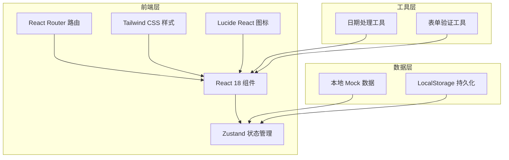
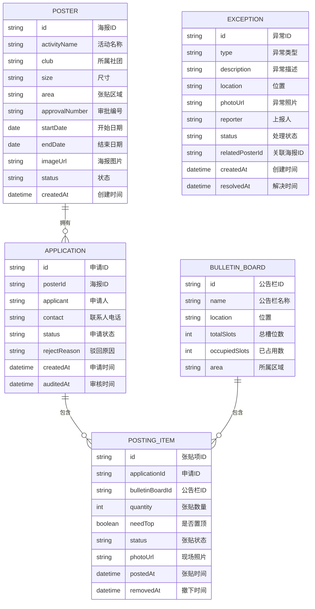

## 1. 架构设计



## 2. 技术描述

- **前端框架**: React@18 + TypeScript
- **构建工具**: Vite@5
- **样式方案**: TailwindCSS@3
- **状态管理**: Zustand@4
- **路由管理**: React Router DOM@6
- **图标库**: Lucide React
- **数据存储**: LocalStorage + Mock 数据
- **包管理器**: npm

## 3. 路由定义

| 路由路径 | 页面名称 | 功能说明 |
|----------|----------|----------|
| /dashboard | 看板首页 | 数据概览、统计卡片、区域占用率、各类列表 |
| /posters | 海报档案 | 海报列表、新增、编辑、删除 |
| /posters/new | 新增海报 | 海报表单页面 |
| /applications | 张贴申请 | 申请列表、新建申请 |
| /applications/new | 新建申请 | 选择公告栏、数量、联系人等 |
| /audit | 审核管理 | 待审核申请列表、审批操作 |
| /posting-list | 张贴清单 | 生成的张贴清单详情 |
| /execution | 张贴执行 | 现场确认、拍照上传 |
| /exceptions | 异常管理 | 异常记录列表、新增异常 |
| /reminders | 到期提醒 | 即将到期和已过期海报列表 |

## 4. 数据模型

### 4.1 数据模型定义



### 4.2 类型定义

```typescript
// 海报状态
type PosterStatus = 'draft' | 'pending' | 'approved' | 'rejected' | 'posting' | 'posted' | 'expired' | 'removed';

// 申请状态
type ApplicationStatus = 'pending' | 'approved' | 'rejected';

// 张贴状态
type PostingStatus = 'pending' | 'posted' | 'expired' | 'removed';

// 异常类型
type ExceptionType = 'damaged' | 'covered' | 'unauthorized' | 'wrong_position' | 'expired_not_removed';

// 异常状态
type ExceptionStatus = 'pending' | 'processing' | 'resolved';

interface Poster {
  id: string;
  activityName: string;
  club: string;
  size: string;
  area: string;
  approvalNumber: string;
  startDate: string;
  endDate: string;
  imageUrl: string;
  status: PosterStatus;
  createdAt: string;
}

interface Application {
  id: string;
  posterId: string;
  applicant: string;
  contact: string;
  status: ApplicationStatus;
  rejectReason?: string;
  createdAt: string;
  auditedAt?: string;
}

interface BulletinBoard {
  id: string;
  name: string;
  location: string;
  totalSlots: number;
  occupiedSlots: number;
  area: string;
}

interface PostingItem {
  id: string;
  applicationId: string;
  bulletinBoardId: string;
  quantity: number;
  needTop: boolean;
  status: PostingStatus;
  photoUrl?: string;
  postedAt?: string;
  removedAt?: string;
}

interface Exception {
  id: string;
  type: ExceptionType;
  description: string;
  location: string;
  photoUrl?: string;
  reporter: string;
  status: ExceptionStatus;
  relatedPosterId?: string;
  createdAt: string;
  resolvedAt?: string;
}
```

## 5. 项目结构

```
src/
├── components/          # 通用组件
│   ├── Layout/         # 布局组件
│   ├── Card/           # 卡片组件
│   ├── Form/           # 表单组件
│   ├── Table/          # 表格组件
│   └── Modal/          # 弹窗组件
├── pages/              # 页面组件
│   ├── Dashboard/      # 看板首页
│   ├── Posters/        # 海报档案
│   ├── Applications/   # 张贴申请
│   ├── Audit/          # 审核管理
│   ├── PostingList/    # 张贴清单
│   ├── Execution/      # 张贴执行
│   ├── Exceptions/     # 异常管理
│   └── Reminders/      # 到期提醒
├── store/              # Zustand 状态管理
│   ├── usePosterStore.ts
│   ├── useApplicationStore.ts
│   ├── useBulletinBoardStore.ts
│   ├── usePostingStore.ts
│   └── useExceptionStore.ts
├── types/              # TypeScript 类型定义
│   └── index.ts
├── utils/              # 工具函数
│   ├── date.ts
│   ├── validation.ts
│   └── mock.ts
├── mock/               # Mock 数据
│   ├── posters.ts
│   ├── applications.ts
│   ├── bulletinBoards.ts
│   ├── postingItems.ts
│   └── exceptions.ts
├── App.tsx
├── main.tsx
└── index.css
```
