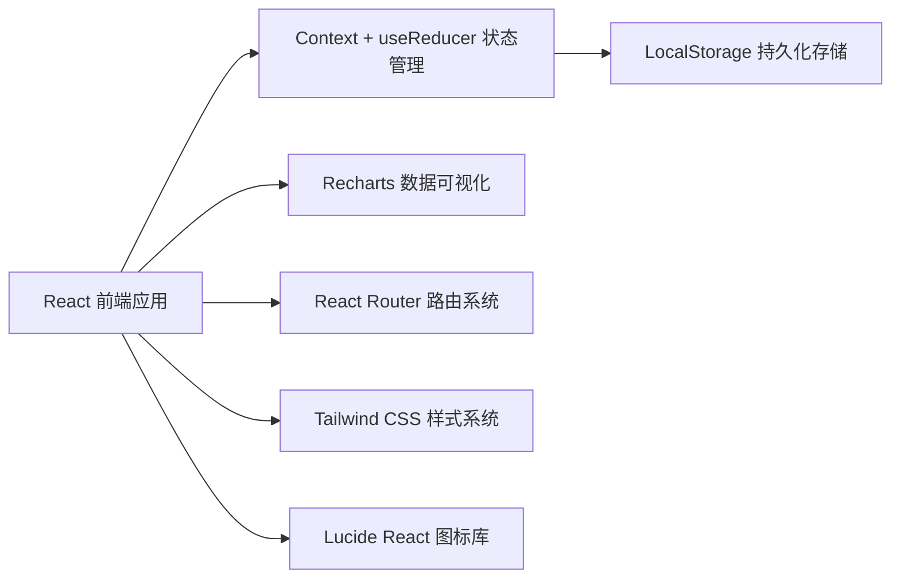
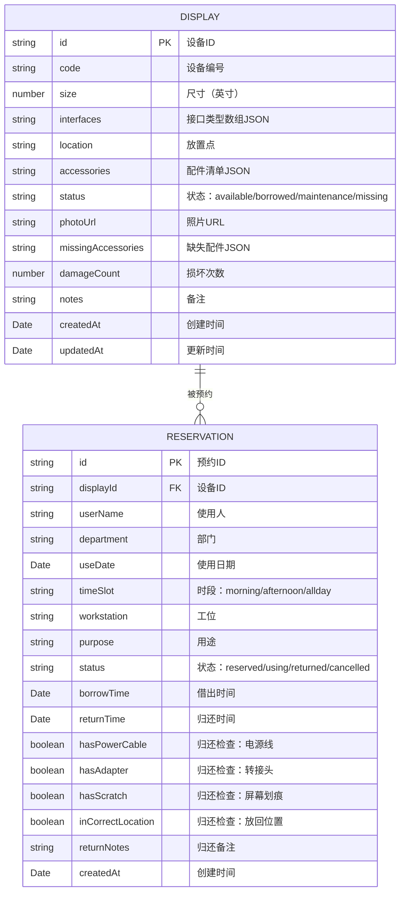

# 共享显示器预约管理系统 技术架构文档

## 1. 架构设计



纯前端架构，使用 LocalStorage 模拟数据库，无需后端服务即可完整运行。

## 2. 技术选型

- **前端框架**：React@18 + TypeScript@5
- **构建工具**：Vite@5
- **样式方案**：Tailwind CSS@3 + CSS Variables
- **路由管理**：React Router@6
- **状态管理**：React Context + useReducer
- **图表库**：Recharts@2
- **图标库**：Lucide React@0.344
- **日期处理**：date-fns@3
- **持久化**：LocalStorage（封装存储工具函数）

## 3. 路由定义

| 路由路径 | 页面组件 | 页面用途 |
|---------|---------|---------|
| `/` | DashboardPage | 统计仪表盘首页 |
| `/devices` | DeviceListPage | 设备档案列表 |
| `/devices/new` | DeviceFormPage | 新建设备档案 |
| `/devices/:id/edit` | DeviceFormPage | 编辑设备档案 |
| `/reservations` | ReservationListPage | 预约记录列表 |
| `/reservations/new` | ReservationFormPage | 创建新预约 |
| `/returns` | ReturnPage | 归还检查页面 |

## 4. 数据模型

### 4.1 Mermaid ER 图



### 4.2 类型定义

```typescript
type DisplayStatus = 'available' | 'borrowed' | 'maintenance' | 'missing';
type ReservationStatus = 'reserved' | 'using' | 'returned' | 'cancelled';
type TimeSlot = 'morning' | 'afternoon' | 'allday';

interface Display {
  id: string;
  code: string;
  size: number;
  interfaces: ('HDMI' | 'DP' | 'VGA' | 'Type-C' | 'DVI')[];
  location: string;
  accessories: Accessory[];
  status: DisplayStatus;
  photoUrl: string;
  missingAccessories: string[];
  damageCount: number;
  notes?: string;
  createdAt: string;
  updatedAt: string;
}

interface Accessory {
  name: string;
  quantity: number;
}

interface Reservation {
  id: string;
  displayId: string;
  userName: string;
  department: string;
  useDate: string;
  timeSlot: TimeSlot;
  workstation: string;
  purpose: string;
  status: ReservationStatus;
  borrowTime?: string;
  returnTime?: string;
  hasPowerCable?: boolean;
  hasAdapter?: boolean;
  hasScratch?: boolean;
  inCorrectLocation?: boolean;
  returnNotes?: string;
  createdAt: string;
}
```

## 5. 核心业务逻辑

### 5.1 预约冲突检测算法

```text
输入：displayId, useDate, timeSlot
1. 查找该 displayId 下所有 status != 'cancelled' 且 status != 'returned' 的预约
2. 对每条预约记录检查：
   a. useDate 相同
   b. 时段重叠判断：
      - allday 与任何时段都冲突
      - morning 与 morning、allday 冲突
      - afternoon 与 afternoon、allday 冲突
3. 存在冲突则返回 false，否则返回 true
```

### 5.2 配件完整性校验

```text
预约前检查：
  display.missingAccessories.length === 0
  且 display.status === 'available'
```

### 5.3 使用率统计

```text
使用率 = (时段被占用数 / 总可用时段数) × 100%
其中每天时段数 = allday 占 1 天 或 morning+afternoon 共 2 个时段
```

## 6. Mock 数据初始化

系统首次运行时自动生成以下示例数据：
- 8 台显示器（24寸/27寸/32寸各若干，接口配置不同）
- 15 条历史预约记录（覆盖近30天不同部门）
- 2 台标记缺配件的设备
- 3 条有损坏记录的设备
