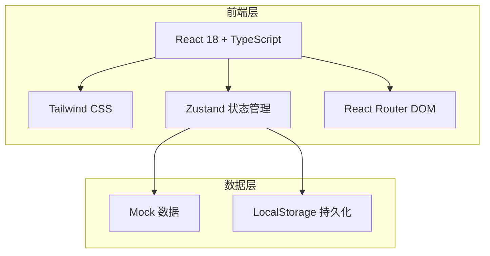
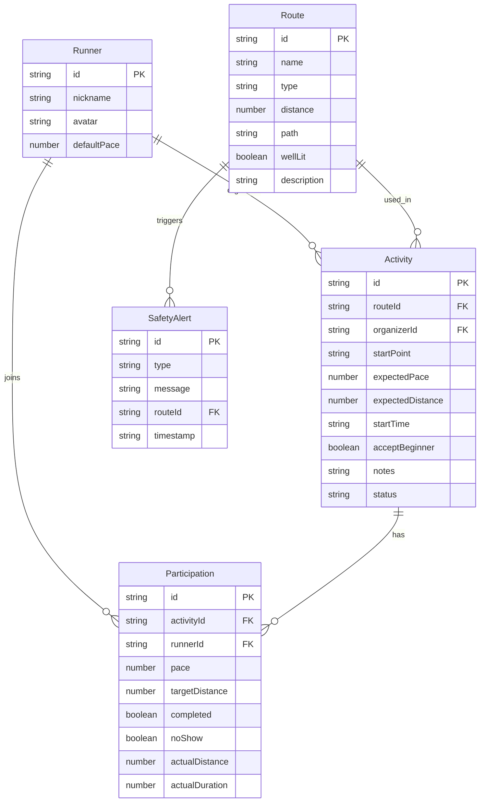

## 1. 架构设计



纯前端架构，使用 Mock 数据 + LocalStorage 持久化，无需后端服务。

## 2. 技术说明

- **前端**：React@18 + TypeScript + Tailwind CSS@3 + Vite
- **初始化工具**：vite-init
- **后端**：无（纯前端项目）
- **数据库**：LocalStorage（Mock 数据 + 持久化）
- **状态管理**：Zustand
- **路由**：React Router DOM v6
- **图标**：lucide-react
- **字体**：Rajdhani（标题）+ Noto Sans SC（正文）
- **动画**：CSS Animations + Tailwind 动画类

## 3. 路由定义

| 路由 | 用途 |
|------|------|
| `/` | 首页地图页 - 社区路线地图 + 活动列表 |
| `/create` | 发起夜跑页 - 创建新的夜跑活动 |
| `/activity/:id` | 活动详情页 - 活动信息 + 报名结伴 |
| `/record/:id` | 跑后记录页 - 记录实际跑步数据 |
| `/stats` | 统计页 - 月度统计和排行 |

## 4. 数据模型

### 4.1 数据模型定义



### 4.2 数据定义

```typescript
interface Runner {
  id: string
  nickname: string
  avatar: string
  defaultPace: number
}

interface Route {
  id: string
  name: string
  type: 'track' | 'riverside' | 'street' | 'park'
  distance: number
  path: [number, number][]
  wellLit: boolean
  description: string
  color: string
}

interface Activity {
  id: string
  routeId: string
  organizerId: string
  startPoint: string
  expectedPace: number
  expectedDistance: number
  startTime: string
  acceptBeginner: boolean
  notes: string
  status: 'upcoming' | 'ongoing' | 'completed'
  createdAt: string
}

interface Participation {
  id: string
  activityId: string
  runnerId: string
  pace: number
  targetDistance: number
  completed: boolean
  noShow: boolean
  actualDistance: number
  actualDuration: number
}

interface SafetyAlert {
  id: string
  type: 'late_night' | 'poor_lighting' | 'rain' | 'solo_return'
  message: string
  routeId?: string
  timestamp: string
}
```

## 5. 状态管理设计

使用 Zustand 管理全局状态：

- **useRunnerStore**：当前登录用户信息
- **useActivityStore**：活动列表、CRUD 操作、筛选逻辑
- **useRouteStore**：路线数据
- **useStatsStore**：统计数据计算

## 6. 安全提醒逻辑

系统自动检测以下条件并触发提醒：

| 条件 | 检测方式 | 提醒内容 |
|------|----------|----------|
| 太晚 | 活动开始时间 > 22:00 | "夜深了，注意安全，建议结伴返回" |
| 路线灯少 | Route.wellLit === false | "此路线灯光较少，建议携带头灯或反光装备" |
| 下雨 | Mock 天气数据 | "今晚有雨，路面湿滑，注意防滑" |
| 独自返回 | 参与者仅1人且路线偏远 | "独自返回风险较高，建议等同伴一起" |
