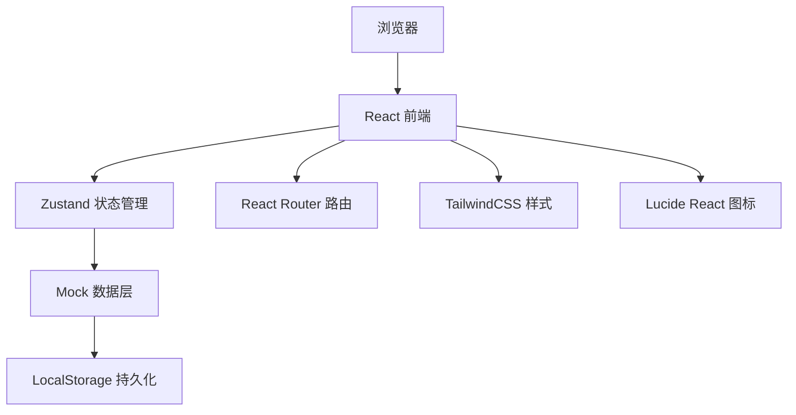
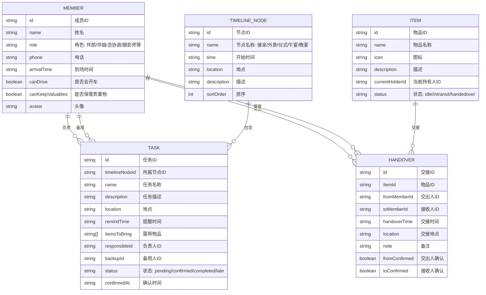

## 1. 架构设计



## 2. 技术说明
- 前端：React@18 + TypeScript + Vite
- 状态管理：Zustand
- 路由：react-router-dom@6
- 样式：TailwindCSS@3
- 图标：lucide-react
- 后端：无，纯前端Mock数据 + LocalStorage持久化
- 数据持久化：LocalStorage存储任务确认状态和交接记录

## 3. 路由定义
| 路由 | 页面 | 用途 |
|------|------|------|
| / | TimelinePage | 时间线总览页(首页) |
| /members | MembersPage | 成员管理页 |
| /items | ItemsPage | 物品交接页 |
| /monitor | MonitorPage | 协调监控页 |
| /workload | WorkloadPage | 人员负载页 |

## 4. 数据模型

### 4.1 数据模型定义



### 4.2 TypeScript类型定义
```typescript
interface Member {
  id: string;
  name: string;
  role: '伴郎' | '伴娘' | '总协调' | '摄影师' | '化妆师' | '司机' | '其他';
  phone: string;
  arrivalTime: string;
  canDrive: boolean;
  canKeepValuables: boolean;
  avatar: string;
}

interface TimelineNode {
  id: string;
  name: '接亲' | '外景' | '仪式' | '午宴' | '晚宴';
  time: string;
  location: string;
  description: string;
  sortOrder: number;
}

type TaskStatus = 'pending' | 'confirmed' | 'completed' | 'late';

interface Task {
  id: string;
  timelineNodeId: string;
  name: string;
  description: string;
  location: string;
  remindTime: string;
  itemsToBring: string[];
  responsibleId: string;
  backupId: string;
  status: TaskStatus;
  confirmedAt?: string;
}

type ItemStatus = 'idle' | 'intransit' | 'handedover';

interface Item {
  id: string;
  name: string;
  icon: string;
  description: string;
  currentHolderId: string;
  status: ItemStatus;
}

interface Handover {
  id: string;
  itemId: string;
  fromMemberId: string;
  toMemberId: string;
  handoverTime: string;
  location: string;
  note: string;
  fromConfirmed: boolean;
  toConfirmed: boolean;
}
```
