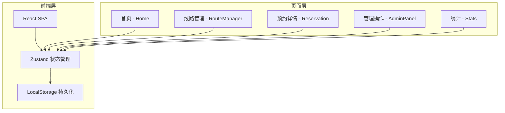
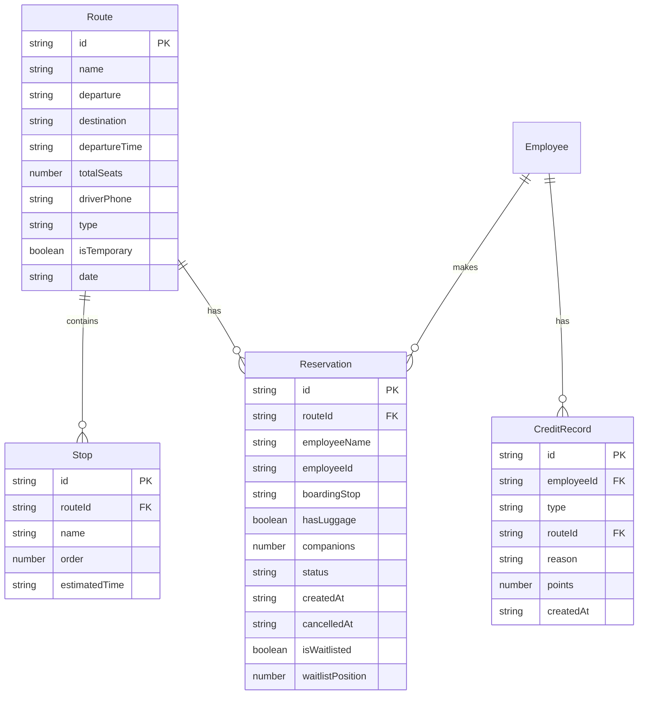

## 1. 架构设计



纯前端架构，使用 Zustand + LocalStorage 进行状态管理和数据持久化，无需后端服务。

## 2. 技术说明

- 前端：React@18 + TypeScript + Tailwind CSS@3 + Vite
- 初始化工具：vite-init (react-ts 模板)
- 状态管理：Zustand（含 persist 中间件持久化到 localStorage）
- 路由：react-router-dom v6
- 图标：lucide-react
- 后端：无（纯前端，mock 数据）
- 数据库：无（localStorage 模拟持久化）

## 3. 路由定义

| 路由 | 用途 |
|------|------|
| / | 首页，今日班车分组展示 |
| /route/new | 添加新线路 |
| /route/:id | 线路详情 + 预约 |
| /route/:id/reserve | 预约座位 |
| /admin | 管理员操作面板 |
| /admin/add-route | 管理员添加/编辑线路 |
| /stats | 统计页面 |

## 4. 数据模型

### 4.1 数据模型定义



### 4.2 数据类型定义

```typescript
interface Route {
  id: string
  name: string
  departure: string
  destination: string
  departureTime: string
  totalSeats: number
  driverPhone: string
  type: 'morning' | 'evening'
  isTemporary: boolean
  date: string
  stops: Stop[]
}

interface Stop {
  id: string
  name: string
  order: number
  estimatedTime: string
}

interface Reservation {
  id: string
  routeId: string
  employeeId: string
  employeeName: string
  boardingStop: string
  hasLuggage: boolean
  companions: number
  status: 'reserved' | 'boarded' | 'late_no_show' | 'no_show' | 'cancelled'
  createdAt: string
  cancelledAt?: string
  isWaitlisted: boolean
  waitlistPosition: number
}

interface CreditRecord {
  id: string
  employeeId: string
  type: 'late_cancel' | 'no_show'
  routeId: string
  reason: string
  points: number
  createdAt: string
}

interface Employee {
  id: string
  name: string
  creditScore: number
  isBanned: boolean
  banEndDate?: string
}
```

## 5. 状态管理设计

使用 Zustand 的 persist 中间件，将所有数据持久化到 localStorage：

- `useRouteStore`：线路数据、增删改查
- `useReservationStore`：预约数据、候补队列管理
- `useEmployeeStore`：员工信息、信用记录
- `useAppStore`：全局状态（当前角色、选中日期等）
