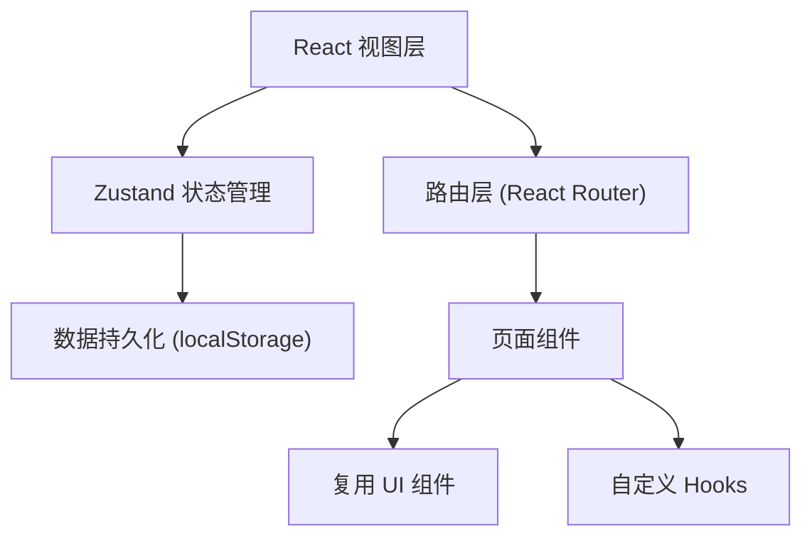
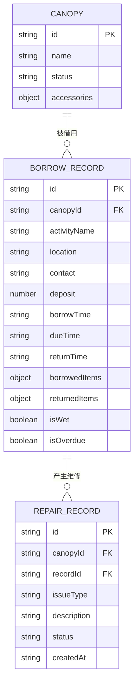

## 1. 架构设计

纯前端单页应用，使用 Zustand 进行状态管理，Mock 数据模拟后端。



## 2. 技术选型说明

- 前端框架：React 18 + TypeScript
- 构建工具：Vite 5
- 样式方案：Tailwind CSS 3
- 状态管理：Zustand 4
- 路由：React Router DOM 6
- 图标库：Lucide React
- 数据持久化：localStorage + zustand/middleware
- 图表：原生 SVG 实现简单柱状图（避免引入重依赖）

## 3. 路由定义

| 路由路径 | 页面组件 | 用途 |
|----------|----------|------|
| / | Dashboard | 今日借用概览主页 |
| /borrow | BorrowPage | 借用登记（新建借用单） |
| /return/:id | ReturnPage | 归还验收页面 |
| /repair | RepairPage | 维修管理列表 |
| /stats | StatsPage | 统计分析页面 |

## 4. 数据模型

### 4.1 ER 图



### 4.2 TypeScript 类型定义

```typescript
type AccessoryType = 'tarp' | 'pole' | 'bar' | 'stake' | 'bag';

interface AccessoryItem {
  type: AccessoryType;
  name: string;
  quantity: number;
}

type CanopyStatus = 'available' | 'borrowed' | 'drying' | 'repairing' | 'disabled';

interface Canopy {
  id: string;
  name: string;
  status: CanopyStatus;
  accessories: Record<AccessoryType, number>;
}

interface BorrowItem {
  tarp: number;
  pole: number;
  bar: number;
  stake: number;
  bag: number;
}

interface BorrowRecord {
  id: string;
  canopyId: string;
  activityName: string;
  location: string;
  contact: string;
  deposit: number;
  borrowTime: string;
  dueTime: string;
  returnTime?: string;
  borrowedItems: BorrowItem;
  returnedItems?: BorrowItem;
  isWet?: boolean;
  isOverdue?: boolean;
  status: 'active' | 'returned';
}

type RepairIssueType = 'hole' | 'bent' | 'missing' | 'other';

interface RepairRecord {
  id: string;
  canopyId: string;
  borrowRecordId?: string;
  issueType: RepairIssueType;
  accessoryType?: AccessoryType;
  description: string;
  status: 'pending' | 'fixed';
  createdAt: string;
}
```

## 5. 目录结构

```
src/
├── components/          # 可复用组件
│   ├── Layout.tsx       # 布局容器（导航+内容）
│   ├── StatCard.tsx     # 统计卡片
│   ├── StatusBadge.tsx  # 状态标签
│   ├── AccessoryChecklist.tsx  # 配件勾选组件
│   └── Modal.tsx        # 通用弹窗
├── pages/               # 页面组件
│   ├── Dashboard.tsx    # 今日借用主页
│   ├── BorrowPage.tsx   # 借用登记页
│   ├── ReturnPage.tsx   # 归还验收页
│   ├── RepairPage.tsx   # 维修管理页
│   └── StatsPage.tsx    # 统计分析页
├── store/               # Zustand 状态管理
│   └── index.ts
├── types/               # TypeScript 类型
│   └── index.ts
├── data/                # Mock 初始数据
│   └── mockData.ts
├── utils/               # 工具函数
│   └── date.ts
├── App.tsx
├── main.tsx
└── index.css
```

## 6. 状态管理设计

Zustand Store 包含三个核心 Slice：

```typescript
interface StoreState {
  canopies: Canopy[];
  borrowRecords: BorrowRecord[];
  repairRecords: RepairRecord[];
  
  createBorrowRecord: (data: Omit<BorrowRecord, 'id' | 'status'>) => void;
  returnBorrowRecord: (id: string, data: ReturnData) => void;
  createRepairRecord: (data: Omit<RepairRecord, 'id' | 'createdAt' | 'status'>) => void;
  fixRepairRecord: (id: string) => void;
  markCanopyDry: (canopyId: string) => void;
}
```

使用 `persist` middleware 将 Store 数据持久化到 localStorage。
